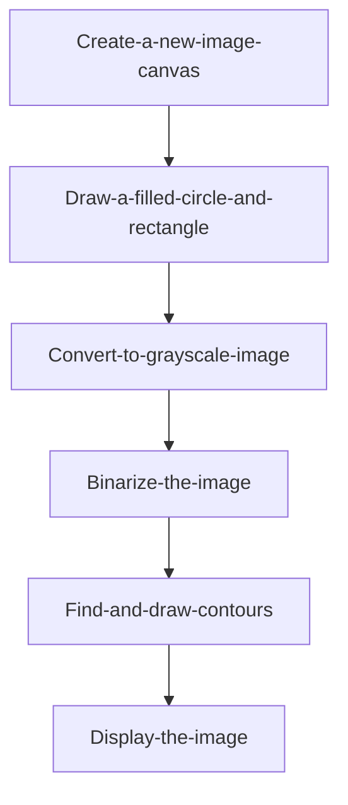
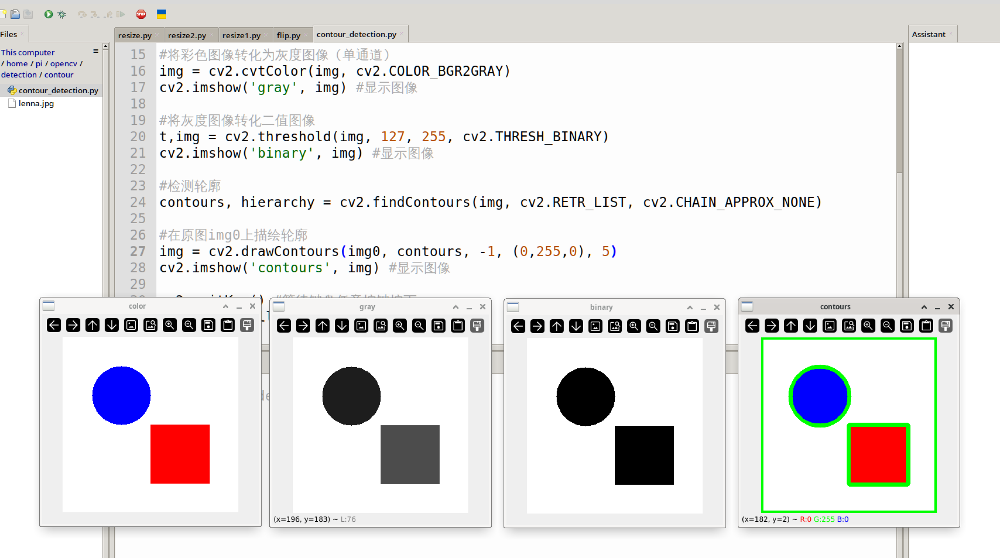
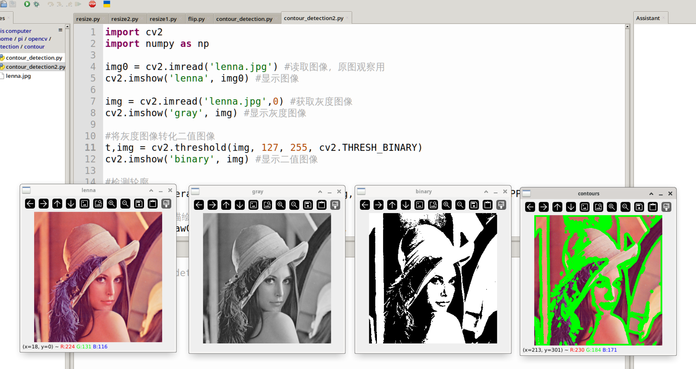

# Contour Detection

## Introduction

This section teaches how to use OpenCV for image contour detection. Contours refer to the edge lines of shapes or objects in an image.

## Experiment Objective

Detect image contours and draw them for display.

## Experiment Explanation

The OpenCV Python library provides the `findContours()` function for finding contours and the `drawContours()` function for drawing contours.

### findContours() Usage

```python
contours, hierarchy = cv2.findContours(image, mode, method)
```

Finds edge coordinates in an image. Returns `contours` as a list of contour point coordinates and `hierarchy` representing the hierarchical relationships.
- `image`: 8-bit single-channel binary image.
- `mode`: Detection mode.
    - `cv2.RETR_EXTERNAL`: Only detect outer contours.
    - `cv2.RETR_LIST`: Detect all contours without establishing hierarchical relationships.
    - `cv2.RETR_CCOMP`: Detect all contours and establish 2-level hierarchical relationships.
    - `cv2.RETR_TREE`: Detect all contours and establish tree-like hierarchical relationships.
- `method`: Detection method.
    - `cv2.CHAIN_APPROX_NONE`: Save all contour points.
    - `cv2.CHAIN_APPROX_SIMPLE`: Only save the endpoints of horizontal, vertical, or diagonal contours.

### drawContours() Usage

```python
img = cv2.drawContours(image, contours, contourIdx, color, thickness, lineType, hierarchy, maxLevel, offset)
```

Draws contours.
- `image`: Original image.
- `contours`: The list obtained from `findContours()`.
- `contourIdx`: Indexing method; `-1` means draw all contours.
- `color`: Color.
- `thickness`: Thickness; `-1` means filled.
- `lineType`: Contour line type (optional).
- `hierarchy`: Hierarchical relationship obtained from `findContours()` (optional).
- `maxLevel`: Depth of hierarchy (optional).
- `offset`: Offset to change the position of the drawn result (optional).


Here we can draw a filled circle and a filled rectangle, then binarize the image, find the contours, and draw them. The code flow is as follows:



<br></br>

The reference code is as follows:

```python
'''
Experiment Name: Contour Detection
Experiment Platform: WalnutPi 1B
'''

import cv2
import numpy as np

# Create a new 300×300 pixel RGB888 pure white image
img = np.ones((300,300,3),np.uint8)*255

# Draw a blue filled circle on img0
img0 = cv2.circle(img, (100, 100), 50, (255,0,0), -1)

# Draw a red filled rectangle
img = cv2.rectangle(img0, (150, 150), (250, 250), (0,0,255), -1)

cv2.imshow('color', img) # Display the image

# Convert the color image to a grayscale image (single channel)
img = cv2.cvtColor(img, cv2.COLOR_BGR2GRAY)
cv2.imshow('gray', img) # Display the image

# Convert the grayscale image to a binary image
t,img = cv2.threshold(img, 127, 255, cv2.THRESH_BINARY)
cv2.imshow('binary', img) # Display the image

# Detect contours
contours, hierarchy = cv2.findContours(img, cv2.RETR_LIST, cv2.CHAIN_APPROX_NONE)

# Draw contours on the original image img0 in green
img = cv2.drawContours(img0, contours, -1, (0,255,0), 5)
cv2.imshow('contours', img) # Display the image

cv2.waitKey() # Wait for any keyboard key to be pressed
cv2.destroyAllWindows() # Close the window

```

## Experiment Results

Run the above code on the WalnutPi, and you can see the transformation process of the experimental images. The final contour drawing result is shown below:



## Extension

Let's use `lenna.jpg` to draw contours and observe the result. The code is as follows:

```python
'''
Experiment Name: Contour Detection 2
Experiment Platform: WalnutPi 1B
'''
import cv2
import numpy as np

img0 = cv2.imread('lenna.jpg') # Read the image for original observation
cv2.imshow('lenna', img0) # Display the image

img = cv2.imread('lenna.jpg',0) # Get the grayscale image
cv2.imshow('gray', img) # Display the grayscale image

# Convert the grayscale image to a binary image
t,img = cv2.threshold(img, 127, 255, cv2.THRESH_BINARY)
cv2.imshow('binary', img) # Display the binary image

# Detect contours
contours, hierarchy = cv2.findContours(img, cv2.RETR_LIST, cv2.CHAIN_APPROX_NONE)

# Draw contours on the original image img0
img = cv2.drawContours(img0, contours, -1, (0,255,0), 5)
cv2.imshow('contours', img) # Display the contour image

cv2.waitKey() # Wait for any keyboard key to be pressed
cv2.destroyAllWindows() # Close the window

```

The experiment results are as follows:


