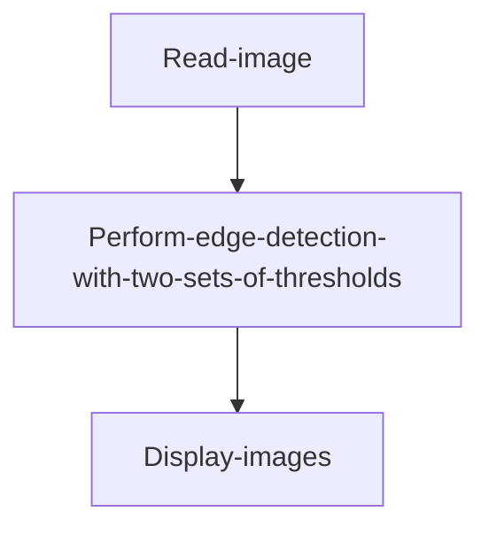
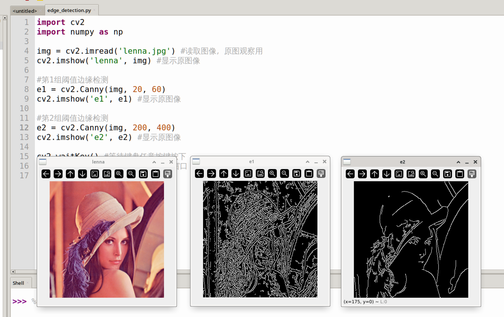

# Edge Detection

## Introduction

This section teaches how to use OpenCV for image edge detection using the Canny edge detection algorithm. Compared to the previous contour detection, this can be achieved with just a few lines of code.

## Experiment Objective

Detect image edges and display them.

## Experiment Explanation

The OpenCV Python library provides the `Canny()` function for edge detection.

### Canny() Usage

```python
edges = cv2.Canny(image, threshold1, threshold2, apertureSize, L2gradient)
```

Canny edge detection. Returns `edges` as a binary image.
- `image`: Original image.
- `threshold1`: The first threshold used for computation, usually the minimum threshold.
- `threshold2`: The second threshold used for computation, usually the maximum threshold.

From the above, we can see that the Canny method is very simple to use. We just need to set appropriate thresholds according to our needs. We can use two sets of thresholds for comparison experiments. The code flow is as follows:



<br></br>

The reference code is as follows:

```python
'''
Experiment Name: Edge Detection
Experiment Platform: WalnutPi 1B
'''

import cv2

img = cv2.imread('lenna.jpg') # Read the image for original observation
cv2.imshow('lenna', img) # Display the original image

# First set of threshold edge detection
e1 = cv2.Canny(img, 20, 60)
cv2.imshow('e1', e1) # Display the image

# Second set of threshold edge detection
e2 = cv2.Canny(img, 200, 400)
cv2.imshow('e2', e2) # Display the image

cv2.waitKey() # Wait for any keyboard key to be pressed
cv2.destroyAllWindows() # Close the window

```

## Experiment Results

Run the above code on the WalnutPi, and you can see the edge detection results for the two sets of thresholds shown below. Different thresholds result in different levels of detail in the detection:


