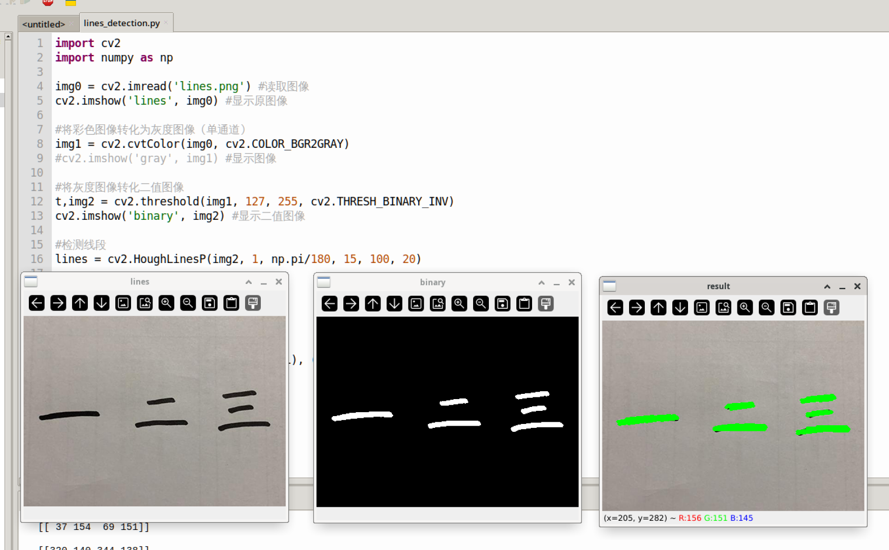

# Line Detection

## Introduction

This section teaches how to use OpenCV to detect line segments in an image.

## Experiment Objective

Detect line segments in an image and draw them for display.

## Experiment Explanation

The OpenCV Python library provides two line detection methods: `HoughLines()` for detecting straight lines (infinite) and `HoughLinesP()` for detecting line segments. This section primarily uses `HoughLinesP()`, which only supports binary grayscale images.

### HoughLinesP() Usage

```python
lines = cv2.HoughLinesP(image, rho, theta, threshold, minLineLength, maxLineGap)
```
Line segment detection. Returns `lines` as an array of all line segment coordinates. Example: `[[x0,y0,x1,y1],[x0,y0,x1,y1]]`
- `image`: Original image. Must be a binary grayscale image.
- `rho`: Detection radius step size. The default value is 1, meaning all radius step sizes are detected.
- `theta`: Angle for detecting lines. The default value is π/180, meaning all angles are detected.
- `threshold`: Threshold; the smaller the value, the more detections.
- `minLineLength`: Minimum length. Line segments shorter than this length are not detected.
- `maxLineGap`: Minimum distance between line segments.

Read the image, convert it to a binary grayscale image, and then perform line segment detection. The code flow is as follows:

```mermaid
graph TD
    Read image-->Binarize image-->Line segment detection-->Display image;
```

<br></br>

The reference code is as follows:

```python
'''
Experiment Name: Line Detection
Experiment Platform: WalnutPi 1B
'''

import cv2
import numpy as np

img0 = cv2.imread('lines.png') # Read the image
cv2.imshow('lines', img0) # Display the original image

# Convert the color image to a grayscale image (single channel)
img1 = cv2.cvtColor(img0, cv2.COLOR_BGR2GRAY)
#cv2.imshow('gray', img1) # Display the image

# Convert the grayscale image to a binary image
t,img2 = cv2.threshold(img1, 127, 255, cv2.THRESH_BINARY_INV)
cv2.imshow('binary', img2) # Display the binary image

# Detect line segments
lines = cv2.HoughLinesP(img2, 1, np.pi/180, 15, 100, 20)

print(lines) # Print line segment information

# Draw line segments on the original image
for l in lines:    
    x0, y0, x1, y1 = l[0]
    cv2.line(img0, (x0, y0), (x1, y1), (0,255,0), 3)

cv2.imshow('result', img0)

cv2.waitKey() # Wait for any keyboard key to be pressed
cv2.destroyAllWindows() # Close the window

```

## Experiment Results

Run the above code on the WalnutPi; the experiment results are as follows:


