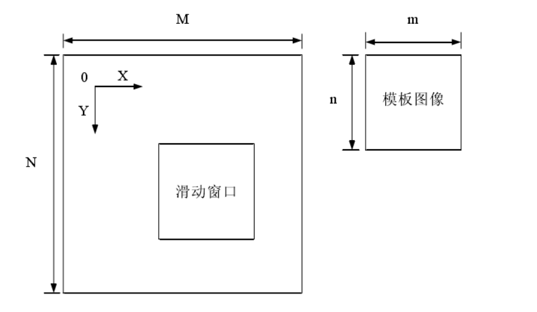
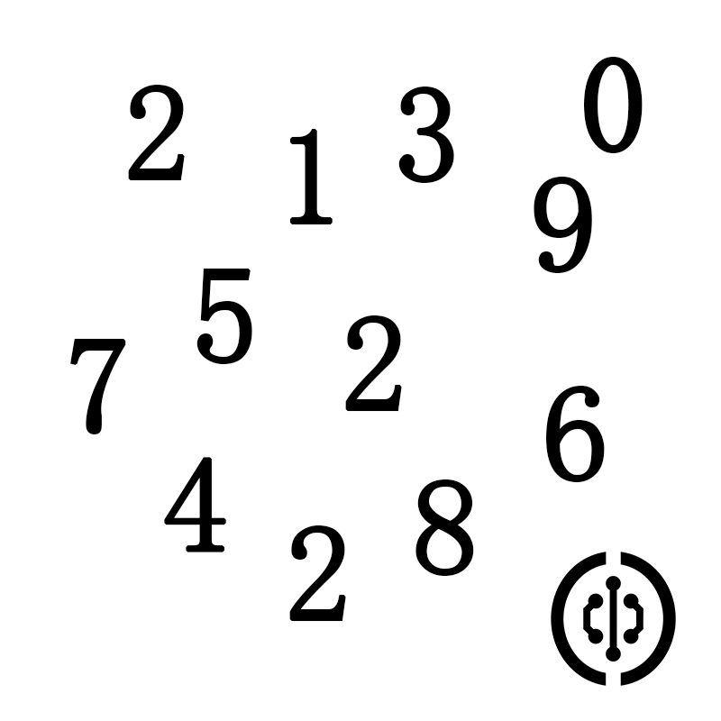
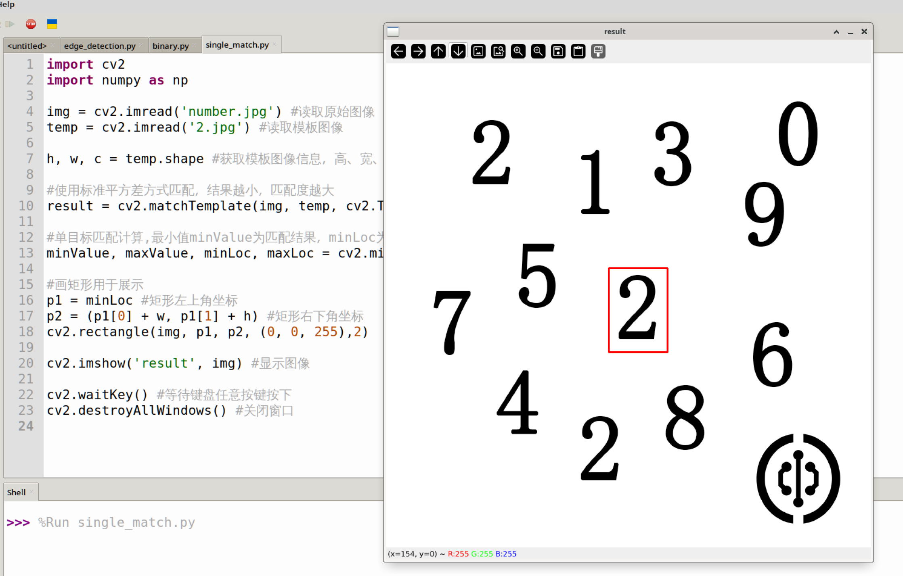

# Template Matching

## Introduction

Template matching refers to finding a specified target object (or image) within an image. The principle is to compare and match the target image against the original image at each position sequentially, thereby finding the position of the target object (or image) within the image.



## Experiment Objective

Use template matching to find a specified image (object) within an image. This experiment aims to find the digit "2" in the following image.



A cropped image of the digit "2" from the above image is used as the template image.


## Experiment Explanation

The OpenCV Python library provides the `matchTemplate()` function for template matching. Practical applications include single-target matching and multi-target matching. Single-target matching finds only the closest match, while multi-target matching finds multiple approximate objects (or images) in an image.

### matchTemplate() Usage

```python
result = cv2.matchTemplate(image, templ, method, mask)
```
Template matching. Returns `result` as a two-dimensional array, which can be viewed by printing with code.
- `image`: Original image.
- `templ`: Template image; its size must be smaller than or equal to the original image.
- `method`: Matching method.
    - `cv2.TM_SQDIFF`: 0, Sum of Squared Differences matching (SSD matching). The higher the match, the smaller the result. A perfect match results in 0.
    - `cv2.TM_SQDIFF_NORMED`: 1, Normalized Sum of Squared Differences matching. The higher the match, the smaller the result. A perfect match results in 0.
    - `cv2.TM_CCORR`: 2, Correlation matching. The higher the match, the larger the result.
    - `cv2.TM_CCORR_NORMED`: 3, Normalized correlation matching. The higher the match, the larger the result.
    - `cv2.TM_CCOEFF`: 4, Correlation coefficient matching. The result is a floating-point number between -1 and 1. 1 indicates a perfect match, 0 indicates no match, -1 indicates the template and original image have opposite brightness.
    - `cv2.TM_CCOEFF_NORMED`: 5, Normalized correlation coefficient matching. The result is a floating-point number between -1 and 1. 1 indicates a perfect match, 0 indicates no match, -1 indicates the template and original image have opposite brightness.
- `mask`: Mask (optional parameter); it is recommended to use the default value.
 
## Single-Target Matching

Single-target matching finds only one optimal result.

The `matchTemplate()` calculation result is a two-dimensional array. Single-target matching parses this array's coordinate values using the `minMaxLoc()` function.

```python
minValue, maxValue, minLoc, maxLoc = cv2.minMaxLoc(src, mask)
```
Parameter descriptions:
- `src`: Calculation result from `matchTemplate()`.
- `mask`: Mask (optional parameter); it is recommended to use the default value.

Return values:
- `minValue`: Minimum value in the array.
- `maxValue`: Maximum value in the array.
- `minLoc`: Coordinates of the minimum value, in the format (x, y).
- `maxLoc`: Coordinates of the maximum value, in the format (x, y).

Using `cv2.TM_SQDIFF_NORMED` normalized squared differences matching as an example: the smaller the result, the higher the match. Therefore, `minValue` is the best matching result, and `minLoc` is the upper-left corner coordinate of the matching region, which has the same size as the template.


The single-target matching code flow is as follows:

```mermaid
graph TD
    Read original image-->Read template image-->Perform single-target matching-->Display result image;
```

<br></br>

### Reference Code

The reference code is as follows:

```python
'''
Experiment Name: Template Matching (Single Target)
Experiment Platform: WalnutPi 1B
'''

import cv2
import numpy as np

img = cv2.imread('number.jpg') # Read the original image
temp = cv2.imread('2.jpg') # Read the template image

h, w, c = temp.shape # Get template image information: height, width, number of channels

# Use normalized squared differences matching; the smaller the result, the higher the match
result = cv2.matchTemplate(img, temp, cv2.TM_SQDIFF_NORMED)

print(result) # Print the result

# Single-target matching calculation: minValue is the matching result, minLoc is the upper-left corner coordinate of the match
minValue, maxValue, minLoc, maxLoc = cv2.minMaxLoc(result)

# Draw a rectangle for display
p1 = minLoc # Upper-left corner coordinate of the rectangle
p2 = (p1[0] + w, p1[1] + h) # Lower-right corner coordinate of the rectangle
cv2.rectangle(img, p1, p2, (0, 0, 255),2)

cv2.imshow('result', img) # Display the image

cv2.waitKey() # Wait for any keyboard key to be pressed
cv2.destroyAllWindows() # Close the window

```

### Experiment Results

Run the above code on the WalnutPi; the experiment results are as follows. You can see that the digit "2" template image is detected, and there is only one result (single target):



By printing the matching result, you can see that the `matchTemplate()` function's return result is essentially a bunch of numbers, and the `minMaxLoc()` function then finds the minimum value within this result.


## Multi-Target Matching

Multi-target matching can find multiple results based on a specified parameter (recognition value).

The `matchTemplate()` calculation result is a two-dimensional array. Multi-target matching determines whether a target matches by comparing the correlation coefficient in each set of data from this result with a set value.

Here, we use `cv2.TM_CCORR_NORMED` normalized correlation matching: the larger the result, the higher the match. The code flow is as follows:

```mermaid
graph TD
    Read original image-->Read template image-->Perform multi-target matching-->Display result image;
```

<br></br>

### Reference Code

The reference code is as follows:

```python
'''
Experiment Name: Template Matching (Multi Target)
Experiment Platform: WalnutPi 1B
'''

import cv2
import numpy as np

img = cv2.imread('number.jpg') # Read the original image
temp = cv2.imread('2.jpg') # Read the template image

h, w, c = temp.shape # Get template image information: height, width, number of channels

# Use normalized correlation matching; the larger the result, the higher the match
result = cv2.matchTemplate(img, temp, cv2.TM_CCORR_NORMED)

print(result) # Print the result

# Calculate matching results and draw rectangles
num = 0 # Used to count the number of matching results
for y in range(len(result)): # Iterate over each row
    for x in range(len(result[y])): # Iterate over each column
        
        if result[y][x] > 0.999: # Can be modified (must be less than 1); the larger the value, the higher the precision, and the fewer results obtained.
            
            cv2.rectangle(img, (x, y), (x+w, y+h), (0, 0, 255),2) # Draw a rectangle
            
            num = num + 1 

print(num)  # Calculate the number of matching results; you can observe the count by modifying the parameter to 0.9 or 0.999.

cv2.imshow('result', img) # Display the result image

cv2.waitKey() # Wait for any keyboard key to be pressed
cv2.destroyAllWindows() # Close the window

```

### Experiment Results

Run the above code on the WalnutPi; the experiment results are as follows. You can see that the digit "2" template image is detected:


