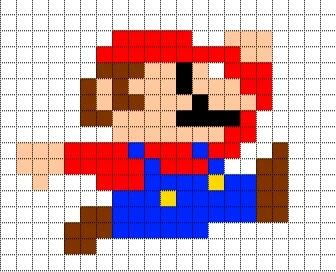
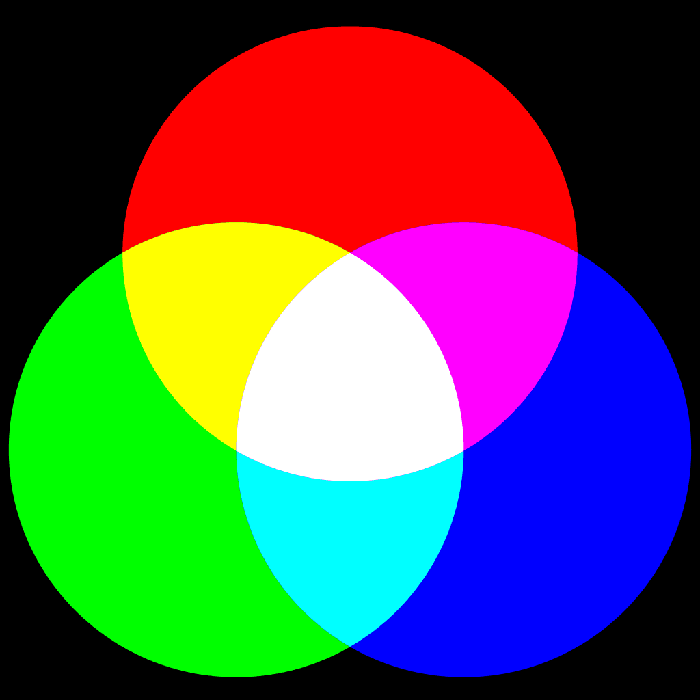
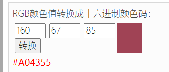

# Image Basics

## Introduction to Pixels

 

The above image is from a game over a decade ago. Due to the limited technology at the time, the display pixels were very small and visible. A complete image is composed of individual pixels like those shown above. With technological advances, the displays in phones and laptops we use today have very high resolutions, so the pixels are invisible to the naked eye. But the principle remains the same.

## Reading a Pixel

Pixels are the smallest unit that makes up an image. All visual algorithm applications ultimately process and compute these pixels. We can use the OpenCV library to read an image and its pixels to gain a deeper understanding of how OpenCV processes images.

Take the following image as an example:

 

You can view its properties on a computer:

 


When we read an image using OpenCV's `imread()` function, the coordinate orientation is as follows: the top-left corner is the origin (0, 0), with 316 pixels in the vertical direction [0-315] and 310 pixels in the horizontal direction [0-309].

 

You can read the value of a specific pixel with the following code.

```python
'''
Experiment Name: Reading Pixels
Experiment Platform: WalnutPi 1B
'''

import cv2

img = cv2.imread("lenna.jpg") # Read the image lenna.jpg from the current directory

p = img[315,309] # Read the pixel value at coordinates (315,309); 315 is vertical, 309 is horizontal

print(p) # Print pixel value information

```

Run the code on the WalnutPi development board, and the output is `[85 67 160]`.

 

`[85 67 160]` is actually the BGR value of the pixel at the bottom-right corner of the image below **(OpenCV reads pixels in BGR order, not RGB)**. This involves knowledge of primary colors, which will be explained next.

 

## Primary Colors (RGB)

The RGB color model (also known as the RGB color system, RGB color model, or red-green-blue color model) is an additive color model in which the three primary colors — Red (R), Green (G), and Blue (B) — are combined in different proportions to produce a wide range of colors.

 

Therefore, the pixel data obtained earlier — `[85 67 160]` — actually corresponds to B=85, G=67, R=160 **(OpenCV reads pixels in BGR order, not RGB)**. The color is produced by mixing these three channels. Each channel value has 2^8 = 256 levels [0-255]. So what is commonly referred to as RGB888 means 24-bit true color, where each of the three RGB channels uses 8 bits of color.

We can use an online color conversion tool to test the correspondence between colors and values:

Online RGB tool link: https://www.sioe.cn/yingyong/yanse-rgb-16/

Enter the RGB value (255, 0, 0) to get red:

 

The original pixel value read earlier was: `[85 67 160]`. Converted to an RGB value of (160, 67, 85), entering this gives the corresponding color:

 

## Modifying Pixel Values

OpenCV can read a pixel value and can also write a pixel value. For easier viewing of results, here we use code to fill a 30×30 region in the top-left corner of the image with green.

Simply assign a value to the specified pixel coordinates of the image to modify its pixel values. The reference code is as follows:

```python
'''
Experiment Name: Modifying Pixels
Experiment Platform: WalnutPi 1B
'''

import cv2

img = cv2.imread("lenna.jpg") # Read the image lenna.jpg from the current directory
cv2.imshow('1', img) # Display the original image

for i in range (30):
    for j in range (30):
        img[i,j] = [0, 255, 0] # Modify to green
        
cv2.imshow('2', img) # Display the modified image

cv2.waitKey() # Wait for any keyboard key to be pressed
cv2.destroyAllWindows() # Close the window
```

Run the code, and you can see that the pixels in the 30×30 region in the top-left corner of the image have been changed to green. (After running, the two images may overlap; simply use the mouse to drag them apart.)

 

## GRAY Grayscale Images

Earlier we saw that in a color RGB888 image, each pixel's B/G/R channel value ranges from [0,255]. A grayscale image, on the other hand, has only one channel ranging from [0,255], where `0` represents pure black, `255` represents pure white, and values between 0 and 255 represent different shades, such as dark gray or light gray.

 

::::tip Note
Since grayscale images contain less image information compared to RGB888 images, they are often used in visual algorithm scenarios that do not require color, such as shape recognition and face recognition. By converting to grayscale images before processing, computational load can be greatly reduced, achieving faster recognition speeds.
::::

The following code reads the pixel values of a grayscale image:
```python
import cv2

img = cv2.imread("lenna.jpg", 0) # Read the image lenna.jpg from the current directory and convert to grayscale
cv2.imshow('grey', img) # Display the image

p = img[315,309] # Read the pixel value at coordinates (315,309); 315 is vertical, 309 is horizontal
print(p) # Print pixel value information

cv2.waitKey() # Wait for any keyboard key to be pressed
cv2.destroyAllWindows() # Close the window

```
 
