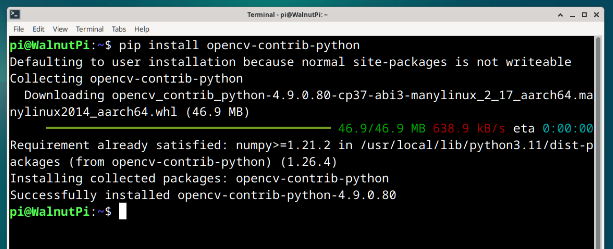
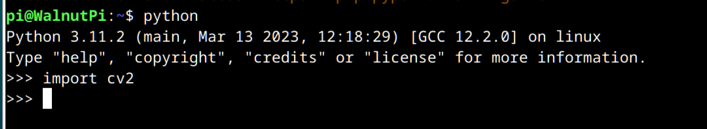

# Installing OpenCV

Installing OpenCV on the WalnutPi 1B is very simple — just use pip to install it. **It is recommended to install the opencv-contrib-python library, which includes both the OpenCV main module and the contrib module for complete functionality.**

Enter the following command in the WalnutPi terminal to install:

```bash
pip install opencv-contrib-python
```

::::tip Note:
If your network cannot download it, or if you are a user in mainland China, you can use the Tsinghua mirror source for faster downloads. Replace the above install command with the following:

```bash
pip install opencv-contrib-python -i https://pypi.tuna.tsinghua.edu.cn/simple 
```
::::



<br></br>

After installation, let's test whether the installation was successful.

Enter the `python` command to enter the Python terminal:

```bash
python
```

Then enter the following command; if no error occurs, the installation was successful.

```python
import cv2
```



Continue by entering the following command to view the version number:

```python
cv2.__version__
```


Since this tutorial is based on Python development and the WalnutPi development board provides multiple ways to run Python code, please refer to the [Running Python Code](../python/python_run.md) section for details, which will not be repeated here.

OpenCV is primarily for vision development, so it is recommended that users use a monitor, keyboard, and mouse for local development on the WalnutPi board, or develop via VNC remote desktop. [WalnutPi VNC Remote](../os_software/vnc.md)
