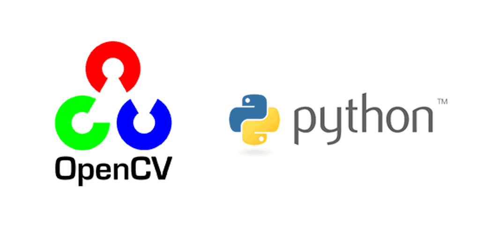
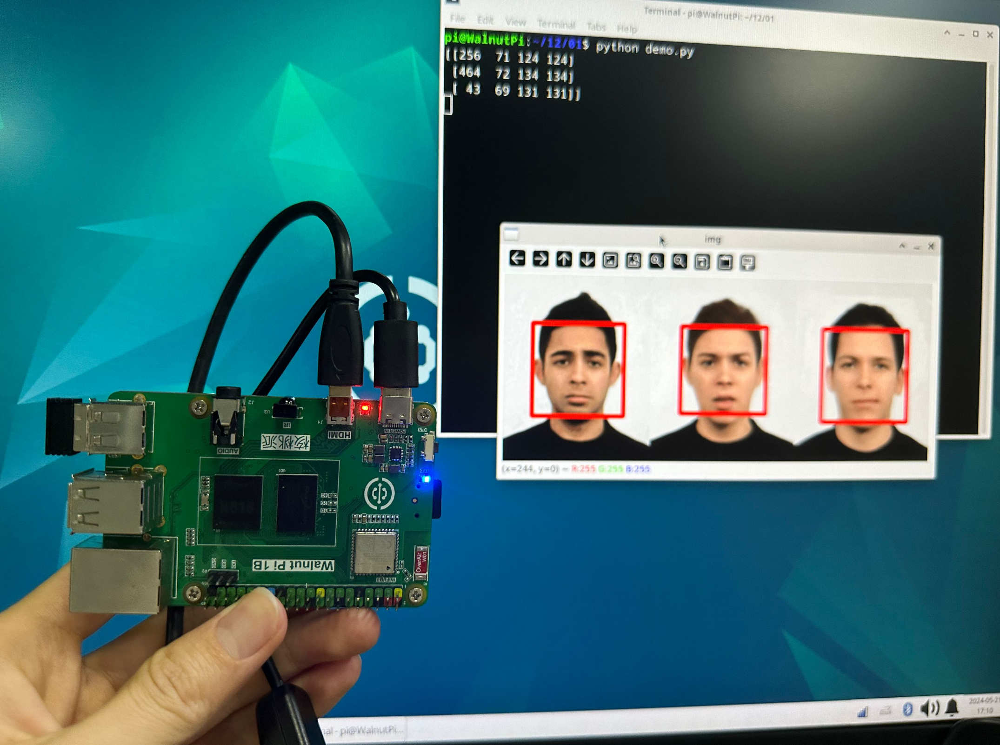
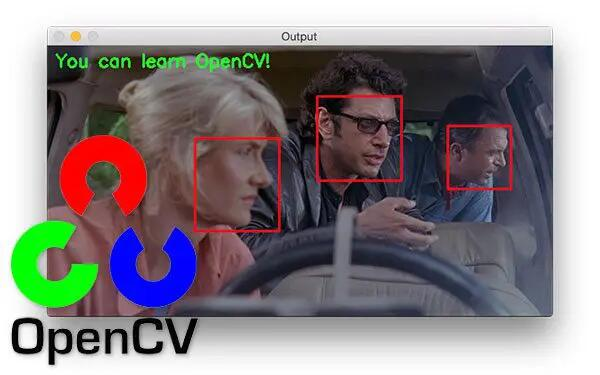
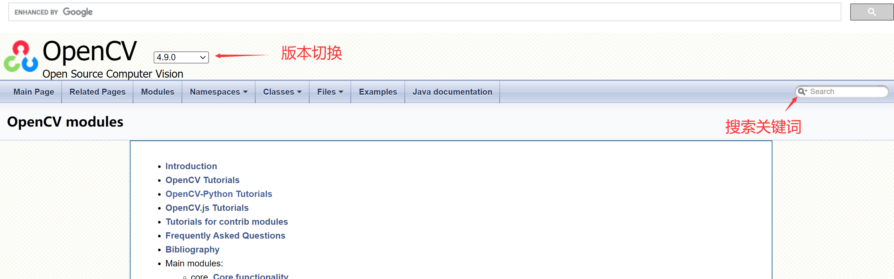
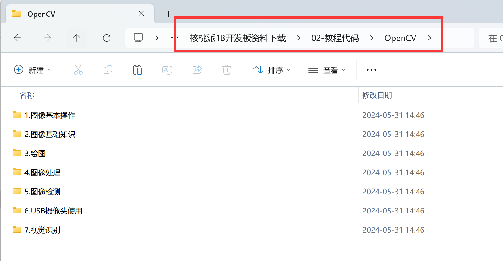

# Introduction to OpenCV

OpenCV is a cross-platform computer vision and machine learning software library released under the Apache 2.0 license (open source). It can run on Linux, Windows, Android, and macOS operating systems. It is lightweight and efficient — built from a series of C functions and a small number of C++ classes, while also providing interfaces for Python, Ruby, MATLAB, and other languages, implementing many common algorithms in image processing and computer vision.

This tutorial is based on the WalnutPi development board, using OpenCV + Python development to easily implement image processing and visual recognition functions for commercial and industrial projects.

## Official Website

https://www.opencv.org/

## OpenCV Python Library Documentation

https://docs.opencv.org/4.9.0/

You can search for various library descriptions using the search function on the right side.

## Source Code Download for This Tutorial

Please go to [WalnutPi Resource Download](../intro/download.md) to download. The code is located in the following path:

