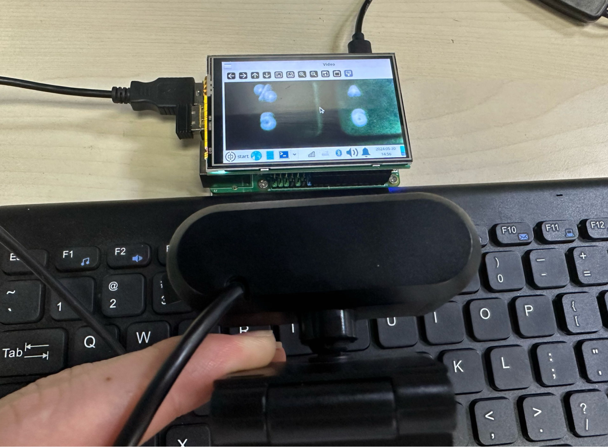
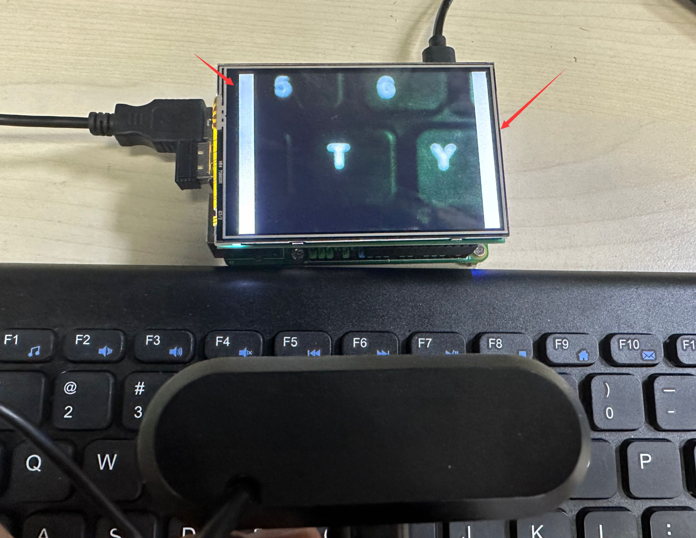

# Using an LCD

## WalnutPi 3.5-inch LCD

The WalnutPi official image provides a driver for the 3.5-inch LCD screen. After flashing the desktop system image and configuring startup, you can display the desktop via the LCD, enabling OpenCV visualization — such as real-time camera capture and display.

WalnutPi Official 3.5-inch LCD (Resistive Touch): [Click to view the usage tutorial](../os_software/3.5_LCD.md)

Simply run the USB camera code from the previous section directly:



You can achieve a borderless full-screen display with the following code:

```python
# Create a full-screen borderless window
cv2.namedWindow('Video', cv2.WND_PROP_FULLSCREEN)
cv2.setWindowProperty('Video', cv2.WND_PROP_FULLSCREEN, cv2.WINDOW_FULLSCREEN)
```

The complete reference code is as follows:
```python
'''
Experiment Name: Using a USB Camera (Full-Screen Display)
Experiment Platform: WalnutPi 1B
Description: Press the spacebar to exit
'''

import cv2

# Create a full-screen borderless window
cv2.namedWindow('Video', cv2.WND_PROP_FULLSCREEN)
cv2.setWindowProperty('Video', cv2.WND_PROP_FULLSCREEN, cv2.WINDOW_FULLSCREEN)

cam = cv2.VideoCapture(1) # Open the camera

while (cam.isOpened()): # Confirm it is opened
    
    retval, img = cam.read() # Read images from the camera in real time
    
    cv2.imshow("Video", img) # Display the captured images in a window
    
    key = cv2.waitKey(1) # The window image refresh interval is 1 millisecond to prevent blocking
    
    if key == 32: # If the spacebar is pressed, break out
        break
    
cam.release() # Close the camera
cv2.destroyAllWindows() # Destroy the window displaying the camera video

```

The result of running the code (borderless):



::::tip Note
The 1.54-inch LCD can also achieve the above operations. WalnutPi Official 1.54-inch LCD: [Click to view the usage tutorial](../os_software/1.54_LCD.md)
::::

