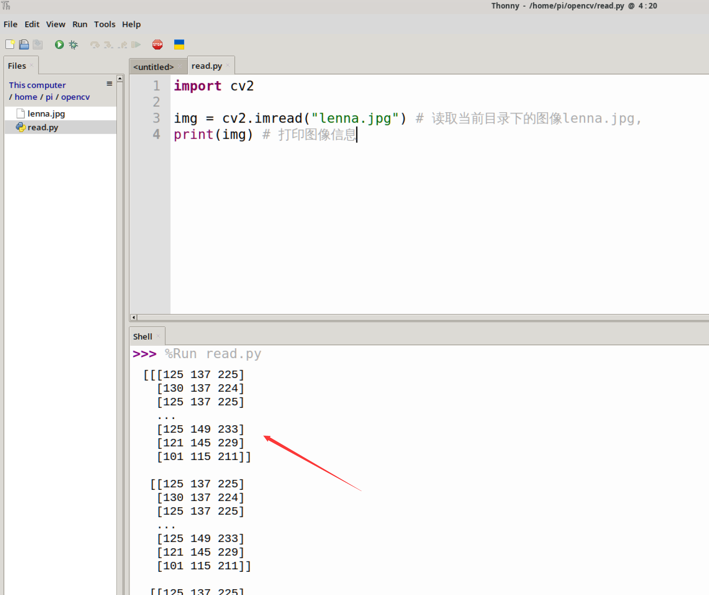
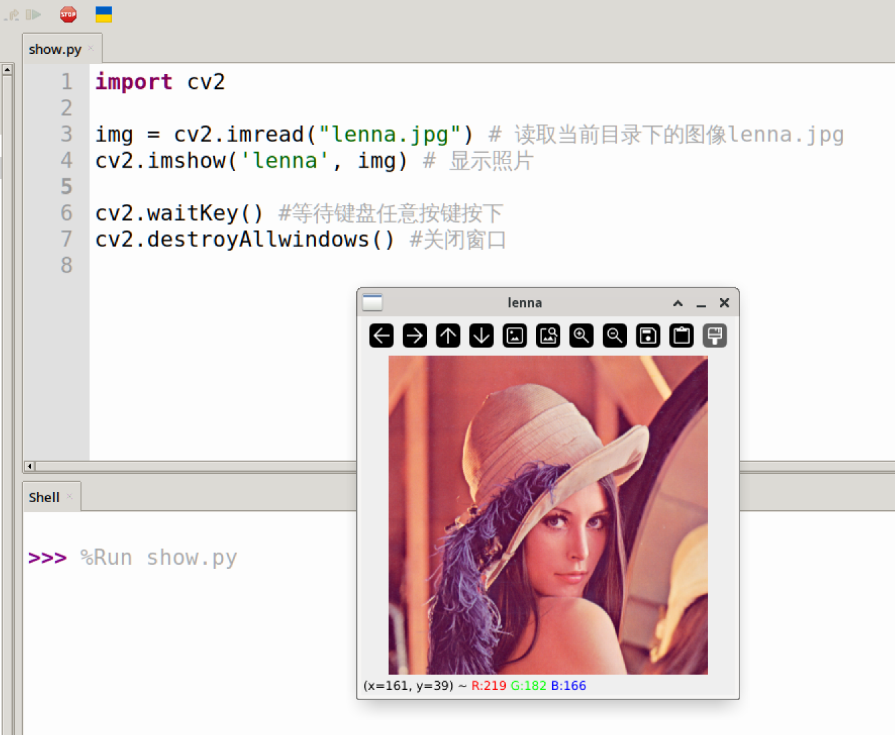
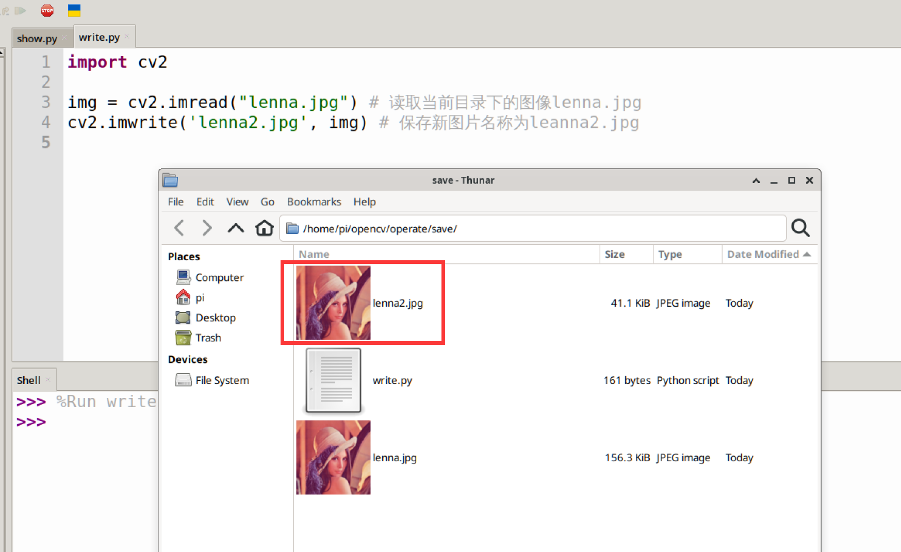
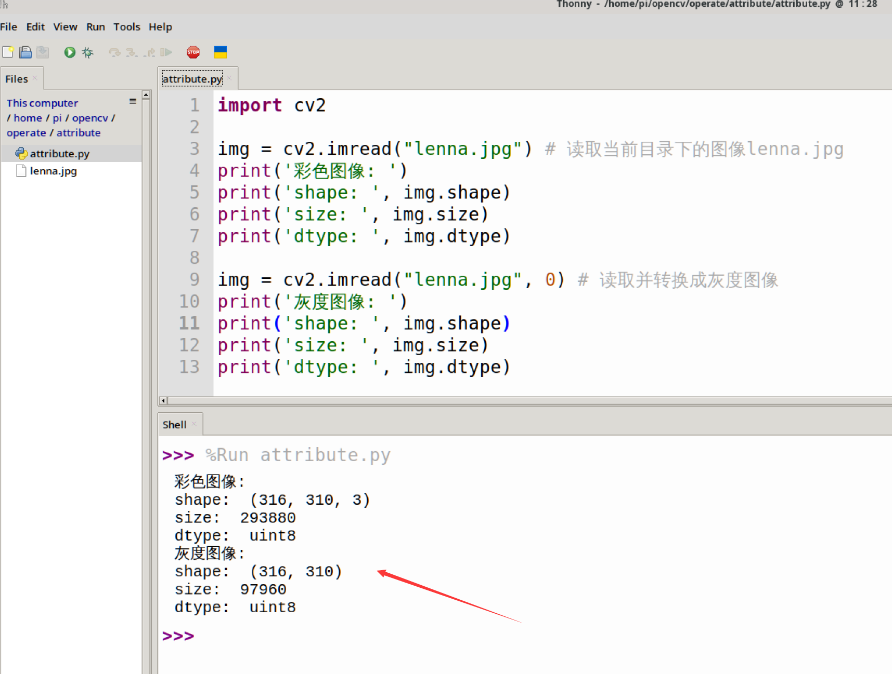

# Basic Image Operations

After successfully installing OpenCV on the WalnutPi in the previous section, this section will teach you how to implement some basic image operations using Python programming with the OpenCV library, such as: opening (reading) images, displaying images, saving images, and obtaining image property information.

## Reading Images

 

Using the OpenCV library to read an image is very simple — just use the `imread()` function. The function is described as follows:

### imread() Usage

```python
img = cv2.imread(filename, flags)
```
To read an image:
- `filename`: Image name (including path), does not support paths containing Chinese characters.
- `flags`: Color type. Default is `1`.
    - `1`: Color.
    - `0`: Grayscale image.

<br></br>

Reference code is as follows:

```python
'''
Experiment Name: Reading an Image
Experiment Platform: WalnutPi 1B
'''

import cv2

img = cv2.imread("lenna.jpg") # Read the image lenna.jpg from the current directory
print(img) # Print image information

```

Run the above code via the WalnutPi terminal or WalnutPi Thonny IDE, and you can see the image information printed out. **You can see that what is printed is the RGB value information of each pixel of the image, which will be explained in subsequent tutorials.**

 

## Displaying Images

Displaying images here refers to using the OpenCV library to show images, allowing for more intuitive observation of experimental results. This is frequently used in future experiments.

### imshow() Usage

```python
cv2.imshow(winname, mat)
```
To display an image:
- `winname`: Window name, does not support Chinese characters.
- `mat`: The image to be displayed.

<br></br>

Here we demonstrate reading the image `lenna.jpg` and then displaying it via `imshow()`. The reference code is as follows:

```python
'''
Experiment Name: Displaying an Image
Experiment Platform: WalnutPi 1B
'''
import cv2

img = cv2.imread("lenna.jpg") # Read the image lenna.jpg from the current directory
cv2.imshow('lenna', img) # Display the image

cv2.waitKey() # Wait for any keyboard key to be pressed
cv2.destroyAllWindows() # Close the window

```

The code execution result is as follows: a window named **lenna** pops up displaying the relevant image. Below the window are the x,y coordinates and RGB color values, which will be discussed in later chapters.

 

## Saving Images

To save a specified image, use the `imwrite()` method.

### imwrite() Usage

```python
cv2.imwrite(filename, img)
```
To save an image:
- `filename`: The path to save the image.
- `img`: The image to be saved.

<br></br>

Here we demonstrate reading the image `lenna.jpg` and then saving it as `lenna2.jpg`. The reference code is as follows:

```python
'''
Experiment Name: Saving an Image
Experiment Platform: WalnutPi 1B
'''

import cv2

img = cv2.imread("lenna.jpg") # Read the image lenna.jpg from the current directory
cv2.imwrite('lenna2.jpg', img) # Save a new image named lenna2.jpg

```

The code execution result is as follows: an additional image named `lenna2` appears in the current directory:

 

## Obtaining Image Property Information

We can view image information through image properties, commonly including size, resolution, color type, etc., as shown below.

 

All of this information can be obtained using OpenCV library functions. This can be done by directly operating on the image object returned by reading the image.

```python
img = cv2.imread("lenna.jpg") # Read the image lenna.jpg from the current directory

img.shape # Returns the image shape — an array of pixel columns, pixel rows, and number of channels (1 for grayscale images).

img.size  # Returns the number of image pixels, i.e.: pixel columns × pixel rows × number of channels

img.dtype # Image data type
```

<br></br>

Let's use the following code to obtain information about color and grayscale images:

```python
'''
Experiment Name: Obtaining Image Property Information
Experiment Platform: WalnutPi 1B
'''

import cv2

img = cv2.imread("lenna.jpg") # Read the image lenna.jpg from the current directory
print('Color image: ')
print('shape: ', img.shape)
print('size: ', img.size)
print('dtype: ', img.dtype)

img = cv2.imread("lenna.jpg", 0) # Read and convert to grayscale image
print('Grayscale image: ')
print('shape: ', img.shape)
print('size: ', img.size)
print('dtype: ', img.dtype)

```

Run the above code on the WalnutPi, and you can see the output results as follows:

 

A color image has 3 channels, i.e., RGB888. A grayscale image has only 1 channel.
