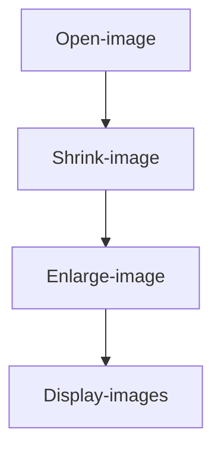
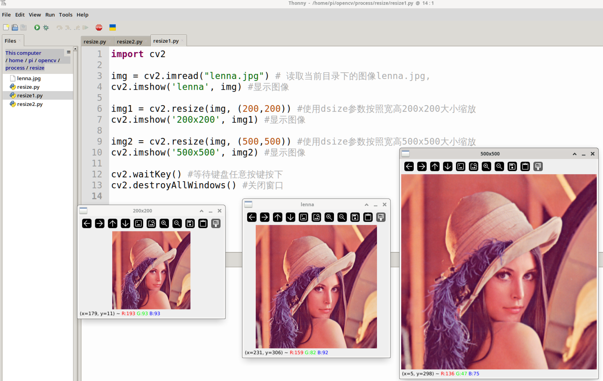
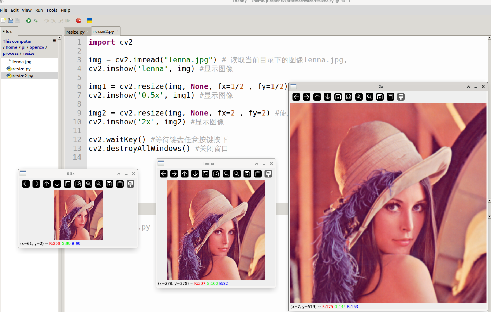

# Resize

## Introduction

This section teaches how to use OpenCV to resize images — i.e., shrinking and enlarging, which means changing the image size.

## Experiment Objective

Resize an image and display it.

## Experiment Explanation

The OpenCV Python library provides the `resize()` function for image resizing.

### resize() Usage

```python
img = cv2.resize(src, dsize, fx, fy, interpolation)
```

Image resizing.
- `src`: Original image.
- `dsize`: Size of the output image, format (width, height), in pixels.
- `fx`: Horizontal scaling factor (optional).
- `fy`: Vertical scaling factor (optional).
- `interpolation`: Pixel interpolation or decimation (optional); the default value is recommended.

In this section, we will shrink and enlarge the image and display them. The code flow is as follows:



<br></br>

The reference code is as follows:

**Resizing using the `dsize` parameter:**
```python
'''
Experiment Name: Image Resize (dsize parameter)
Experiment Platform: WalnutPi 1B
'''

import cv2

img = cv2.imread("lenna.jpg") # Read the image lenna.jpg from the current directory
cv2.imshow('lenna', img) # Display the image

img1 = cv2.resize(img, (200,200)) # Resize to 200×200 using the dsize parameter
cv2.imshow('200x200', img1) # Display the image

img2 = cv2.resize(img, (500,500)) # Resize to 500×500 using the dsize parameter
cv2.imshow('500x500', img2) # Display the image

cv2.waitKey() # Wait for any keyboard key to be pressed
cv2.destroyAllWindows() # Close the window

```

**Resizing using the `fx, fy` parameters:**
```python
'''
Experiment Name: Image Resize (fx, fy parameters)
Experiment Platform: WalnutPi 1B
'''

import cv2

img = cv2.imread("lenna.jpg") # Read the image lenna.jpg from the current directory
cv2.imshow('lenna', img) # Display the image

img1 = cv2.resize(img, None, fx=1/2 , fy=1/2) # Shrink the image to 1/2 using fx,fy parameters
cv2.imshow('0.5x', img1) # Display the image

img2 = cv2.resize(img, None, fx=2 , fy=2) # Enlarge the image by 2x using fx,fy parameters
cv2.imshow('2x', img2) # Display the image

cv2.waitKey() # Wait for any keyboard key to be pressed
cv2.destroyAllWindows() # Close the window

```

## Experiment Results

Run the above two codes on the WalnutPi separately; the experiment results are as shown below (multiple windows may overlap — use the mouse to drag them apart):

**Resize result using the `dsize` parameter:**


**Resize result using the `fx, fy` parameters:**

