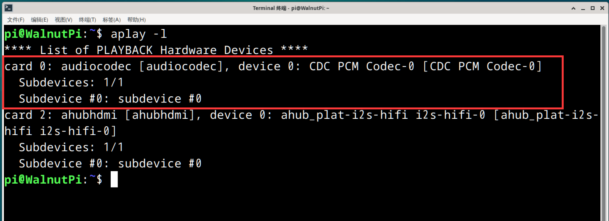
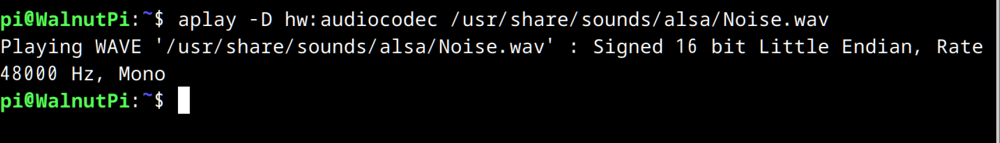
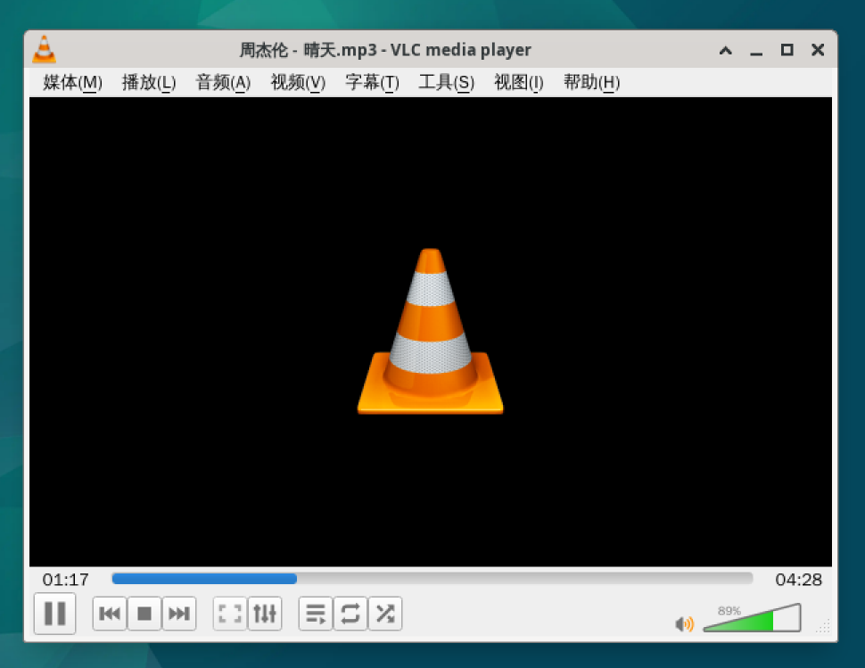
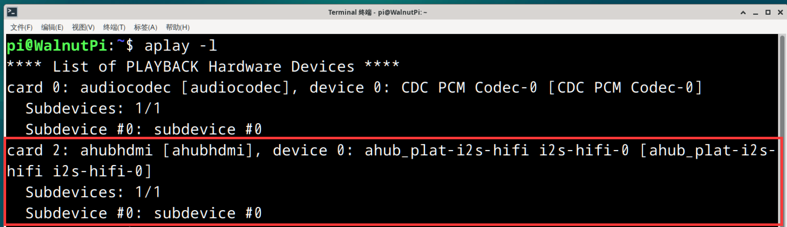
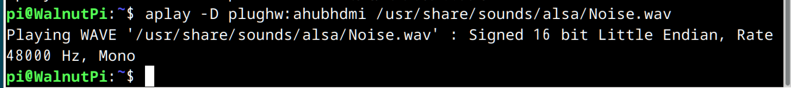
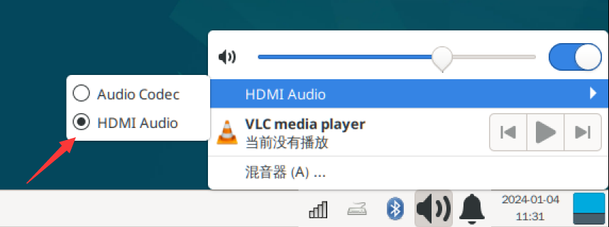

# Audio

## Headphone Jack

The WalnutPi has an onboard 3.5mm audio output jack with a certain amount of output power. You can use headphones or powered speakers to play sound.

### Checking Audio Devices

Use the following command to check audio information:

```bash
aplay -l
```



### Audio Playback Test

Play the system's built-in WAV audio file for testing. In the command below, **audiocodec** is the headphone jack device name found by the above command:

```bash
aplay -D hw:audiocodec /usr/share/sounds/alsa/Noise.wav
```



Connect headphones or speakers to the audio jack, and you should hear sound playing.

### Desktop Music Playback

You can directly use the pre-installed VLC media player on the desktop system to play audio.

First, copy the audio file to the WalnutPi via USB drive or SSH, then right-click and select **Open with VLC Media Player**:



## HDMI Audio

If your HDMI display has built-in speakers, you can test it by connecting to a Windows computer and checking if audio can be played through the HDMI display's audio output option.

::::tip Note
This feature requires system version v2.0.0 or above.
::::


### Checking Audio Devices

Use the following command to check HDMI audio information:

```bash
aplay -l
```



### Audio Playback Test

Play the system's built-in WAV audio file for testing. In the command below, **ahubhdmi** is the HDMI audio device name found by the above command: (**Note: this command uses [plughw], not [hw] as in the headphone jack command**)

```bash
aplay -D plughw:ahubhdmi /usr/share/sounds/alsa/Noise.wav
```




### Desktop Music Playback

You can directly use the pre-installed VLC media player on the desktop system to play audio. The WalnutPi system defaults to using the headphone jack for audio output. Simply switch to HDMI in the navigation bar at the bottom right to globally switch audio output for players, web browsers, etc.




First, copy the audio file to the WalnutPi via USB drive or SSH, then right-click and select **Open with VLC Media Player**:


