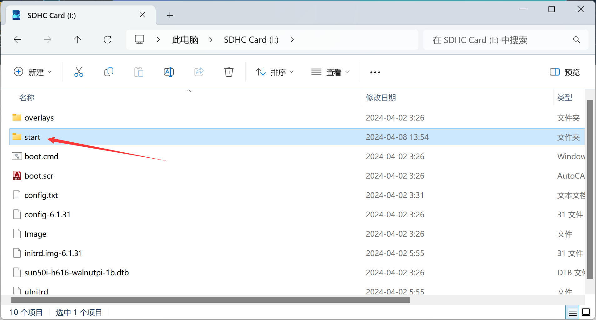
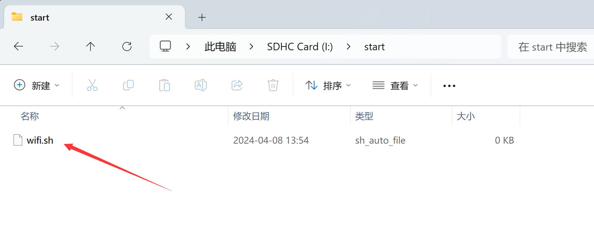
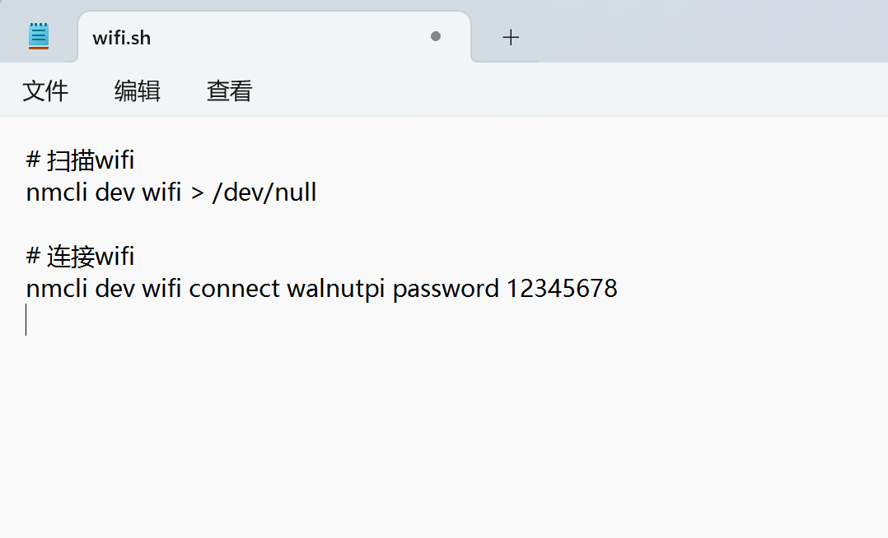
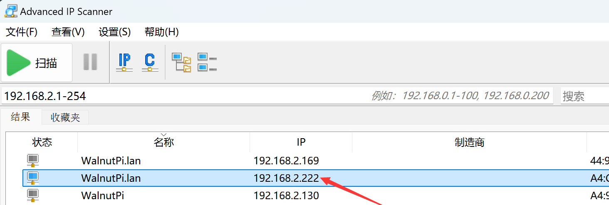
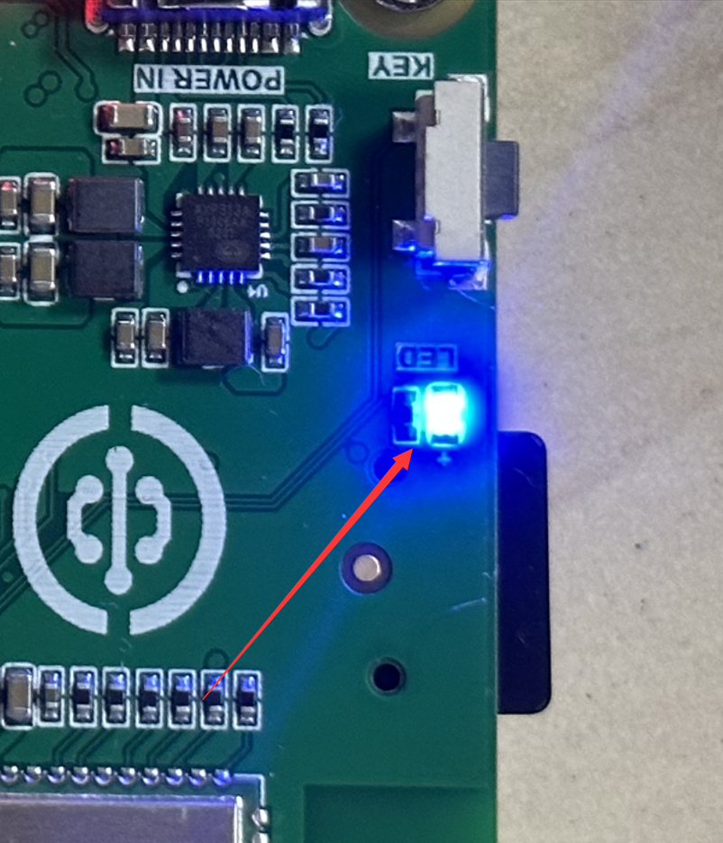

# Auto-Run Script on Boot

The WalnutPi official Debian system supports auto-running `.sh` files in a specified path on boot, requiring system version v2.2 or above [(System Version Check)](./os_intro.md#checking-system-version).

The path is `/boot/start`. Users can read the SD card on Windows or customize multiple sh files on the WalnutPi to execute various custom commands on boot. Below are some application examples:

## Auto-Connect to WiFi on Boot

After flashing the image, if you don't have an Ethernet cable or a USB TTL serial tool, you can use this feature to let the WalnutPi automatically connect to WiFi, then obtain the WalnutPi's IP address through the router or a WiFi scanning tool to enable SSH remote terminal. (The WalnutPi system comes with a wifi.sh file by default.)

Create a file under the `/boot/start` path with a name ending in .sh, such as wifi.sh.






Fill in the following content: replace `walnutpi` and `12345678` with your home or office WiFi SSID and password. Both 2.4G and 5G signals are supported.
```
# Scan WiFi
nmcli dev wifi > /dev/null

# Connect to WiFi
nmcli dev wifi connect walnutpi password 12345678
```



Insert the SD card into the WalnutPi. After booting, the wifi.sh script will be executed automatically, connecting to the specified WiFi.

Download an IP scanning tool from: https://www.advanced-ip-scanner.com/,


After installation, within the same LAN (usually under the same router), you can scan for the WalnutPi's IP address.




You can then wirelessly log in to the WalnutPi via SSH remote terminal: [SSH Remote Terminal Tutorial](./ssh.md)

## Auto-Run Python Code on Boot

This feature also allows you to automatically run your pre-written Python scripts on power-up.

Let's write a test Python program using the onboard LED blinking effect as a demonstration.

```python
'''
Experiment Name: LED Blinking
Experiment Platform: WalnutPi
'''

# Import relevant modules
import board,time
from digitalio import DigitalInOut, Direction

# Build LED object and initialize
led = DigitalInOut(board.LED) # Define pin number
led.direction = Direction.OUTPUT  # IO as output

while True:

    led.value = 1 # Output high level, turn on onboard blue LED
    
    time.sleep(0.5)
    
    led.value = 0 # Output low level, turn off onboard blue LED
    
    time.sleep(0.5)

```

Save the above code as **led_blink.py** and place it in the WalnutPi /home/pi directory for testing. You can transfer it using Thonny or copy it directly to that directory using a USB drive.

Then create a python.sh file in the /boot/start/ directory with the following content (indicating to run the led_blink.py file):

::::tip Note
Adding **&** at the end of the command indicates running in a new thread, preventing Python programs with infinite loops from blocking the startup of other system services.
::::

```
sudo python /home/pi/led_blink.py &
```


Insert the SD card into the WalnutPi board and start the system, or reboot the board. You will see the blue LED blinking after the WalnutPi starts, indicating the Python code has run successfully on boot.


