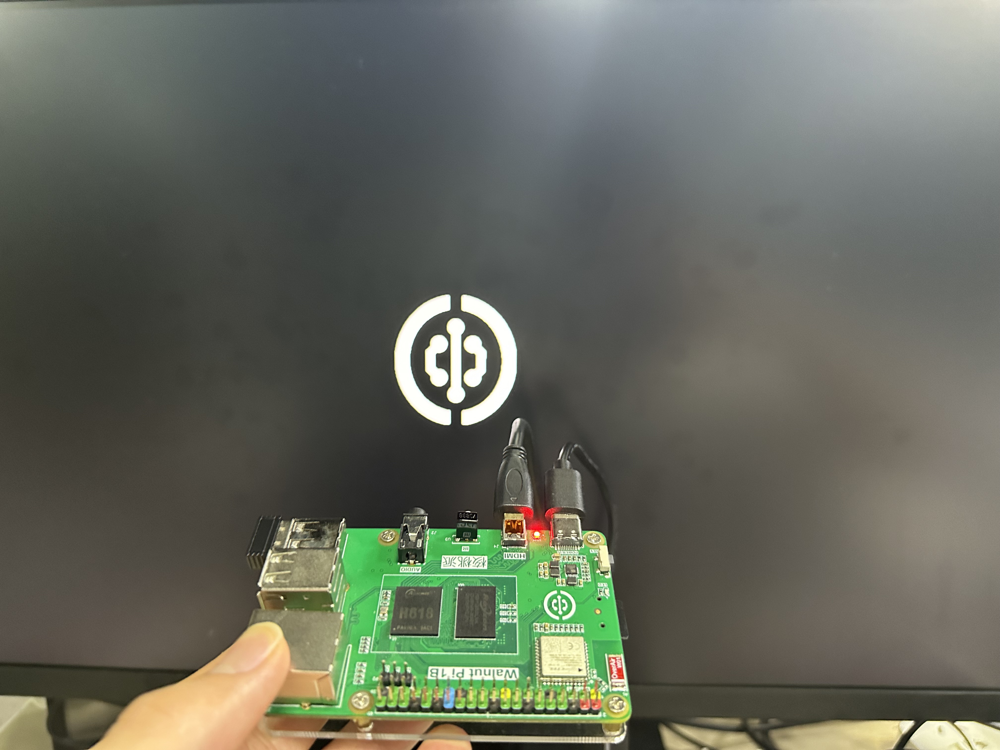

# Boot LOGO

- **Video Tutorial**

<iframe src="//player.bilibili.com/player.html?isOutside=true&aid=1102857888&bvid=BV1uA4m1F7zy&cid=1510987131&p=1" scrolling="no" border="0" frameborder="no" framespacing="0" allowfullscreen="true" width="100%" height="500"></iframe>

<br></br>
<br></br>

The WalnutPi official Debian system supports boot LOGO customization, requiring system version v2.2 or above [(System Version Check)](./os_intro.md#checking-system-version). Configuration steps are as follows:

Edit the config.txt file. Refer to: [config.txt](./config.txt.md). Change the following variable to `true`:

```
bootlogo = true
```

Replace the logo image with your own, using `png` format. By default, it displays without scaling.

```
/usr/share/plymouth/themes/walnutpi/logo.png
```

After configuration, execute the following command to activate:

```
sudo update-initramfs -u
```

Restart the board:

```
sudo reboot
```

You will then see the boot LOGO. **Effective on WalnutPi HDMI, 3.5-inch LCD, and 1.54-inch LCD.**



::::tip Note
For advanced usage such as auto-scaling, adjusting display position, and animation effects, you can edit this script:
```
/usr/share/plymouth/themes/walnutpi/walnutpi.script
```
For syntax documentation of this script file, see:
 https://www.freedesktop.org/wiki/Software/Plymouth/Scripts/
::::
