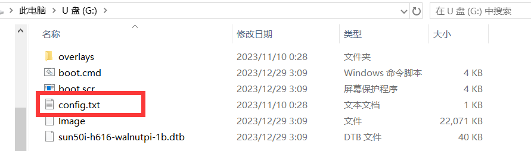

# config.txt

**config.txt is primarily used to configure certain features of the WalnutPi.**

The SD card has two partitions. config.txt is stored in the first partition. On the WalnutPi board, config.txt can be accessed under the `/boot` path. If you use a card reader to read the SD card on a Windows computer, the system will report SD card corruption for partition 2 (which is in ext4 format, unrecognized by Windows). Please ignore this warning.




## Boot LOGO

Disabled by default. For enabling and usage, refer to: [Boot LOGO](./boot_logo.md).
```
bootlogo = false
```

## Enable Console Terminal on Display (HDMI or LCD)

`console_display` is enabled by default. If disabled, after boot messages finish, there will no longer be a terminal prompting for username and password or accepting command input.

Typical application scenario: You have written a Qt program displayed on fb and set it to auto-start on boot. If the terminal on the display is not disabled, all keyboard input will be received by both the Qt window and the terminal. Additionally, the terminal may output content onto the display.

- Enable
```
console_display=enable
```
- Disable
```
console_display=disable
```

## Set Serial Terminal Location

`console_uart` defaults to uart0 as the serial terminal. It can be set to other serial ports.

U-Boot information is always output from uart0.

- Set to UART2
```
console_uart=uart2
```


## Output Boot Messages on Display

`display_bootinfo` defaults to enabled. If disabled, the boot messages will not be output to the display.

- Enable
```
display_bootinfo=enable
```
- Disable
```
display_bootinfo=disable
```

## Kernel Log Output Level

`printk_level` defaults to 3. Driver output messages come with a level number. If the number is lower than this variable's value, it will be output directly to the terminal.

| Number | Meaning |
| - | - |
| 0 | System Unusable |
| 1 | Action Required Immediately |
| 2 | Emergency |
| 3 | Error |
| 4 | Warning |
| 5 | Normal but Important |
| 6 | Informational |
| 7 | Debug Information |


## Enable Device Tree Overlays

`overlay_prefix` specifies the prefix of the device tree files. The default is `sun50i-h616`.

`overlays` indicates which device tree overlays the Linux kernel will enable during boot. For example, when overlays=spi1, the system will load the sun50i-h616-spi1.dtbo device tree file from the /boot/overlays path.

We provide a set-device command that scans all device tree files under the /boot/overlays path and allows enabling or disabling them with a single command ---> [set-device](../gpio/gpio_config)
