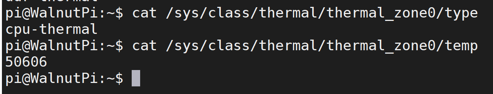
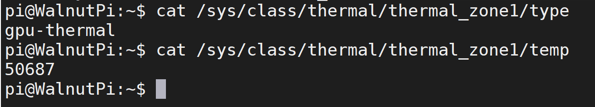
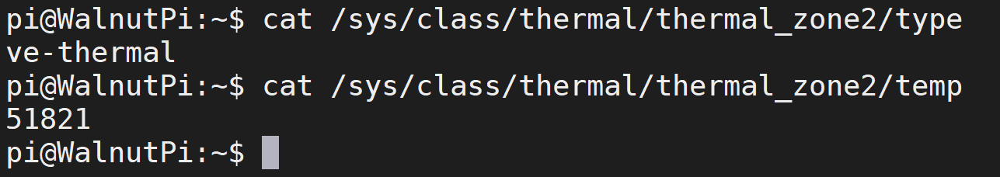
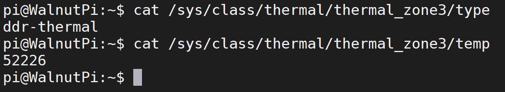

# CPU Temperature Information

The WalnutPi 1B's H616/H618 SoC features 4 built-in temperature sensors:

- `sensor0`: CPU Temperature
- `sensor1`: GPU Temperature
- `sensor2`: VE (Video Encoding) Temperature
- `sensor3`: DDR Temperature

::::tip Note
The temperature values obtained from the commands below need to be divided by 1000.
::::

## CPU Temperature

Command to check sensor type:

```bash
cat /sys/class/thermal/thermal_zone0/type
```

Command to check temperature:

```bash
cat /sys/class/thermal/thermal_zone0/temp
```



## GPU Temperature

Command to check sensor type:

```bash
cat /sys/class/thermal/thermal_zone1/type
```

Command to check temperature:

```bash
cat /sys/class/thermal/thermal_zone1/temp
```



## VE (Video Encoding) Temperature

Command to check sensor type:

```bash
cat /sys/class/thermal/thermal_zone2/type
```

Command to check temperature:

```bash
cat /sys/class/thermal/thermal_zone2/temp
```



## DDR Temperature

Command to check sensor type:

```bash
cat /sys/class/thermal/thermal_zone3/type
```

Command to check temperature:

```bash
cat /sys/class/thermal/thermal_zone3/temp
```


