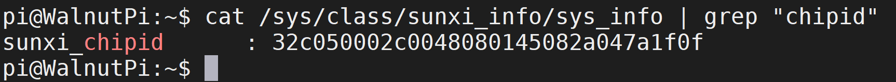

# SoC Chip ID

The WalnutPi 1B uses the Allwinner H616/H618 SoC. Each chip has a unique chipid. Users can obtain the chipid using the following command to distinguish different boards.

```bash
cat /sys/class/sunxi_info/sys_info | grep "chipid"
```


