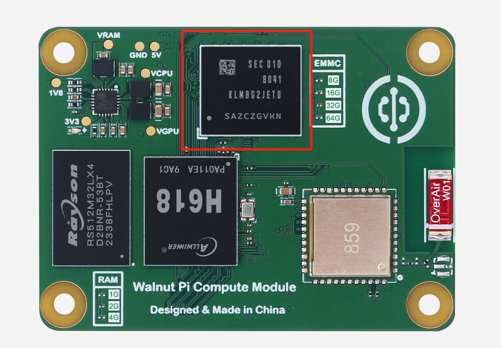
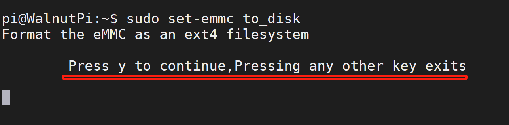
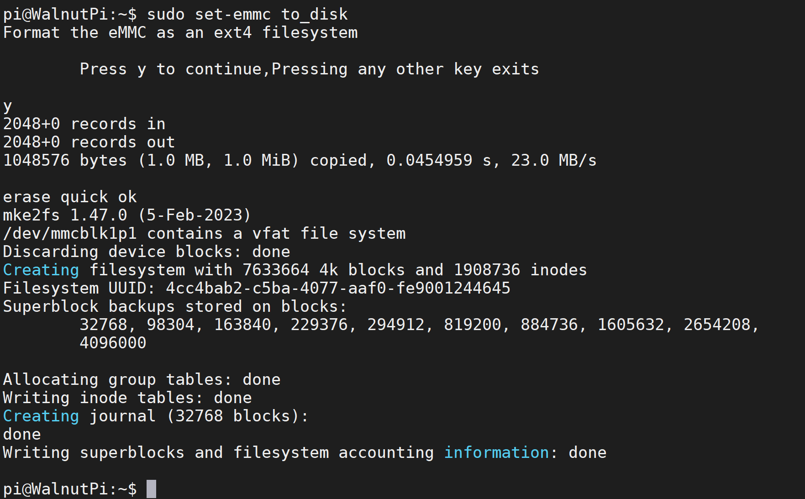
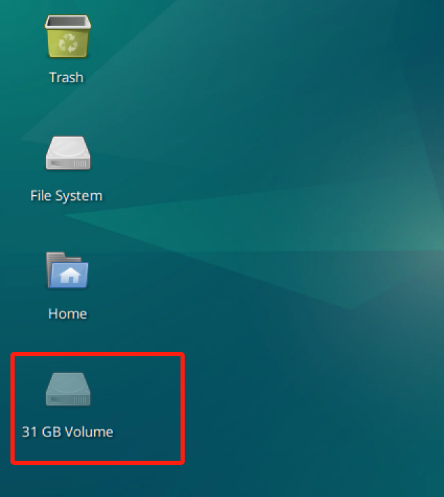

# EMMC Flash Storage

::::tip Note
This feature is only available in WalnutPi Gen 1 images V2.5.0 and above.
::::

The WalnutPi 2B can be configured with an EMMC flash storage version, with a default capacity of 32GB. The transfer speed is much faster than an SD card. It can be used to install the WalnutPi system or as a storage drive.



## EMMC as System Boot Drive

Flash the WalnutPi OS to EMMC and boot from it. Refer to: [EMMC Image Flashing Method](../getting_start/os-install.md#emmc-flashing)

## EMMC as a Storage Drive

When the WalnutPi 2B boots from an SD card, you can set the EMMC to be used as a storage drive, effectively giving you a 32GB hard drive.

The WalnutPi system includes a quick setup command:

```bash
sudo set-emmc to_disk
```

::::danger Warning
This command configures the EMMC as a disk drive. It will format the EMMC and erase all content. Please back up important files beforehand.
::::

After running, a prompt will appear. Press "y" to continue:



A successful setup looks like the following:



You will see a ~32GB drive appear on the desktop.



Double-click to mount and use it. A prompt will ask for the password, which is the system password, i.e., `pi`.


## EMMC Formatting

Quick format (recommended):

```bash
sudo set-emmc erase-quick
```

Full format (will be very slow):

```bash
sudo set-emmc erase-overwrite
```
