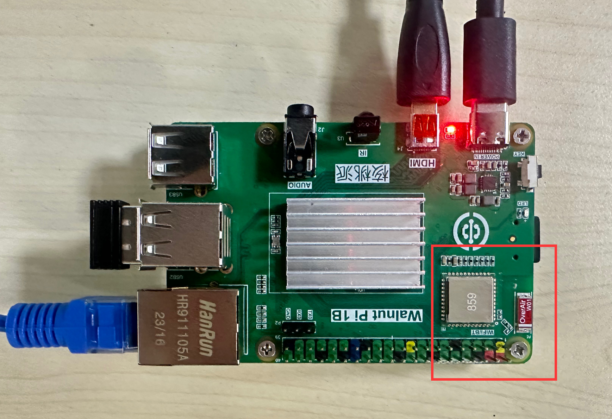
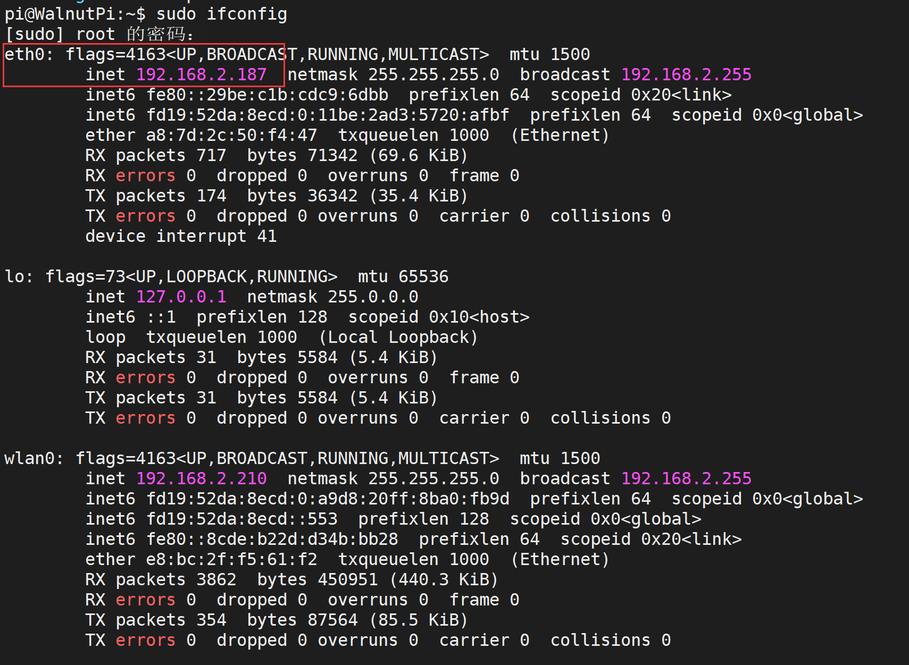

# Obtaining IP Address

## WiFi IP Address

WiFi module hardware location. Connect wirelessly to a router via WiFi (supports 2.4G and 5G signals):



Use the following command to get all network IP addresses of the WalnutPi. **wlan0** is the WiFi card name. Once connected, you can see its IP address.

```bash
sudo ifconfig
```


## Ethernet IP Address

Ethernet module hardware location. Connect to a router via an Ethernet cable:


Use the following command to get all network IP addresses of the WalnutPi. **eth0** is the Ethernet card name. Once connected, you can see its IP address.

```bash
sudo ifconfig
```


