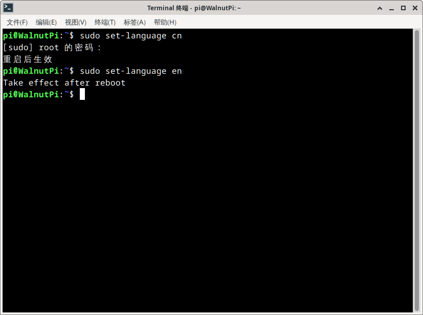

# System Language

- **Video Tutorial**

<iframe src="//player.bilibili.com/player.html?isOutside=true&aid=1553503974&bvid=BV1z142197kt&cid=1517260775&p=1" scrolling="no" border="0" frameborder="no" framespacing="0" allowfullscreen="true" width="100%" height="500"></iframe>

<br></br>
<br></br>


The WalnutPi system supports switching the operating system language via terminal commands, currently supporting Chinese and English. **The first switch may take a little longer, about tens of seconds. Please be patient.** After configuration, restart the WalnutPi for the change to take effect:

- Switch to Chinese:

```bash
sudo set-language cn
```

- Switch to English:

```bash
sudo set-language en
```


