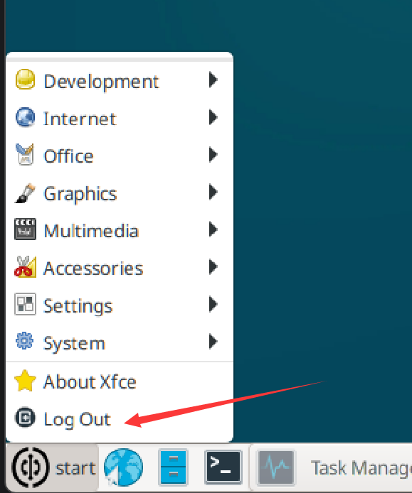
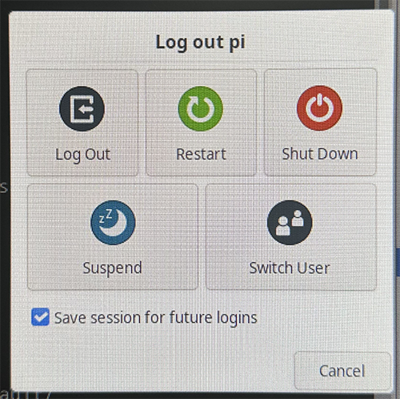

# Shutdown and Restart

The WalnutPi runs an operating system. Unlike regular microcontroller boards that can simply be powered off, to protect the board, it is recommended to use the **Log Out** function in the menu bar and choose Shut Down or Restart from the dialog box. This avoids the risk of sudden power loss damaging the operating system or causing file loss.



**Shut Down** to power off, **Restart** to reboot.



You can also shut down or restart using commands:

- Shutdown
```bash
sudo poweroff
```

- Restart
```bash
sudo reboot
```
