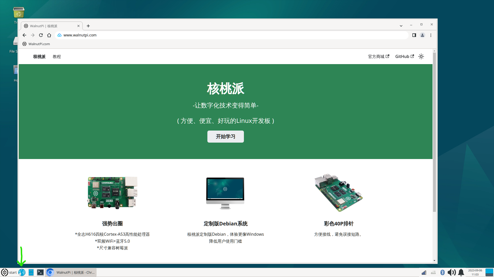
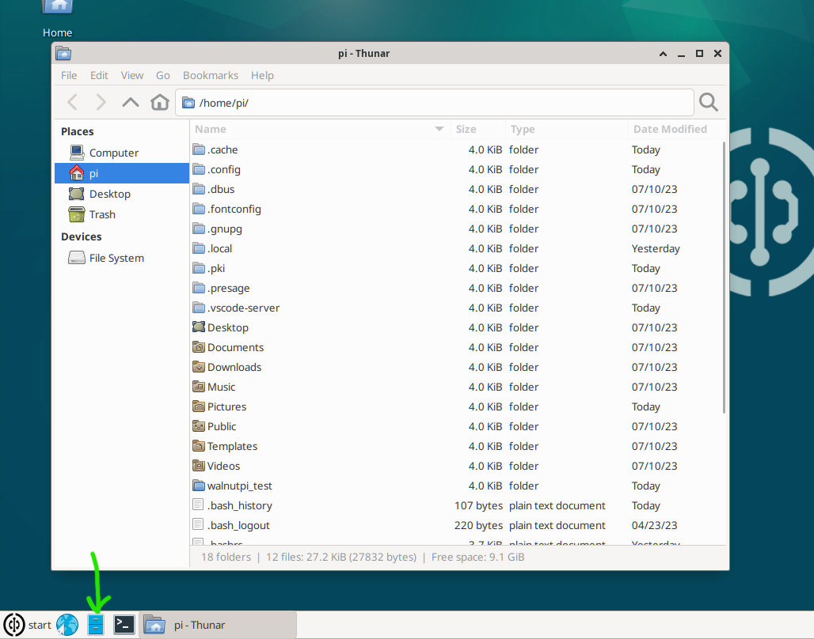
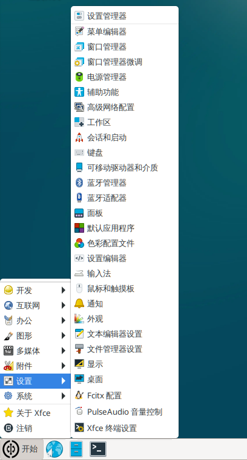
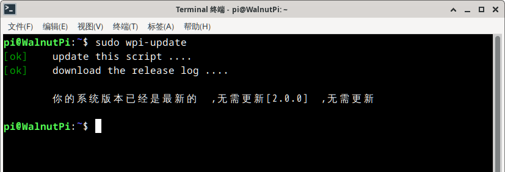

# System Introduction

In the previous chapter, we completed booting up the WalnutPi and logging into the system. The main difference between the desktop and non-desktop versions of WalnutPi: simply put, the non-desktop version is the desktop version with the desktop environment removed. Therefore, standard Linux commands and configuration instructions are generally applicable to both systems.

::::tip Note

The first startup of the WalnutPi desktop system takes a relatively long time (approximately a few minutes) due to software initialization. Please be patient and wait for the desktop to appear. Subsequent startups will be much faster, taking about tens of seconds.

:::: 

<br></br>

- `Regular User (default)` Username: pi ; Password: pi
- `Administrator Account` Username: root ; Password: root

## Desktop Features
The WalnutPi Debian system has been customized to make it similar to Windows, reducing the learning curve for users. Below is an overview of the desktop features.


**<font color='#06fe00' size='4'>A&nbsp;</font>** **<font size='4'>Trash</font>** &nbsp;&nbsp;&nbsp;&nbsp;&nbsp;&nbsp;
**<font color='#06fe00' size='4'>B&nbsp;</font>** **<font size='4'>File System</font>** &nbsp;&nbsp;&nbsp;&nbsp;&nbsp;&nbsp; 
**<font color='#06fe00' size='4'>C&nbsp;</font>** **<font size='4'>Current User Files</font>** &nbsp;&nbsp;&nbsp;&nbsp;&nbsp;&nbsp; 
**<font color='#06fe00' size='4'>D&nbsp;</font>** **<font size='4'>Menu Bar</font>** &nbsp;&nbsp;&nbsp;&nbsp;&nbsp;&nbsp; 

**<font color='#06fe00' size='4'>E&nbsp;</font>** **<font size='4'>Launch Bar:</font>** <font size='4'>From left to right: **Browser, File Manager, Terminal**</font>

**<font color='#06fe00' size='4'>F&nbsp;</font>** **<font size='4'>System Tray:</font>** <font size='4'>From left to right: **Network, Input Method, Bluetooth, Sound, Notifications, Date & Time, Quick Desktop**</font>

## Browser
The WalnutPi system comes pre-installed with Chromium (the mini version of Google Chrome), located at the first position in the Launch Bar. It functions just like the browser on your regular computer.



## File Manager
The File Manager is located at the second position in the Launch Bar. Opening it allows you to view WalnutPi-related files, all of which are stored on the SD card.



## System Settings
System Settings is located in the Start Menu. You can configure various features of the WalnutPi system according to your needs.



## Checking System Version

You can check the current WalnutPi system version information with the following command:

```bash
cat /etc/WalnutPi-release
```


## Online System Upgrade (OTA)

You can obtain upgrade packages from the WalnutPi cloud server via commands to achieve remote system upgrades, eliminating the need to re-flash the image every time.

::::danger Warning:
This feature is only available for system versions **v2.0.0** and above. Before using the online upgrade feature, be sure to back up important data to avoid data loss in case of issues during the upgrade process.
::::

Online upgrade command:

```bash
sudo wpi-update
```


