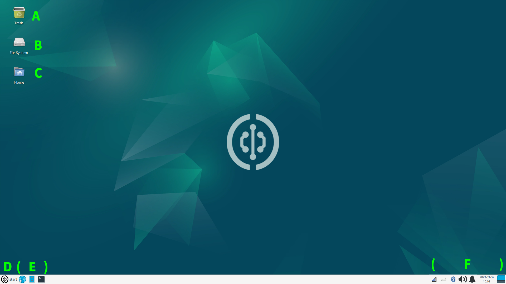
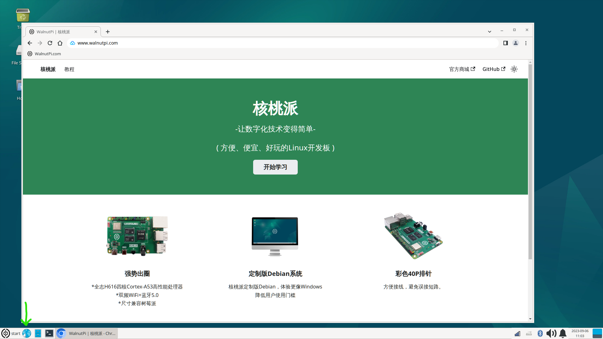
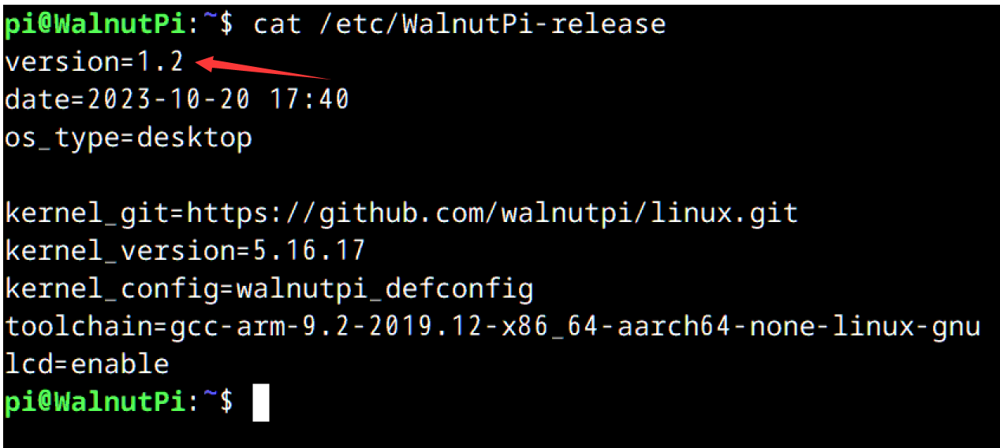

# 系统简介

在上一章我们完成了核桃派开机并登录了系统，核桃派带桌面版和无桌面版系统主要区别:可以简单将无桌面版理解成是带桌面版去掉了桌面后的系统。因此Linux标准命令和配置指令在两个系统下基本都通用。

:::tip 提示

核桃派桌面系统首次启动由于需要初始化软件等，耗时比较长，大约几分钟，需要耐心等待系统桌面显示出来。以后再次启动速度会快很多，大约几十秒。

::: 

<br></br>

- `普通用户（默认）` 账号：pi ; 密码：pi
- `管理员账户` 账号：root ; 密码：root

## 桌面功能
核桃派Debian系统经过定制修改，目的是做成跟Windows接近，降低用户的使用门槛。以下是桌面功能说明。



**<font color='#06fe00' size='4'>A&nbsp;</font>** **<font size='4'>回收站</font>** &nbsp;&nbsp;&nbsp;&nbsp;&nbsp;&nbsp;
**<font color='#06fe00' size='4'>B&nbsp;</font>** **<font size='4'>文件系统</font>** &nbsp;&nbsp;&nbsp;&nbsp;&nbsp;&nbsp; 
**<font color='#06fe00' size='4'>C&nbsp;</font>** **<font size='4'>当前用户文件</font>** &nbsp;&nbsp;&nbsp;&nbsp;&nbsp;&nbsp; 
**<font color='#06fe00' size='4'>D&nbsp;</font>** **<font size='4'>菜单栏</font>** &nbsp;&nbsp;&nbsp;&nbsp;&nbsp;&nbsp; 

**<font color='#06fe00' size='4'>E&nbsp;</font>** **<font size='4'>启动栏：</font>** <font size='4'>从左往右依次是**浏览器、文件管理器、终端**</font>

**<font color='#06fe00' size='4'>F&nbsp;</font>** **<font size='4'>系统托盘：</font>** <font size='4'>从左往右依次是**网络、输入法、蓝牙、声音、通知、日期时间、快速桌面**</font>

## 浏览器
核桃派系统预装了谷歌浏览器迷你版Chromium, 位于启动栏第1项，使用方法跟我们平时电脑浏览器没什么区别。



## 文件管理
文件管理位于启动栏第2项，打开后可以看到核桃派相关文件，这些文件都是存放在SD卡里。


## 系统设置
系统设置位于开始菜单栏，用户可以根据自己需要配置核桃派系统各项功能。


## 系统版本查询

可以通过下面指令查询当前核桃派系统版本信息：

```bash
cat /etc/WalnutPi-release
```



## 系统在线升级（OTA）

可通过指令从核桃派云服务器获取升级包，实现系统远程升级，无需每次重烧镜像。

:::danger 警告：
此功能在系统版本**v2.0.0**以上才有，使用在线升级功能前务必先备份好重要资料，避免升级过程出现问题导致资料丢失。
:::

在线升级指令：

```bash
sudo wpi-update
```


