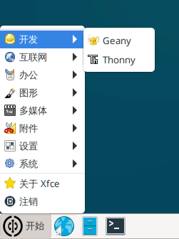
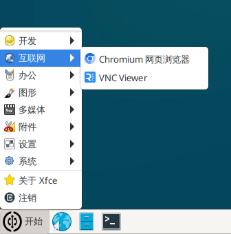
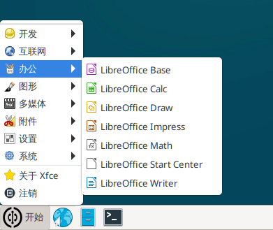
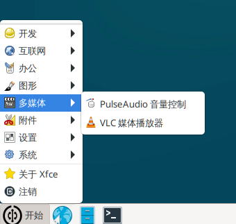
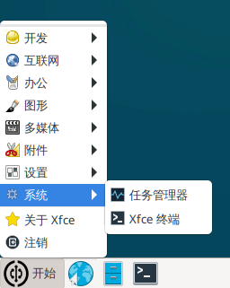
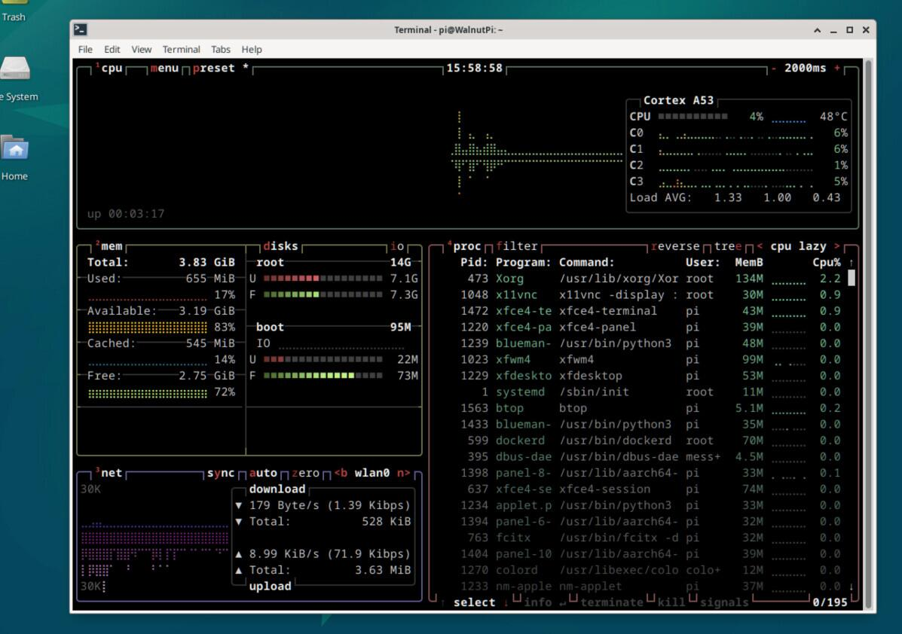

# Pre-installed Software

The WalnutPi system comes pre-installed with some applications for user convenience. This section briefly introduces the relevant software. Applications are located in the Start Menu.

## Programming & Development



### Geany
Geany is a compact integrated development environment and free open-source software. WalnutPi's C programming tutorials will use Geany.

### Thonny
Thonny is a lightweight Python IDE, primarily used for Python programming and development. The WalnutPi Python embedded programming content mainly uses Thonny. Thonny can also be used to develop for MicroPython hardware (pyboard, ESP32, etc.) connected to the WalnutPi.

## Internet



### Chromium Browser
A mini version of Google Chrome for web browsing, and the default browser of the WalnutPi system.

### VNC Viewer
A VNC client that can remotely connect to the desktop of a computer running a VNC server.

## Office



### LibreOffice
An open-source office suite that can open and edit Word, Excel, PPT, and other related files on Linux systems.


## Graphics


### Ristretto Image Viewer
Ristretto Image Viewer can be used to open common jpg and png files.

## Multimedia



### PulseAudio Volume Control
Adjusts the volume of the 3.5mm audio output jack.

### VLC Media Player
Used to play MP3, MP4, and other multimedia files.


## Accessories


### Screenshot
Screenshot software.

### Mousepad Text
A lightweight text editor.

### Galculator
Calculator.

## System



### Task Manager
View system CPU and memory usage as well as running processes.

### Xfce Terminal
The default terminal of the WalnutPi system.

### btop

Starting from WalnutPi OS v2.4.0, the btop system monitoring tool has been added. Compared to the Task Manager, it provides more complete system information and can be used on both desktop and non-desktop systems.

Desktop system command:

```bash
btop
```

Server (non-desktop) system command:

```bash
btop --utf-force
```


