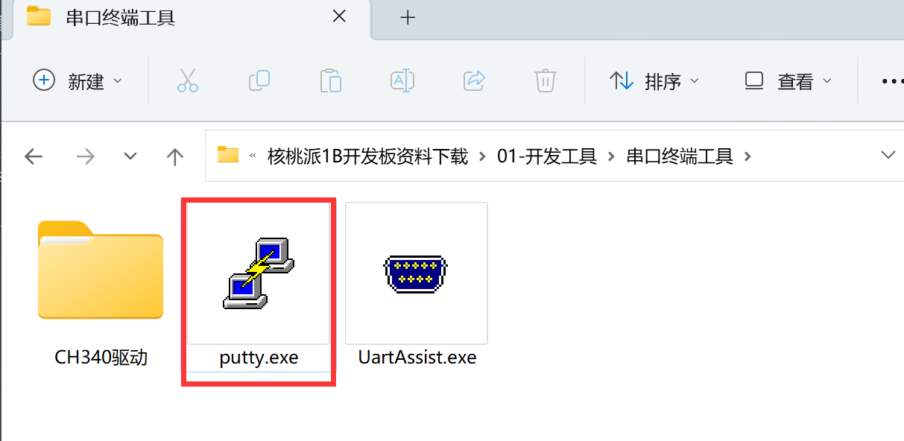
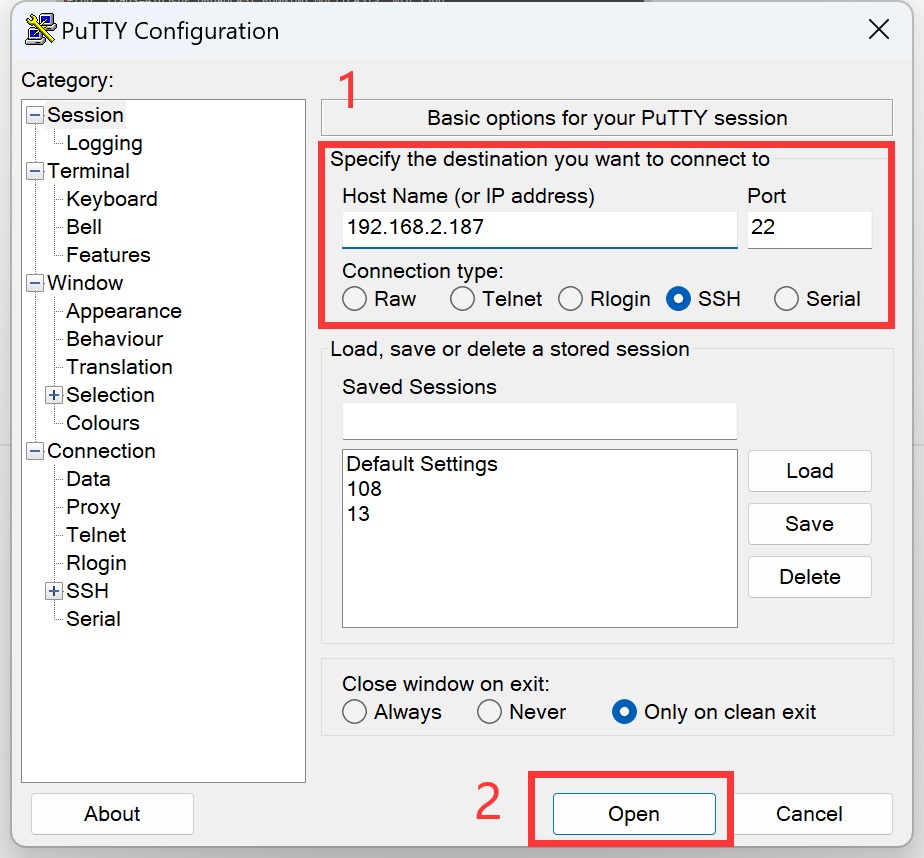
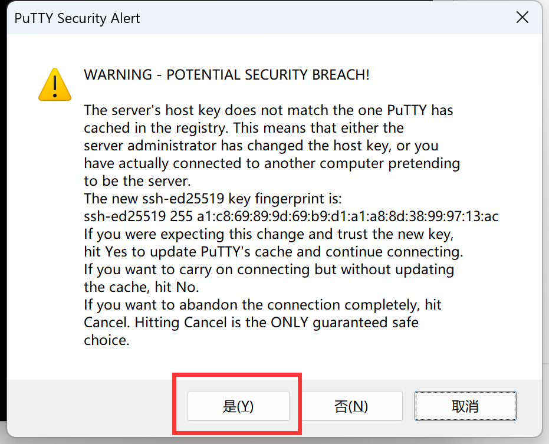
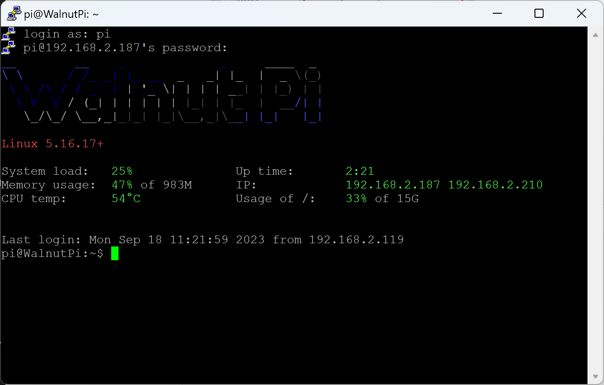

# SSH Remote Terminal

Users familiar with command-line operations can control the networked WalnutPi via LAN SSH remote terminal, allowing convenient use of their own PC to remotely execute various commands on the WalnutPi.

- `Regular User (default)` Username: pi ; Password: pi
- `Administrator Account` Username: root ; Password: root

Before this, you need to connect the WalnutPi to the router via **Ethernet cable** or WiFi (refer to the next section [WiFi Connection](../os_software/wifi)). Ensure that the WalnutPi and your computer are on the same subnet (typically connected to the same router).

First, obtain the WalnutPi's current IP address using an HDMI display or serial connection with the following command:

```bash
sudo ifconfig
```
eth0 represents the Ethernet interface, and wlan0 represents the WiFi connection. Once connected, the IP address will appear below.


This example uses the PuTTY software (you can use any other software with SSH functionality):



Select SSH, then enter the WalnutPi's IP address. The default port is 22.



When the trust prompt appears, simply select Yes.



Then a username and password prompt will appear. Enter "pi" for both the regular user account and password. After successful login, the WalnutPi terminal information will be displayed.


