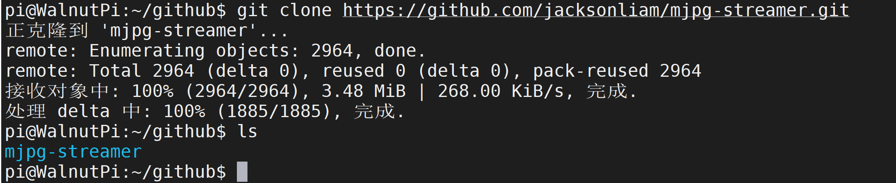
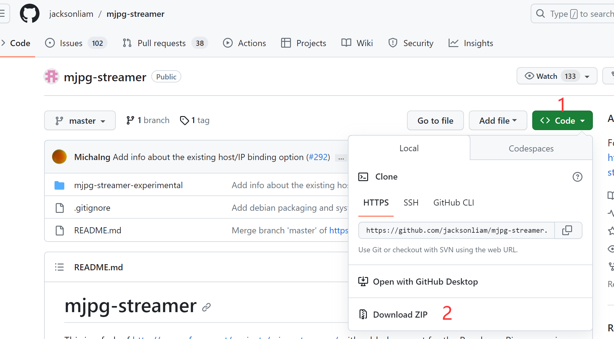
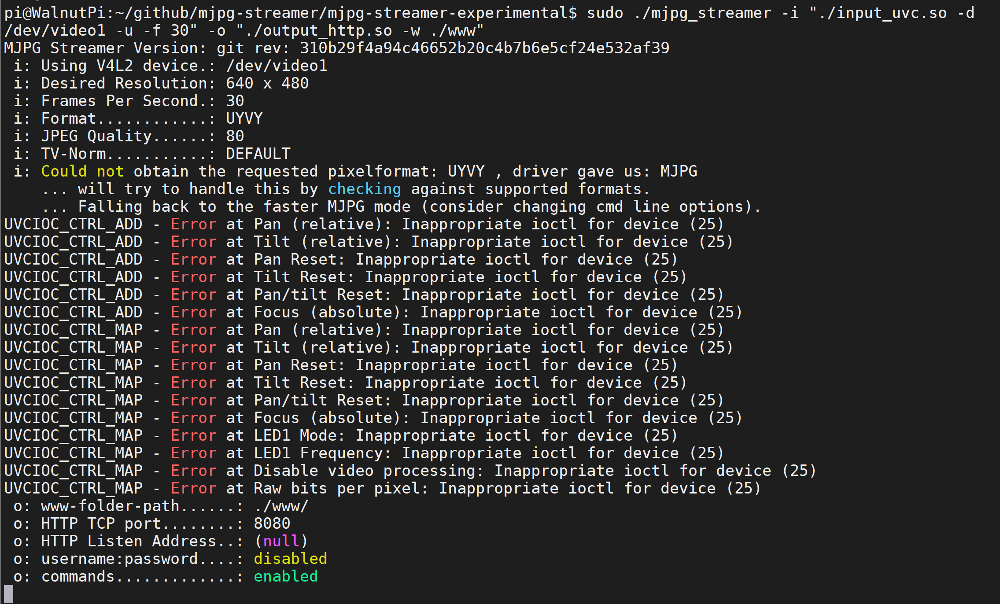

# USB Camera

The WalnutPi system has built-in USB camera drivers. Most USB cameras on the market are supported. The following model is used in this guide:


Simply plug it into one of the WalnutPi's USB ports.


## Getting Device Information

First, use v4l2-ctl to view the current USB camera device information. You need to install v4l. Most WalnutPi software can be installed via `sudo apt install`:

```bash
sudo apt install v4l-utils
```

After installation, run the following command to view the inserted USB camera information:

```bash
v4l2-ctl --list-devices
```

You can see that this camera has multiple video devices, usually the first one. Here it is: video1

 

## Testing with mjpg-streamer

### Download the Project

Project URL: https://github.com/jacksonliam/mjpg-streamer

Here we use git to download, making future updates easier.

```bash
git clone https://github.com/jacksonliam/mjpg-streamer.git
```

 

::::tip Note

If you don't have access to GitHub, you can open the project URL in a browser, click **Code -- Download Zip** to download the project files, then copy them to the WalnutPi.

::::
 

Also install the required dependencies:

```bash
sudo apt install -y cmake libjpeg62-turbo-dev
```

### Compile and Install

Next, execute the following commands to compile and install mjpg-streamer:

```bash
cd mjpg-streamer/mjpg-streamer-experimental
```

```bash
make -j4
```

```bash
sudo make install
```

### Start Testing

After installation, enter the following command to start mjpg_streamer. Note that we use video1 here; adjust according to your actual device number.

```bash
export LD_LIBRARY_PATH=.
```

```bash
sudo ./mjpg_streamer -i "./input_uvc.so -d /dev/video1 -u -f 30" -o "./output_http.so -w ./www"
```

After a successful start, the output looks like the following. Some error messages can be ignored:
 

On a computer on the same LAN (usually under the same router), open a browser and enter the WalnutPi's IP address and port 8080, e.g., 192.168.2.134:8080. Open the webpage and you will see the mjpg_streamer homepage. **You can also do this directly in the browser on the WalnutPi's desktop system.**

 

Click Stream to see the real-time video stream captured by the camera.

 
