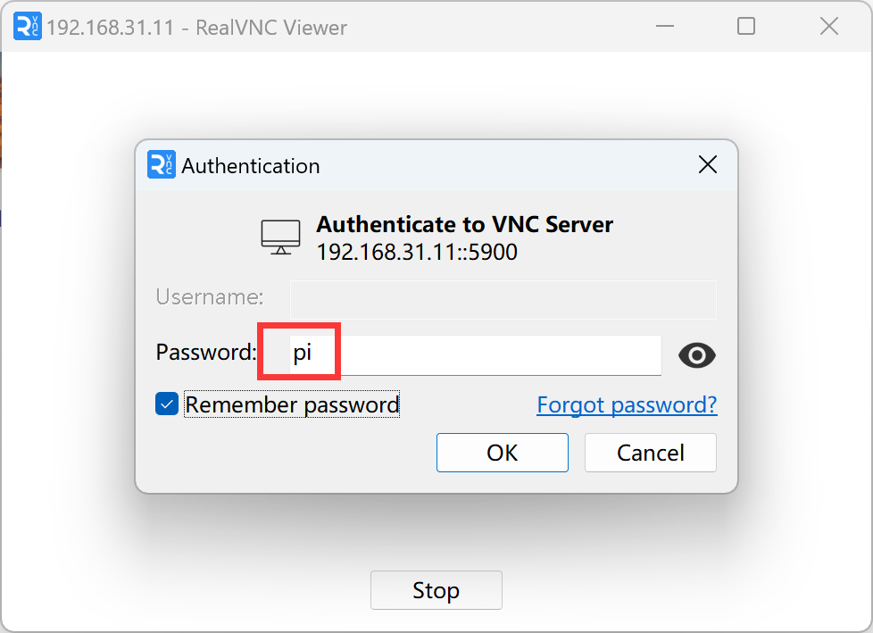
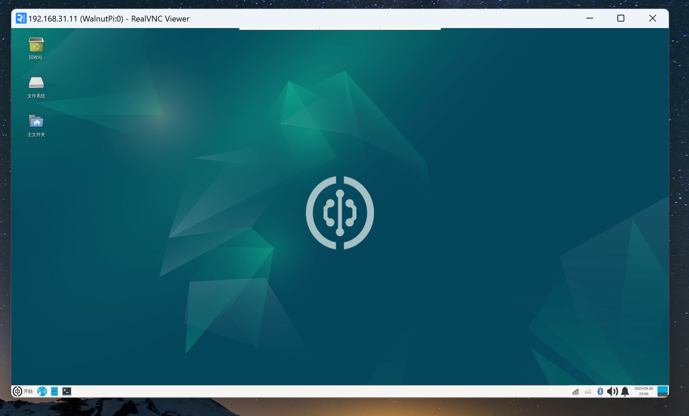
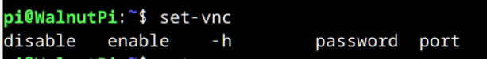

# VNC Remote Desktop

- **Video Tutorial**

<iframe src="//player.bilibili.com/player.html?isOutside=true&aid=1953508549&bvid=BV14C411n7TY&cid=1518749812&p=1" scrolling="no" border="0" frameborder="no" framespacing="0" allowfullscreen="true" width="100%" height="500"></iframe>

<br></br>
<br></br>

The WalnutPi comes pre-installed with a VNC server. VNC is suitable for LAN desktop login (typically within the same router network). **Before using this service, make sure the WalnutPi is connected to the router via Ethernet or WiFi.**

When using the WalnutPi desktop system for various configurations and networking, you can use an HDMI display with keyboard and mouse. Once the network and other parameters are configured, you can log in to the WalnutPi via remote desktop for computer-based control.

::::danger Note
The WalnutPi currently comes pre-installed with the X11VNC server. The advantage is that it directly remotes to the current desktop without consuming extra memory. However, during remote access, the WalnutPi needs to remain connected to a monitor via HDMI; otherwise, lag may occur. The reason is unknown, but it may be because the system does not use hardware rendering for the desktop when no HDMI display is connected.

Since the purpose of using VNC is to save a monitor, a solution is to purchase an **HDMI Dummy Plug** for about 10 RMB. Connect it to the WalnutPi via a microHDMI-to-HDMI female adapter to resolve the lag issue when no monitor is connected. [**Click to purchase ->**](https://item.taobao.com/item.htm?spm=a213gs.success.result.1.6c854831c6UKif&id=741004778478) 
::::


In addition to the official recommendation, you can also purchase a DIY HDMI dummy plug made by WalnutPi users, which is more compact: [**Click to purchase ->**](https://www.goofish.com/item?id=839752328610) 


## Enabling VNC Service

Enter the following command to enable (default password: **pi**, default port: **5900**):

```bash
set-vnc enable
```

After enabling, restart the WalnutPi:

```bash
sudo reboot
```


## Connecting to WalnutPi via VNC from PC

Install VNC Viewer (client, not server) on your computer to connect to the WalnutPi. Download from: https://www.realvnc.com/en/connect/download/viewer/


After installation, open the software and enter the WalnutPi's IP address in the top field. [How to get the IP address](../os_software/ip_get). **You don't need to enter the port number here, as the WalnutPi's pre-installed VNC server uses the default port 5900.**


Press Enter, then click "Continue" on the prompt:


The password is **pi**. You can check "Remember password" to avoid entering it again.



Click OK to log in successfully.



## Disabling VNC Service

Once VNC is enabled, it starts on boot. To disable the VNC service, use the following command. The change takes effect after restarting the WalnutPi.

```bash
set-vnc disable
```

## Setting Password

The default password is **pi**. To set it to "12345678", for example:

```bash
set-vnc password 12345678
```

## Setting Port

The default port is **5900**. To set it to "5901", for example:

```bash
set-vnc port 5901
```

::::tip Note

Enter "set-vnc " in the terminal and press the `Tab` key to see all available commands.

::::


