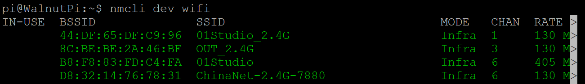
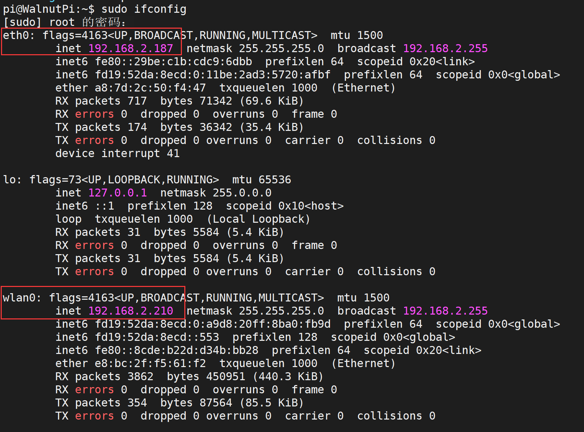

# WiFi Connection

- **Video Tutorial**

<iframe src="//player.bilibili.com/player.html?isOutside=true&aid=1303287491&bvid=BV16M4m1D7D4&cid=1511170283&p=1" scrolling="no" border="0" frameborder="no" framespacing="0" allowfullscreen="true" width="100%" height="500"></iframe>

<br></br>
<br></br>

After the system is up and running, the first thing you'll probably want to do is connect to the internet. For Ethernet, simply plug in an Ethernet cable to get online. Additionally, the WalnutPi has an onboard dual-band WiFi module supporting both 2.4G and 5G WiFi networks.

## Desktop Button Connection

On the desktop system, simply click the network button at the bottom right, select **Available Networks**, choose your WiFi network, and enter the password to connect.


## Command-Line Connection (Non-Desktop System)

Connecting to WiFi via command line is suitable for **non-desktop systems** or scenarios where only terminal login is available. Here's how:

First, use the following command to get available WiFi SSIDs:

```bash
nmcli dev wifi
```




::::danger Warning

Be sure to run the **nmcli dev wifi** command above to get WiFi information before proceeding with the next step to connect.

::::
<br></br>

Press **Ctrl+C or Ctrl+Z** to interrupt the above command.

Then use the following command to connect to the specified WiFi (requires sudo administrator privileges). Below, "walnutpi" is the WiFi SSID and "88888888" is the password. Replace them with your own WiFi credentials.

```bash
sudo nmcli dev wifi connect walnutpi password 12345678
```
<br></br>

After successful connection, use the following command to check the WiFi connection status. An IP address indicates a successful connection.

```bash
sudo ifconfig
```
wlan0 indicates the WiFi connection, with the IP address below. eth0 indicates the Ethernet connection.


