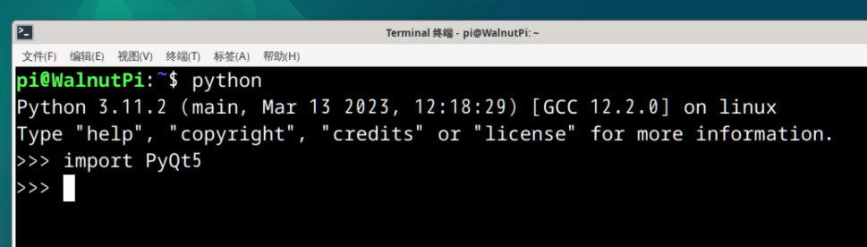
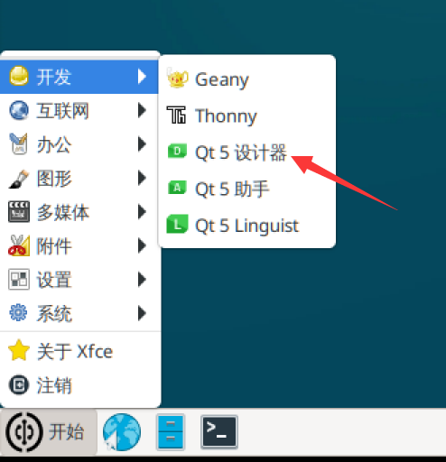
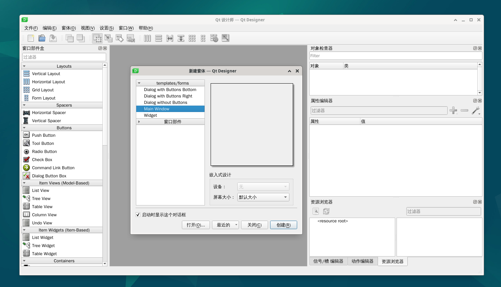
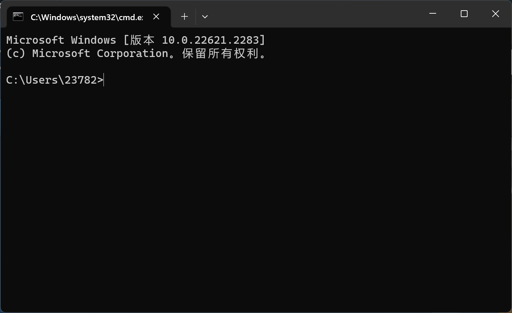
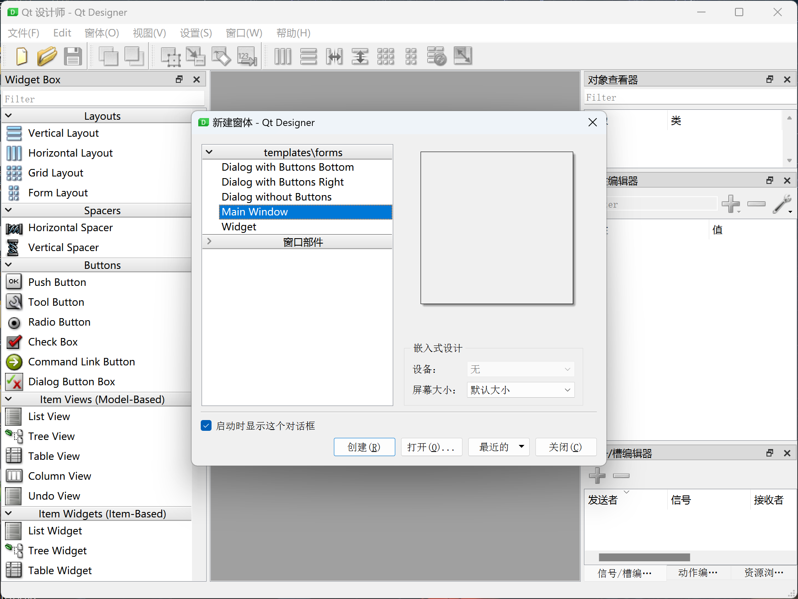

# Development Environment Setup

## WalnutPi

The WalnutPi factory system comes with PyQt5 already installed, and the desktop version comes with QT Designer pre-installed. QT Designer is a powerful visual GUI design tool that can greatly improve development efficiency.

:::tip Tip

We recommend using the WalnutPi desktop system for development, as it makes debugging easier.

:::

### PyQt5

You can check if PyQt5 is installed with the following commands:

Since PyQt5 is a series of Python libraries, first enter Python:

``` bash
python
```

Then import it — pay attention to letter case. If there's no error, it means the system already has it installed. If it says the library is not found, please re-burn the latest image.

``` python
import PyQt5
```




### Qt Designer

The WalnutPi system comes with QT Designer pre-installed, located under **Start Menu > Development**:



After opening, the software interface looks like this:



## Windows

One great advantage of PyQt5 is its strong portability, meaning the code works across Windows, Mac, and Linux. If you want to develop on Windows and then use the code on the WalnutPi, that's perfectly fine.

### Installing Python

1. Make sure Python 3 is installed on your computer. Run the `python` command in the terminal to check:

On Windows, press `Win` + `R` and type `cmd` to quickly open the terminal:




Type **python** in the terminal — if you can see the Python version, it means it's installed.


If not installed, download from the [Python official download page](https://www.python.org/downloads/). Python 3.10 or above is recommended. Make sure to check the option to add to PATH during installation.

### Installing PyQt5

Install via the Windows terminal with the following command:

``` bash
pip3 install pyqt5
```

### Installing Qt Designer

Install via the Windows terminal with the following command:

``` bash
pip3 install pyqt5-tools
```

After installation, the executable is located in the lib directory of your Python installation path:

C:\Users\{YourUser}\AppData\Local\Programs\Python\Python310\Lib\site-packages\qt5_applications\Qt\bin

Since it's frequently used, you can drag it to the desktop to create a shortcut.


After opening, the software looks like this:


