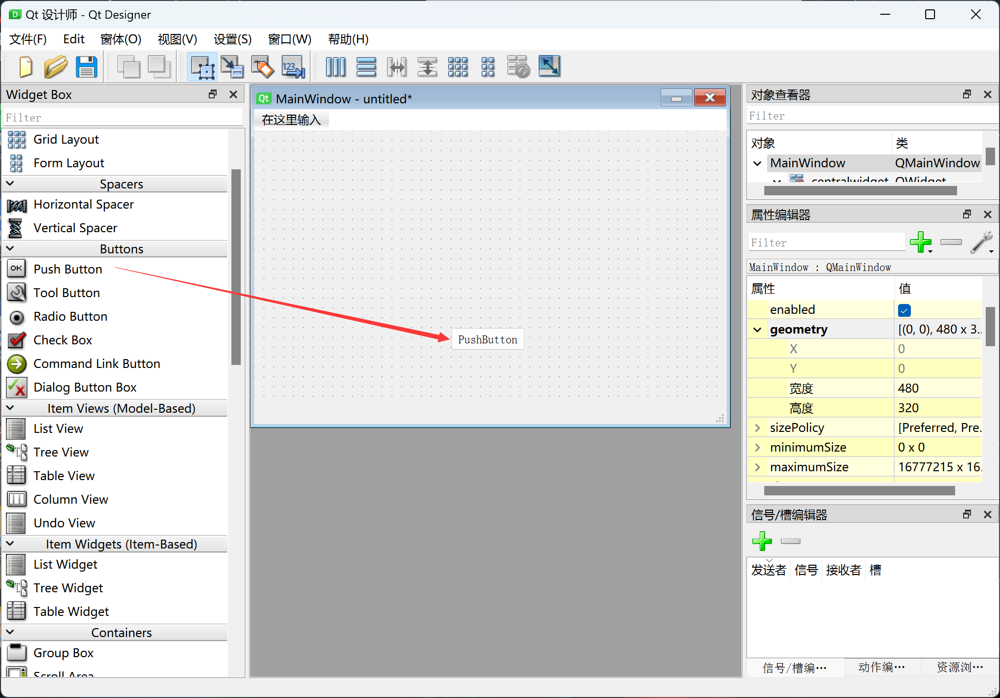
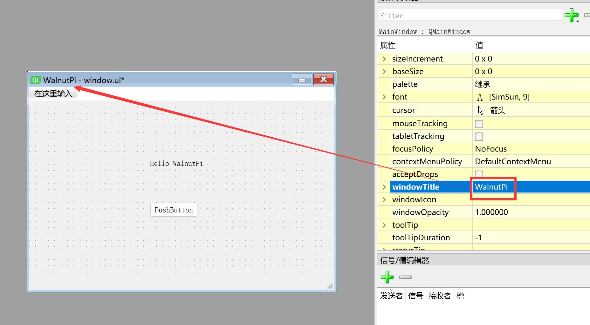
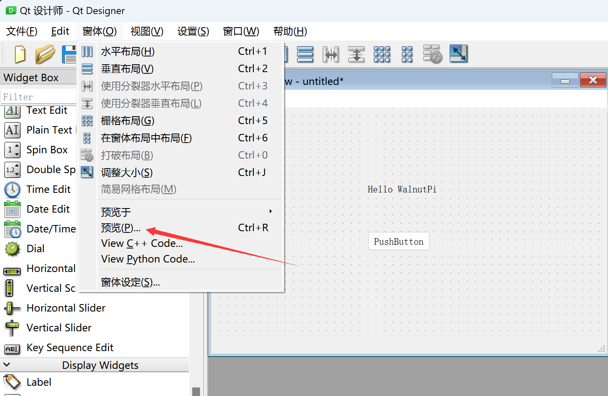
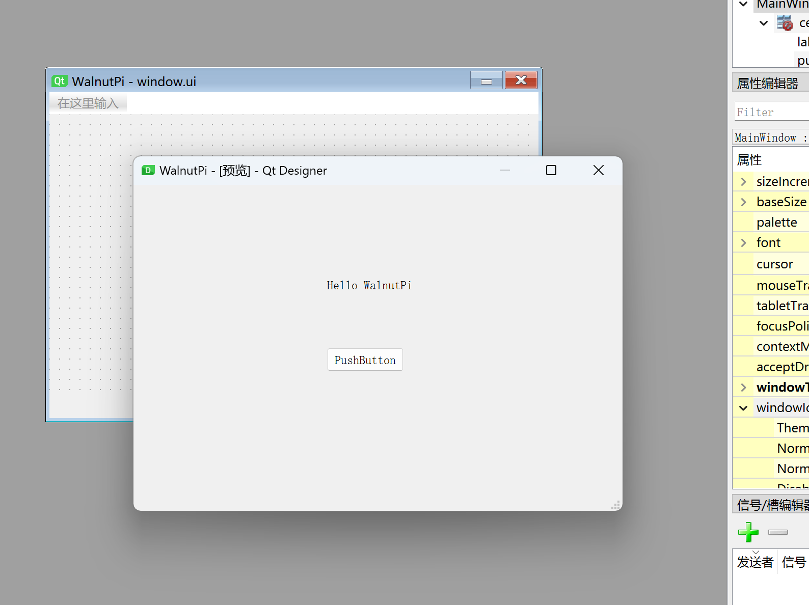
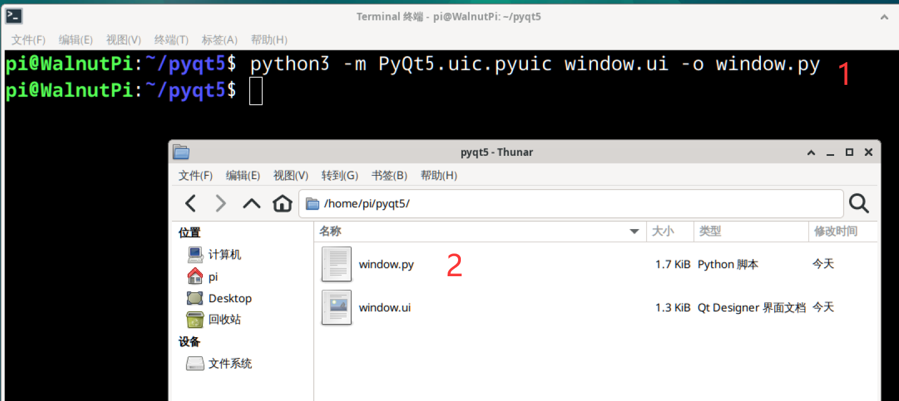

# First Window

In this section, we'll create the simplest window to learn how to build your own GUI and run it on the WalnutPi.

## Creating a Window with Qt Designer

:::tip Tip

1. The WalnutPi needs to be connected to an HDMI display, keyboard, and mouse for design work, or you can use VNC remote desktop. See: [VNC Remote Desktop](../os_software/vnc.md).

2. Due to PyQt5's excellent cross-platform features, the operations in this section also apply to Windows.

:::

Designing PyQt5 windows requires Qt Designer. This section only provides the simplest demonstration; more detailed window settings and widget functions will be covered in later chapters.

Open Qt Designer. In the upper-left corner, there are different window type options — the default choice is **Main Window**. Select it and click **Create**:


After creation, the various areas of the software are as follows:


Considering that some users want to display on a 3.5-inch LCD, we can adjust the window size to 480x320 (WalnutPi's 3.5-inch LCD resolution). Expand the **geometry** property in the **Property Editor** on the right, then set the width and height to 480 and 320.


Drag a PushButton widget onto the window.



Drag a Label widget onto the window.


Double-click the label to edit its content. Change it to: Hello WalnutPi.


The **windowTitle** property can change the window title bar text:



The **windowIcon** property can change the icon in the upper-left corner of the window. Interested users can customize it:


We'll use this window as our first demo. Click **Form > Preview** in the menu bar:



You can see the preview of the window we just created. This feature lets you check during development whether it looks the way you want.



Click **File > Save** in the menu bar, or directly click the close button in the upper-right corner of the new window to save it. Name it as you like — here we save it as "window.ui".


- Saving on WalnutPi


At this point, the first window UI file design is complete.

## Converting the Window UI File to a Python Code File

We need to convert the designed window UI file into Python code for it to be executed by Python programs on the WalnutPi. This can be done directly with a terminal command:

In the terminal, navigate to the directory containing window.ui and run the following command, which generates a window.py file from the window.ui file:

```bash
python -m PyQt5.uic.pyuic window.ui -o window.py
```

After execution, you can see the generated .py file:



Open the window.py file and you'll see the generated Python code as follows. It mainly consists of settings like window names, position coordinates, and other attributes. You can modify window or button property values, then regenerate the Python code to compare — this gives you an intuitive understanding of how each object works.

```python

# -*- coding: utf-8 -*-

# Form implementation generated from reading ui file 'window.ui'
#
# Created by: PyQt5 UI code generator 5.15.9
#
# WARNING: Any manual changes made to this file will be lost when pyuic5 is
# run again.  Do not edit this file unless you know what you are doing.

from PyQt5 import QtCore, QtGui, QtWidgets

class Ui_MainWindow(object):
    def setupUi(self, MainWindow):
        MainWindow.setObjectName("MainWindow")
        MainWindow.resize(480, 250)
        self.centralwidget = QtWidgets.QWidget(MainWindow)
        self.centralwidget.setObjectName("centralwidget")
        self.pushButton = QtWidgets.QPushButton(self.centralwidget)
        self.pushButton.setGeometry(QtCore.QRect(190, 160, 75, 23))
        self.pushButton.setObjectName("pushButton")
        self.label = QtWidgets.QLabel(self.centralwidget)
        self.label.setGeometry(QtCore.QRect(190, 90, 91, 16))
        self.label.setObjectName("label")
        MainWindow.setCentralWidget(self.centralwidget)
        self.menubar = QtWidgets.QMenuBar(MainWindow)
        self.menubar.setGeometry(QtCore.QRect(0, 0, 480, 22))
        self.menubar.setObjectName("menubar")
        MainWindow.setMenuBar(self.menubar)
        self.statusbar = QtWidgets.QStatusBar(MainWindow)
        self.statusbar.setObjectName("statusbar")
        MainWindow.setStatusBar(self.statusbar)

        self.retranslateUi(MainWindow)
        QtCore.QMetaObject.connectSlotsByName(MainWindow)

    def retranslateUi(self, MainWindow):
        _translate = QtCore.QCoreApplication.translate
        MainWindow.setWindowTitle(_translate("MainWindow", "WalnutPi"))
        self.pushButton.setText(_translate("MainWindow", "PushButton"))
        self.label.setText(_translate("MainWindow", "Hello WalnutPi"))
```

You can see that the generated code only defines classes and functions, so it cannot be run directly — additional code is needed to display the window. This will be covered in the next section.
