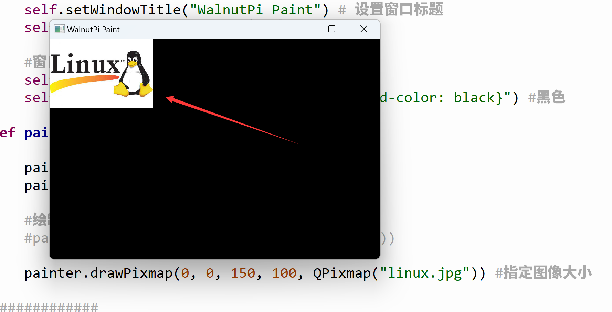

# Drawing Images

Drawing an image is similar to drawing shapes — it only takes one function:

## Function

```python
drawPixmap(x, y, width, height, QPixmap("xx.jpg"))
```
Draw an image.
- `x, y` : Starting coordinates (top-left corner of the image)
- `width` : Width — defaults to the image's actual width if omitted
- `height` : Height — defaults to the image's actual height if omitted
- `QPixmap("xx.jpg")` : Image path; supports common formats like BMP, JPG, JPEG, PNG

## Programming Method

Let's implement image drawing through code:

We'll run the final code first, then explain:

```python
# -*- coding: utf-8 -*-

# pyQT5 For WalnutPi

from PyQt5 import QtCore, QtGui, QtWidgets

from PyQt5.QtCore import Qt
from PyQt5.QtGui import QPainter, QPixmap
from PyQt5.QtWidgets import QWidget

class Window(QWidget):
    
    def __init__(self):
        super().__init__() # Execute the parent QWidget's __init__ as well
        self.setWindowTitle("WalnutPi Paint") # Set window title
        self.resize(480,320) # Set window size
        
        # Window background color setting
        self.setObjectName("Paint_Window")
        self.setStyleSheet("#Paint_Window{background-color: black}") # Black

    def paintEvent(self,event):
        
        painter=QPainter(self) # Create drawing object
        painter.setPen(Qt.green) # Set pen, green
        
        # Draw image
        painter.drawPixmap(0,0,QPixmap("linux.jpg"))
        
#################
#   Main Code    #
#################
import sys

# [Optional] Allow Thonny remote execution
import os
os.environ["DISPLAY"] = ":0.0"

# [Optional] Fix display issues on 2K+ resolution monitors
QtCore.QCoreApplication.setAttribute(QtCore.Qt.AA_EnableHighDpiScaling)

# Main program entry — build and display the window
app = QtWidgets.QApplication(sys.argv)
window = Window() # Create window object
window.show() # Show window
#window.showFullScreen() # Full-screen display

# [Recommended] Allow Ctrl+C to interrupt the window from terminal for easier debugging
import signal
signal.signal(signal.SIGINT, signal.SIG_DFL)
timer = QtCore.QTimer()
timer.start(100)  # You may change this if you wish.
timer.timeout.connect(lambda: None)  # Let the interpreter run each 100 ms

sys.exit(app.exec_()) # Exit the process when the window is closed

```

First, place the image you want to display in the same directory as the code:


Run the code and you'll see the following result:


<br></br>

Now let's examine how the code works:

The main program entry code is similar to before — it creates a window:

```python
# Main program entry — build and display the window
app = QtWidgets.QApplication(sys.argv)
window = Window() # Create window object
window.show() # Show window
```

The newly created window initializes the window title and size, and also sets the background color to black for better visibility of the result:

```python
class Window(QWidget):
    
    def __init__(self):
        super().__init__() # Execute the parent QWidget's __init__ as well
        self.setWindowTitle("WalnutPi Paint") # Set window title
        self.resize(480,320) # Set window size
        
        # Window background color setting
        self.setObjectName("Paint_Window")
        self.setStyleSheet("#Paint_Window{background-color: black}") # Black
```

**def paintEvent(self,event):** is a fixed-form method — it is automatically called after the window is constructed. So all QPainter object initialization and drawing functions are placed inside it:

```python
    def paintEvent(self,event):
        
        painter=QPainter(self) # Create drawing object
        painter.setPen(Qt.green) # Set pen, green
        
        # Draw image
        painter.drawPixmap(0, 0, QPixmap("linux.jpg"))
```

Modify the image drawing code as follows:

```python
    def paintEvent(self,event):
        
        ...

        # Draw image
        painter.drawPixmap(0, 0, 150, 100, QPixmap("linux.jpg"))
```

Run again — you can see the image size has been set to 150x100:


