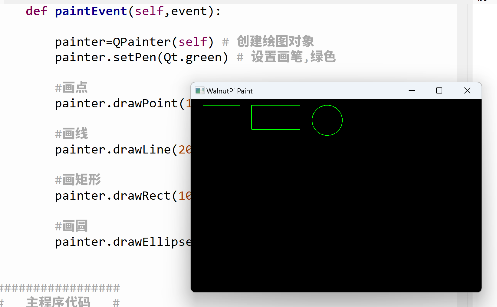

# Drawing Shapes

In this section, we'll learn about PyQt5 drawing features using the drawing functions under the QPainter object.

## Function Introduction

### Drawing a Point

```python
drawPoint(x, y)
```
Draw a point.
- `x` : X-coordinate
- `y` : Y-coordinate

### Drawing a Line

```python
drawLine(x0, y0, x1, y1)
```
Draw a straight line.
- `x0, y0` : Starting coordinates
- `x1, y1` : Ending coordinates

### Drawing a Rectangle

```python
drawRect(x, y, width, height)
```
Draw a rectangle.
- `x, y` : Starting coordinates
- `width` : Rectangle width
- `height` : Rectangle height

### Drawing an Ellipse (Circle)

```python
drawEllipse(x, y, width, height)
```
Draw an ellipse.
- `x, y` : Starting coordinates
- `width` : Ellipse width
- `height` : Ellipse height

**When the ellipse's width equals height, it becomes a circle, where width = height = diameter of the circle.**

## Programming Method

Let's implement code to draw points, lines, rectangles, and circles:

We'll run the final code first, then explain:

```python
# -*- coding: utf-8 -*-

# pyQT5 For WalnutPi

from PyQt5 import QtCore, QtGui, QtWidgets

from PyQt5.QtCore import Qt
from PyQt5.QtGui import QPainter,QPen,QBrush
from PyQt5.QtWidgets import QWidget

class Window(QWidget):
    
    def __init__(self):
        super().__init__() # Execute the parent QWidget's __init__ as well
        self.setWindowTitle("WalnutPi Paint") # Set window title
        self.resize(480,320) # Set window size
        
        # Window background color setting
        self.setObjectName("Paint_Window")
        self.setStyleSheet("#Paint_Window{background-color: black}") # Black

    def paintEvent(self,event):
        
        painter=QPainter(self) # Create drawing object
        painter.setPen(Qt.green) # Set pen, green
        
        # Draw point
        painter.drawPoint(10,10) 
        
        # Draw line
        painter.drawLine(20, 10, 80, 10)
        
        # Draw rectangle
        painter.drawRect(100, 10, 80, 40) 
        
        # Draw circle
        painter.drawEllipse(200, 10, 50, 50)
        
        
#################
#   Main Code    #
#################
import sys

# [Optional] Allow Thonny remote execution
import os
os.environ["DISPLAY"] = ":0.0"

# [Optional] Fix display issues on 2K+ resolution monitors
QtCore.QCoreApplication.setAttribute(QtCore.Qt.AA_EnableHighDpiScaling)

# Main program entry — build and display the window
app = QtWidgets.QApplication(sys.argv)
window = Window() # Create window object
window.show() # Show window
#window.showFullScreen() # Full-screen display

# [Recommended] Allow Ctrl+C to interrupt the window from terminal for easier debugging
import signal
signal.signal(signal.SIGINT, signal.SIG_DFL)
timer = QtCore.QTimer()
timer.start(100)  # You may change this if you wish.
timer.timeout.connect(lambda: None)  # Let the interpreter run each 100 ms

sys.exit(app.exec_()) # Exit the process when the window is closed

```

Run the code and you'll see the window as follows:




<br></br>

Now let's examine how the code works:

The main program entry code is similar to before — it creates a window:

```python
# Main program entry — build and display the window
app = QtWidgets.QApplication(sys.argv)
window = Window() # Create window object
window.show() # Show window
```

The newly created window initializes the window title and size, and also sets the background color to black for better visibility of the result:

```python
class Window(QWidget):
    
    def __init__(self):
        super().__init__() # Execute the parent QWidget's __init__ as well
        self.setWindowTitle("WalnutPi Paint") # Set window title
        self.resize(480,320) # Set window size
        
        # Window background color setting
        self.setObjectName("Paint_Window")
        self.setStyleSheet("#Paint_Window{background-color: black}") # Black
```

**def paintEvent(self,event):** is a fixed-form method — it is automatically called after the window is constructed. So all QPainter object initialization and drawing functions are placed inside it:

```python
    def paintEvent(self,event):
        
        painter=QPainter(self) # Create drawing object
        painter.setPen(Qt.green) # Set pen, green
        
        # Draw point
        painter.drawPoint(10,10) 
        
        # Draw line
        painter.drawLine(20, 10, 80, 10)
        
        # Draw rectangle
        painter.drawRect(100, 10, 80, 40) 
        
        # Draw circle
        painter.drawEllipse(200, 10, 50, 50)
```

