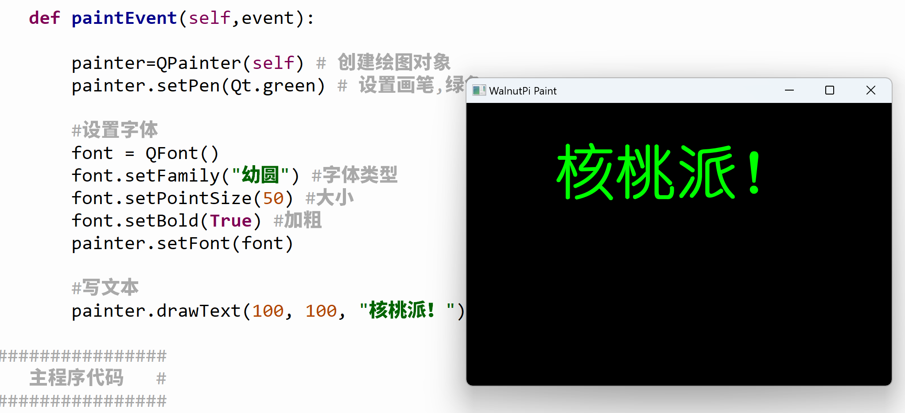

# Font Configuration

In the previous section, we learned the basic methods of drawing graphics. In this section, we'll learn about pen and brush configuration.

## Font Object (QFont)

The font object is primarily used to set font size, style, etc.

|  Common Font Methods |  Description |
|  :---:  | --- | 
| setFamily()  |  Set the font type | 
| setPointSize()  |  Set the font size  | 
| setBold()  |  Set bold. Parameters: `True` for bold, `False` for normal  | 
| setItalic()  |  Set italic. Parameters: `True` for italic, `False` for normal  | 
| setOverline()  |  Set text overline  | 
| setUnderline()  |  Set text underline  | 
| setStrikeOut()  |  Set text strikethrough  | 

## Example

**Example: Make the font in the previous text-drawing example larger and bolder.**

Here's the implementation code:

```python
# -*- coding: utf-8 -*-

# pyQT5 For WalnutPi

from PyQt5 import QtCore, QtGui, QtWidgets

from PyQt5.QtCore import Qt
from PyQt5.QtGui import QPainter, QFont
from PyQt5.QtWidgets import QWidget

class Window(QWidget):
    
    def __init__(self):
        super().__init__() # Execute the parent QWidget's __init__ as well
        self.setWindowTitle("WalnutPi Paint") # Set window title
        self.resize(480,320) # Set window size
        
        # Window background color setting
        self.setObjectName("Paint_Window")
        self.setStyleSheet("#Paint_Window{background-color: black}") # Black

    def paintEvent(self,event):
        
        painter=QPainter(self) # Create drawing object
        painter.setPen(Qt.green) # Set pen, green
        
        # Configure font
        font = QFont()
        font.setFamily("YouYuan") # Font type
        font.setPointSize(50) # Size
        font.setBold(True) # Bold
        painter.setFont(font)
        
        # Draw text
        painter.drawText(100, 100, "WalnutPi!")
     
#################
#   Main Code    #
#################
import sys

# [Optional] Allow Thonny remote execution
import os
os.environ["DISPLAY"] = ":0.0"

# [Optional] Fix display issues on 2K+ resolution monitors
QtCore.QCoreApplication.setAttribute(QtCore.Qt.AA_EnableHighDpiScaling)

# Main program entry — build and display the window
app = QtWidgets.QApplication(sys.argv)
window = Window() # Create window object
window.show() # Show window
#window.showFullScreen() # Full-screen display

# [Recommended] Allow Ctrl+C to interrupt the window from terminal for easier debugging
import signal
signal.signal(signal.SIGINT, signal.SIG_DFL)
timer = QtCore.QTimer()
timer.start(100)  # You may change this if you wish.
timer.timeout.connect(lambda: None)  # Let the interpreter run each 100 ms

sys.exit(app.exec_()) # Exit the process when the window is closed

```

The main difference from the previous code is the addition of font configuration:

```python

    def paintEvent(self,event):

        ...

        # Configure font
        font = QFont()
        font.setFamily("YouYuan") # Font type
        font.setPointSize(50) # Size
        font.setBold(True) # Bold
        painter.setFont(font)
        
```

The result is as follows:


