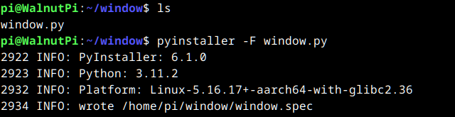
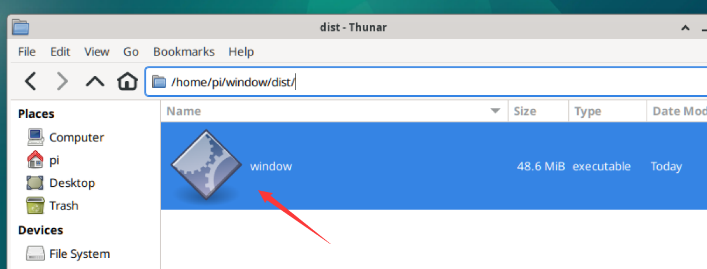

# Packaging and Publishing Programs

On the WalnutPi system, you can use Pyinstaller to package Python code into an executable file. This is essentially an application that can be run by double-clicking.

:::tip Tip

You can already run Python programs on the WalnutPi system with the `python xx.py` command. The purpose of this feature is to protect the code and make it easier to distribute and use.

:::

The newer version of the WalnutPi system comes with this application pre-installed. For system versions that don't have it, you can install it via pip:

```bash
sudo pip install pyinstaller
```

## Packaging a Python Program

Create a new folder called `window` in the pi directory, then copy your verified Python code file into it. Here we'll use the window.py from the First Window tutorial as a demo.

Run:

```bash
pyinstaller -F window.py
```



After execution, you'll see 3 new directories/files generated:

- dist: Location of the generated application
- build: Log files and intermediate files from the packaging process
- window.spec: Configuration needed for packaging


Open the dist folder — the executable file is inside. Double-click to open it.



If it can't be opened, run the following command to grant execution permissions:

```bash
chmod +x window
```

After opening, you can see the window program:


