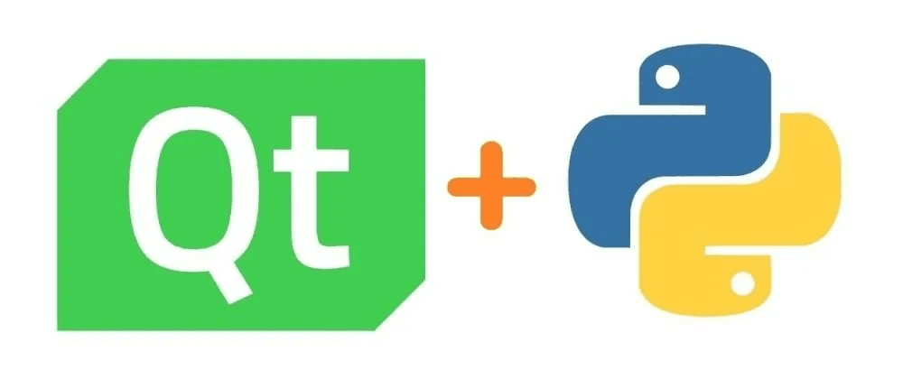

# Introduction to PyQt5

If you're into Linux, you've probably heard of QT. QT is a cross-platform C++ development library primarily used for developing graphical user interfaces (GUIs). PyQt, developed by Digia, is a Python interface-based QT framework consisting of a series of Python modules. Simply put, it allows you to develop GUIs using Python.

Life is short — the advantage of PyQt is that it retains QT's underlying execution efficiency while improving development efficiency. No more C++ programming required — as long as you know Python and use QT Designer (QT's visual GUI programming tool), you can easily build your own GUI.

The "5" in PyQt5 is the version number, and it is not backward-compatible. It is currently the most popular and most well-documented version on the market. We hope this chapter's tutorial can help you quickly get familiar with developing PyQt5 applications and deploying them to the WalnutPi.
