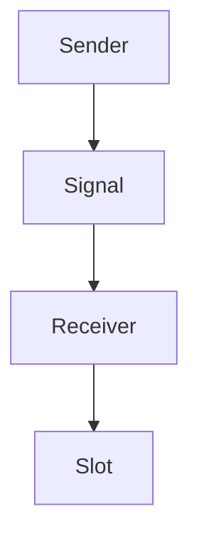
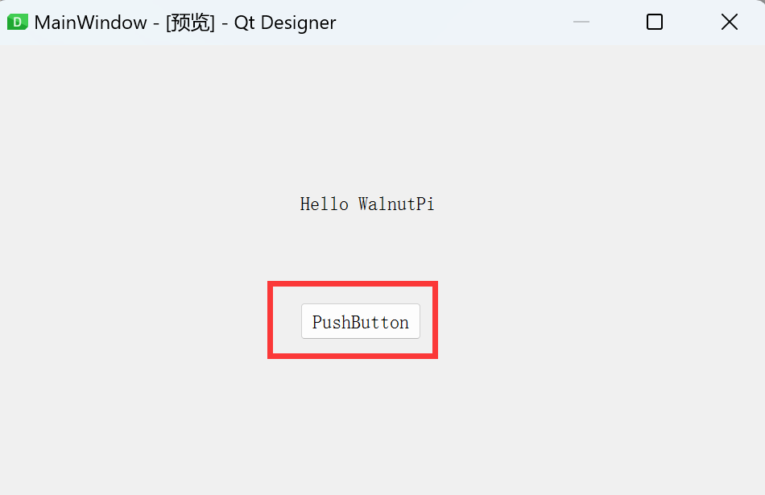
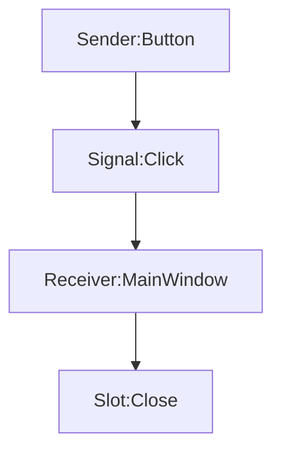
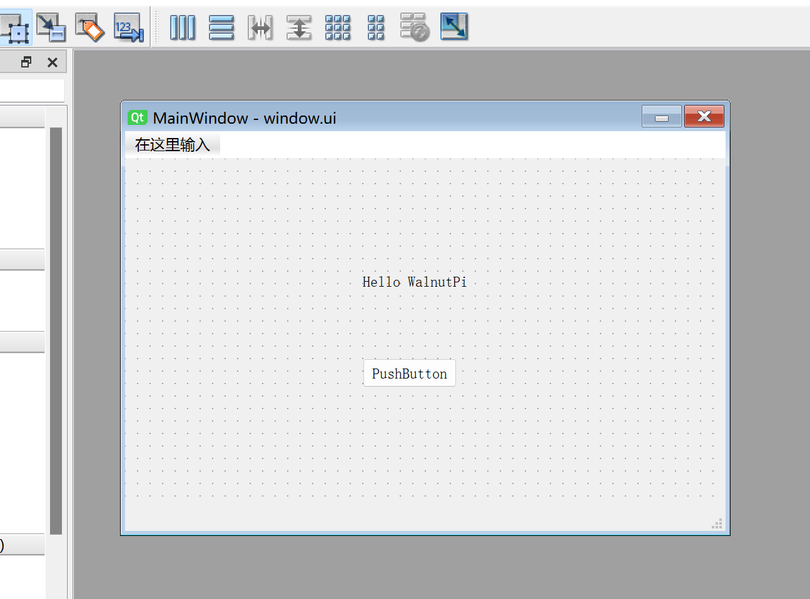
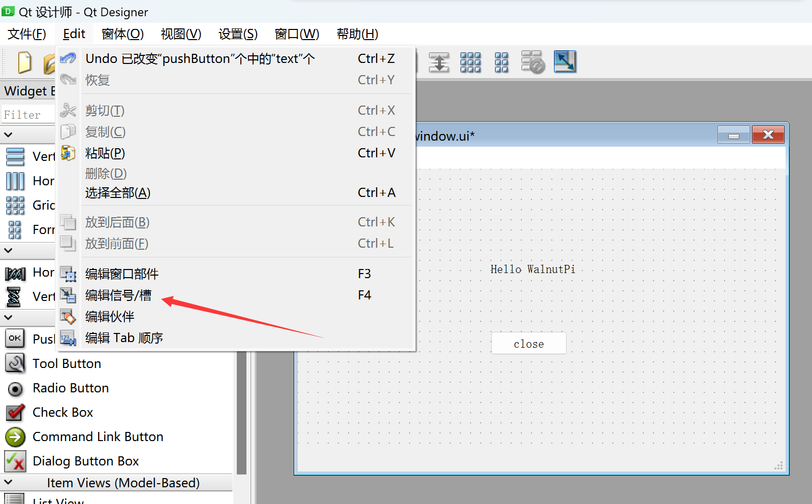
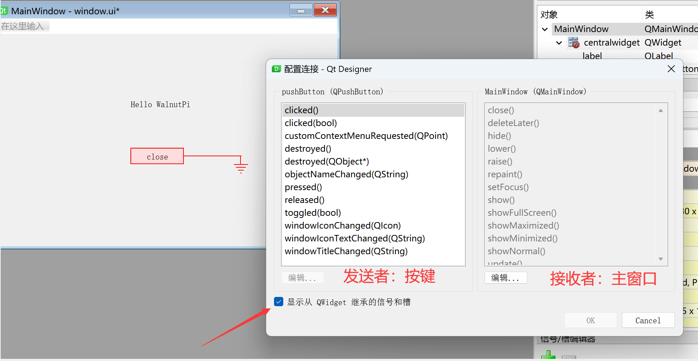
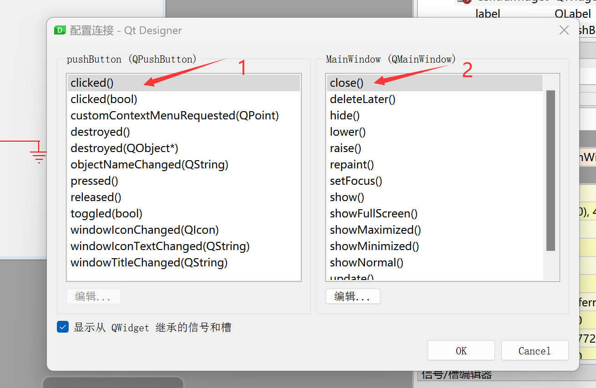

# Signals and Slots

## What Are Signals and Slots

Signals and slots are the communication mechanism between PyQt5 objects. A complete signal-slot flow consists of 4 elements: **Sender, Signal, Receiver, Slot.** The simplest flow between them is as follows:



<br></br>

For example: in the previous "First Window" section, we created a button, but it was isolated — clicking it had no effect.
<br></br>



If we want the button click to close the current window, we can achieve this by editing their signals and slots. The flow chart above then becomes:



<br></br>

From this, it's easy to understand that the signal-slot mechanism is primarily used for QObject objects (widgets and windows). The signal sent by the sender can be understood as an action (click), and the receiver, upon receiving the signal, executes the corresponding slot function (close window).

**Features of Signals and Slots in PyQt5:**

- A signal can be sent to multiple slots.
- A slot can receive multiple signals.

## Editing Signals and Slots

Let's implement the functionality of closing the main window when the button is clicked:

Open the window.ui file saved from the previous **First Window** section using Qt Designer.



Double-click the PushButton and rename it to "close":


Next, click **Edit > Edit Signals/Slots** in the menu bar:



Now, here's the key step: click and hold the button with your mouse, drag it to an empty area of the window, then release. After releasing, it should look like this:


A configuration dialog will pop up. Check **Show signals and slots inherited from QWidget** in the lower-left corner:



On the left side is the button widget — click **clicked()**. On the right side is the main window — click **close()**. Then click OK.



You can see that both the main window and the Signal/Slot Editor in the lower-right corner now display the configuration we just set:


Save the window. In the terminal, from the file directory, run the following command to convert window.ui to a .py file:

```bash
python -m PyQt5.uic.pyuic window.ui -o window.py
```

Open window.py and add the main program code. The complete code after adding is as follows:

```python
# -*- coding: utf-8 -*-

# pyQT5 For WalnutPi

from PyQt5 import QtCore, QtGui, QtWidgets

# [Optional] Allow Thonny remote execution
import os
os.environ["DISPLAY"] = ":0.0"

class Ui_MainWindow(object):
    def setupUi(self, MainWindow):
        MainWindow.setObjectName("MainWindow")
        MainWindow.resize(480, 320)
        self.centralwidget = QtWidgets.QWidget(MainWindow)
        self.centralwidget.setObjectName("centralwidget")
        self.pushButton = QtWidgets.QPushButton(self.centralwidget)
        self.pushButton.setGeometry(QtCore.QRect(190, 160, 75, 23))
        self.pushButton.setObjectName("pushButton")
        self.label = QtWidgets.QLabel(self.centralwidget)
        self.label.setGeometry(QtCore.QRect(190, 90, 91, 16))
        self.label.setObjectName("label")
        MainWindow.setCentralWidget(self.centralwidget)
        self.menubar = QtWidgets.QMenuBar(MainWindow)
        self.menubar.setGeometry(QtCore.QRect(0, 0, 480, 22))
        self.menubar.setObjectName("menubar")
        MainWindow.setMenuBar(self.menubar)
        self.statusbar = QtWidgets.QStatusBar(MainWindow)
        self.statusbar.setObjectName("statusbar")
        MainWindow.setStatusBar(self.statusbar)

        self.retranslateUi(MainWindow)
        self.pushButton.clicked.connect(MainWindow.close) # Signal-slot definition
        QtCore.QMetaObject.connectSlotsByName(MainWindow)

    def retranslateUi(self, MainWindow):
        _translate = QtCore.QCoreApplication.translate
        MainWindow.setWindowTitle(_translate("MainWindow", "MainWindow"))
        self.pushButton.setText(_translate("MainWindow", "close"))
        self.label.setText(_translate("MainWindow", "Hello WalnutPi"))

#################
#   Main Code    #
#################
import sys

# [Optional] Allow Thonny remote execution
import os
os.environ["DISPLAY"] = ":0.0"

# [Optional] Fix display issues on 2K+ resolution monitors
QtCore.QCoreApplication.setAttribute(QtCore.Qt.AA_EnableHighDpiScaling)

# Main program entry — build and display the window
app = QtWidgets.QApplication(sys.argv)
MainWindow = QtWidgets.QMainWindow() # Create window object
ui = Ui_MainWindow() # Create PyQt5-designed window object
ui.setupUi(MainWindow) # Initialize window
MainWindow.show() # Show window

# [Recommended] Allow Ctrl+C to interrupt the window from terminal for easier debugging
import signal
signal.signal(signal.SIGINT, signal.SIG_DFL)
timer = QtCore.QTimer()
timer.start(100)  # You may change this if you wish.
timer.timeout.connect(lambda: None)  # Let the interpreter run each 100 ms

sys.exit(app.exec_()) # Exit the process when the window is closed

```

As you can see from the code above, the added line is the following, which implements the signal and slot between the button and the main window:

```python

self.pushButton.clicked.connect(MainWindow.close) # Signal-slot definition

```

Run the code. In the pop-up window, click the **close** button, and you'll see the window close.


