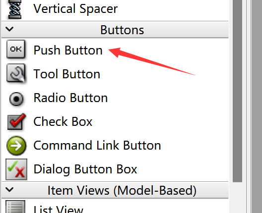
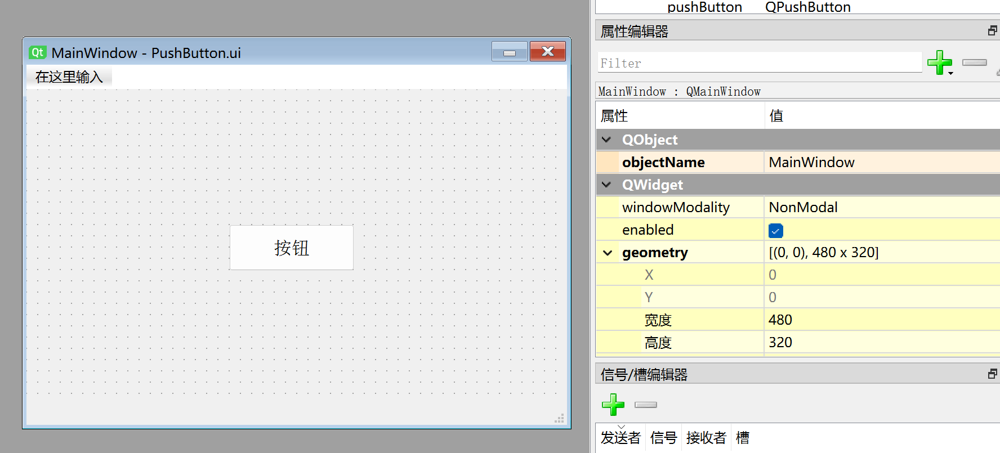
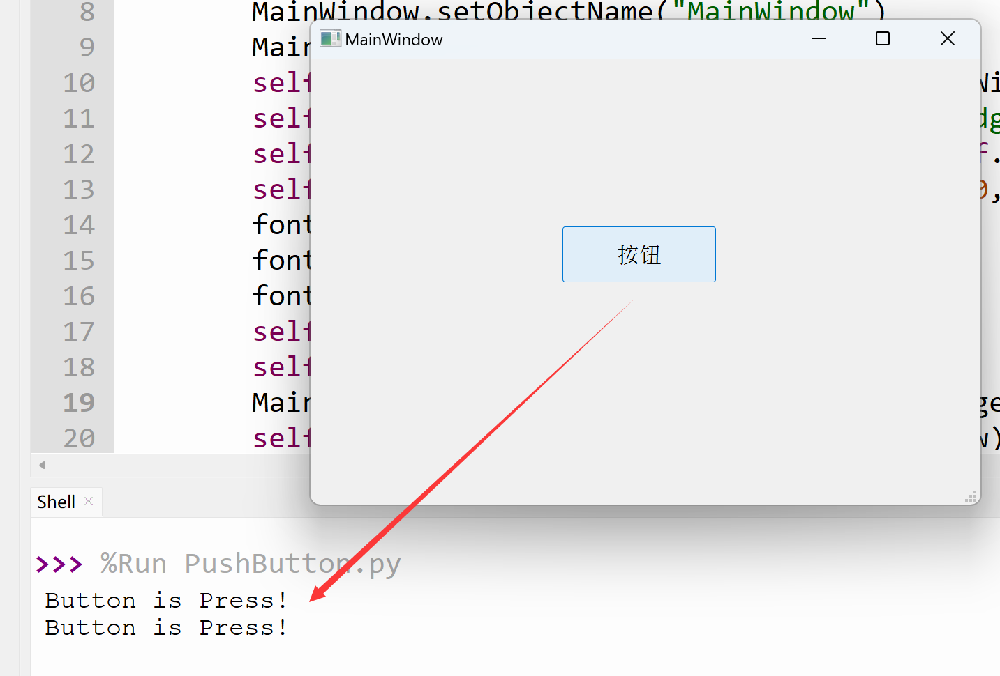

# PushButton

## Introduction

The PushButton widget is very commonly used and is called a button widget. It has press and release effects.



Editing a button is simple — double-click to modify the button text, and drag the edges to resize it. Font size, adding icons, and other settings can all be configured in the property panel on the right.



The generated Python code for this window is as follows:

```python

# -*- coding: utf-8 -*-

from PyQt5 import QtCore, QtGui, QtWidgets


class Ui_MainWindow(object):
    def setupUi(self, MainWindow):
        MainWindow.setObjectName("MainWindow")
        MainWindow.resize(480, 320)
        self.centralwidget = QtWidgets.QWidget(MainWindow)
        self.centralwidget.setObjectName("centralwidget")
        self.pushButton = QtWidgets.QPushButton(self.centralwidget)
        self.pushButton.setGeometry(QtCore.QRect(180, 120, 111, 41))
        font = QtGui.QFont()
        font.setFamily("Agency FB")
        font.setPointSize(12)
        self.pushButton.setFont(font)
        self.pushButton.setObjectName("pushButton")
        MainWindow.setCentralWidget(self.centralwidget)
        self.menubar = QtWidgets.QMenuBar(MainWindow)
        self.menubar.setGeometry(QtCore.QRect(0, 0, 480, 22))
        self.menubar.setObjectName("menubar")
        MainWindow.setMenuBar(self.menubar)
        self.statusbar = QtWidgets.QStatusBar(MainWindow)
        self.statusbar.setObjectName("statusbar")
        MainWindow.setStatusBar(self.statusbar)

        self.retranslateUi(MainWindow)
        QtCore.QMetaObject.connectSlotsByName(MainWindow)

    def retranslateUi(self, MainWindow):
        _translate = QtCore.QCoreApplication.translate
        MainWindow.setWindowTitle(_translate("MainWindow", "MainWindow"))
        self.pushButton.setText(_translate("MainWindow", "Button"))

```

The code related to the button is as follows:

```python
# -*- coding: utf-8 -*-

from PyQt5 import QtCore, QtGui, QtWidgets


class Ui_MainWindow(object):
    def setupUi(self, MainWindow):
        ...
        self.pushButton = QtWidgets.QPushButton(self.centralwidget) # Create a button widget in the window
        self.pushButton.setGeometry(QtCore.QRect(180, 120, 111, 41)) # Button's x, y, width, height

        # Set button font and color
        font = QtGui.QFont()
        font.setFamily("Agency FB")
        font.setPointSize(12)
        self.pushButton.setFont(font)
        
        self.pushButton.setObjectName("pushButton") # Set button object name (internal, not display name)


    def retranslateUi(self, MainWindow):
        ...
        self.pushButton.setText(_translate("MainWindow", "Button")) # Change display name to "Button"

```

## QPushButton Object

|  Common Methods |  Description |
|  :---:  | --- | 
| setText()  |  Text displayed on the button  | 
| Text()  |  Get the text content displayed on the button  | 
| setEnabled()  |  When set to False, the button is disabled  | 

<br></br>

|  Common Signals |  Description |
|  :---:  | --- | 
| clicked  |  Triggered on click  | 


## Example

**Example: Programmatically make a button click execute a custom function.**

The most commonly used button signal is click, i.e., `clicked`. Use `pushButton.clicked.connect()` to specify the function to execute when the button is clicked.

Referring to the signals and slots section, add the following after `self.retranslateUi(MainWindow)`:

```python

self.pushButton.clicked.connect(self.fun) # Execute fun function when button is pressed

```

Then add the function to execute inside the `Ui_MainWindow` class — here we'll have it print a message to the terminal:

```python

# Function to execute on button press
def fun(self):
    print('Button is Press!')

```

Here's the complete code:

```python

# -*- coding: utf-8 -*-

from PyQt5 import QtCore, QtGui, QtWidgets


class Ui_MainWindow(object):
    def setupUi(self, MainWindow):
        MainWindow.setObjectName("MainWindow")
        MainWindow.resize(480, 320)
        self.centralwidget = QtWidgets.QWidget(MainWindow)
        self.centralwidget.setObjectName("centralwidget")
        self.pushButton = QtWidgets.QPushButton(self.centralwidget)
        self.pushButton.setGeometry(QtCore.QRect(180, 120, 111, 41))
        font = QtGui.QFont()
        font.setFamily("Agency FB")
        font.setPointSize(12)
        self.pushButton.setFont(font)
        self.pushButton.setObjectName("pushButton")
        MainWindow.setCentralWidget(self.centralwidget)
        self.menubar = QtWidgets.QMenuBar(MainWindow)
        self.menubar.setGeometry(QtCore.QRect(0, 0, 480, 22))
        self.menubar.setObjectName("menubar")
        MainWindow.setMenuBar(self.menubar)
        self.statusbar = QtWidgets.QStatusBar(MainWindow)
        self.statusbar.setObjectName("statusbar")
        MainWindow.setStatusBar(self.statusbar)

        self.retranslateUi(MainWindow)
        self.pushButton.clicked.connect(self.fun) # Button signal-slot definition
        QtCore.QMetaObject.connectSlotsByName(MainWindow)

    def retranslateUi(self, MainWindow):
        _translate = QtCore.QCoreApplication.translate
        MainWindow.setWindowTitle(_translate("MainWindow", "MainWindow"))
        self.pushButton.setText(_translate("MainWindow", "Button"))
    
    # Function to execute on button press
    def fun(self):
        print('Button is Press!')

#################
#   Main Code    #
#################
import sys

# [Optional] Allow Thonny remote execution
import os
os.environ["DISPLAY"] = ":0.0"

# [Optional] Fix display issues on 2K+ resolution monitors
QtCore.QCoreApplication.setAttribute(QtCore.Qt.AA_EnableHighDpiScaling)

# Main program entry — build and display the window
app = QtWidgets.QApplication(sys.argv)
MainWindow = QtWidgets.QMainWindow() # Create window object
ui = Ui_MainWindow() # Create PyQt5-designed window object
ui.setupUi(MainWindow) # Initialize window
MainWindow.show() # Show window

# [Recommended] Allow Ctrl+C to interrupt the window from terminal for easier debugging
import signal
signal.signal(signal.SIGINT, signal.SIG_DFL)
timer = QtCore.QTimer()
timer.start(100)  # You may change this if you wish.
timer.timeout.connect(lambda: None)  # Let the interpreter run each 100 ms

sys.exit(app.exec_()) # Exit the process when the window is closed

```

Run the code. Each time you press the button, the terminal prints `'Button is Press!'`.



You can also combine this with Python embedded programming to implement functions like controlling an LED with a button.
