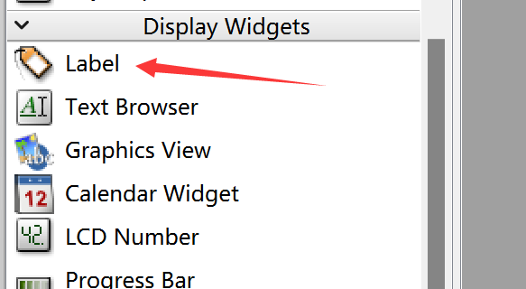
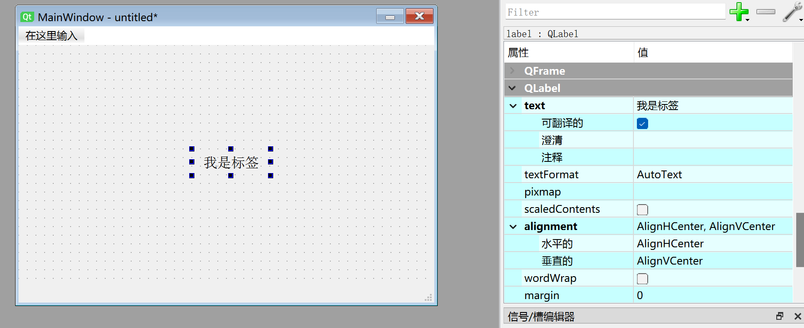

# Label

## Introduction

The Label widget is a widget that can only display preset text content and cannot be edited.



Double-click to modify the label text, and drag the edges to resize it. Font size, alignment, and other settings can all be configured in the property panel on the right.



The generated Python code for this window is as follows:

```python

# -*- coding: utf-8 -*-

from PyQt5 import QtCore, QtGui, QtWidgets


class Ui_MainWindow(object):
    def setupUi(self, MainWindow):
        MainWindow.setObjectName("MainWindow")
        MainWindow.resize(480, 320)
        self.centralwidget = QtWidgets.QWidget(MainWindow)
        self.centralwidget.setObjectName("centralwidget")
        self.label = QtWidgets.QLabel(self.centralwidget)
        self.label.setGeometry(QtCore.QRect(200, 120, 91, 31))
        font = QtGui.QFont()
        font.setFamily("Agency FB")
        font.setPointSize(12)
        self.label.setFont(font)
        self.label.setCursor(QtGui.QCursor(QtCore.Qt.CrossCursor))
        self.label.setAlignment(QtCore.Qt.AlignCenter)
        self.label.setObjectName("label")
        MainWindow.setCentralWidget(self.centralwidget)
        self.menubar = QtWidgets.QMenuBar(MainWindow)
        self.menubar.setGeometry(QtCore.QRect(0, 0, 480, 22))
        self.menubar.setObjectName("menubar")
        MainWindow.setMenuBar(self.menubar)
        self.statusbar = QtWidgets.QStatusBar(MainWindow)
        self.statusbar.setObjectName("statusbar")
        MainWindow.setStatusBar(self.statusbar)

        self.retranslateUi(MainWindow)
        QtCore.QMetaObject.connectSlotsByName(MainWindow)

    def retranslateUi(self, MainWindow):
        _translate = QtCore.QCoreApplication.translate
        MainWindow.setWindowTitle(_translate("MainWindow", "MainWindow"))
        self.label.setText(_translate("MainWindow", "I am a label"))

```

The code related to the label is as follows:

```python
# -*- coding: utf-8 -*-

from PyQt5 import QtCore, QtGui, QtWidgets


class Ui_MainWindow(object):
    def setupUi(self, MainWindow):
        ...
        self.label = QtWidgets.QLabel(self.centralwidget)
        self.label.setGeometry(QtCore.QRect(200, 120, 91, 31))
        font = QtGui.QFont()
        font.setFamily("Agency FB")
        font.setPointSize(12)
        self.label.setFont(font)
        self.label.setCursor(QtGui.QCursor(QtCore.Qt.CrossCursor))
        self.label.setAlignment(QtCore.Qt.AlignCenter)
        self.label.setObjectName("label") # Set label object name (internal, not display name)


    def retranslateUi(self, MainWindow):
        ...
        self.label.setText(_translate("MainWindow", "I am a label")) # Display content is "I am a label"

```
