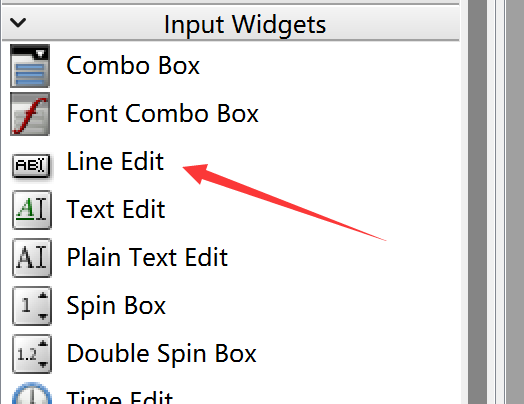
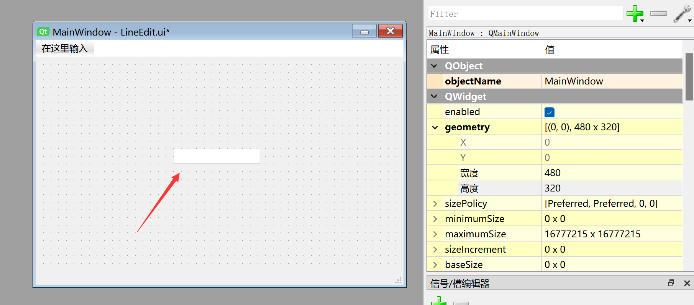

# LineEdit (Single-Line Text Box)

## Introduction

A single-line text box allows the user to input a single line of text.



Double-click to add preset display content, and drag the edges to resize it. Font size and other properties can be configured in the property panel on the right.



The generated Python code for this window is as follows:

```python
# -*- coding: utf-8 -*-

from PyQt5 import QtCore, QtGui, QtWidgets

class Ui_MainWindow(object):
    def setupUi(self, MainWindow):
        MainWindow.setObjectName("MainWindow")
        MainWindow.resize(480, 320)
        self.centralwidget = QtWidgets.QWidget(MainWindow)
        self.centralwidget.setObjectName("centralwidget")
        self.lineEdit = QtWidgets.QLineEdit(self.centralwidget)
        self.lineEdit.setGeometry(QtCore.QRect(180, 120, 113, 20))
        self.lineEdit.setObjectName("lineEdit")
        MainWindow.setCentralWidget(self.centralwidget)
        self.menubar = QtWidgets.QMenuBar(MainWindow)
        self.menubar.setGeometry(QtCore.QRect(0, 0, 480, 22))
        self.menubar.setObjectName("menubar")
        MainWindow.setMenuBar(self.menubar)
        self.statusbar = QtWidgets.QStatusBar(MainWindow)
        self.statusbar.setObjectName("statusbar")
        MainWindow.setStatusBar(self.statusbar)

        self.retranslateUi(MainWindow)
        QtCore.QMetaObject.connectSlotsByName(MainWindow)

    def retranslateUi(self, MainWindow):
        _translate = QtCore.QCoreApplication.translate
        MainWindow.setWindowTitle(_translate("MainWindow", "MainWindow"))

```

The code related to the single-line text box is as follows:

```python
# -*- coding: utf-8 -*-

from PyQt5 import QtCore, QtGui, QtWidgets


class Ui_MainWindow(object):
    def setupUi(self, MainWindow):
        ...
        self.lineEdit = QtWidgets.QLineEdit(self.centralwidget)
        self.lineEdit.setGeometry(QtCore.QRect(180, 120, 113, 20)) # x, y, width, height of the text box
        self.lineEdit.setObjectName("lineEdit") # Set the text box object name (internal, not display name)

```

## QLineEdit Object

|  Common Methods |  Description |
|  :---:  | --- | 
| setText()  |  Set the text box content  | 
| Text()  |  Get the text box content  | 
| clear()  |  Clear the text box content | 
| setMaxLength()  |  Set the maximum allowed character length | 

<br></br>

|  Common Signals |  Description |
|  :---:  | --- | 
| textChanged  |  Triggered when the text box content changes  | 
| editingFinished  |  Triggered when editing finishes, by pressing the **Enter** key  | 

## Example

**Example: When the user finishes entering text and presses the Enter key, print the input content to the terminal.**

Use the `editingFinished` signal. Add the following after `self.retranslateUi(MainWindow)`:

```python

self.lineEdit.editingFinished.connect(self.fun) # Editing finished — press <Enter> to finish

```

Then add the function to execute inside the `Ui_MainWindow` class — here we'll have it print the text to the terminal:

```python

# Execute function
def fun(self):
    print(self.lineEdit.text())


```

Here's the complete code:

```python

# -*- coding: utf-8 -*-

from PyQt5 import QtCore, QtGui, QtWidgets


class Ui_MainWindow(object):
    def setupUi(self, MainWindow):
        MainWindow.setObjectName("MainWindow")
        MainWindow.resize(480, 320)
        self.centralwidget = QtWidgets.QWidget(MainWindow)
        self.centralwidget.setObjectName("centralwidget")
        self.lineEdit = QtWidgets.QLineEdit(self.centralwidget)
        self.lineEdit.setGeometry(QtCore.QRect(180, 120, 113, 20))
        self.lineEdit.setObjectName("lineEdit")
        MainWindow.setCentralWidget(self.centralwidget)
        self.menubar = QtWidgets.QMenuBar(MainWindow)
        self.menubar.setGeometry(QtCore.QRect(0, 0, 480, 22))
        self.menubar.setObjectName("menubar")
        MainWindow.setMenuBar(self.menubar)
        self.statusbar = QtWidgets.QStatusBar(MainWindow)
        self.statusbar.setObjectName("statusbar")
        MainWindow.setStatusBar(self.statusbar)

        self.retranslateUi(MainWindow)
        #self.lineEdit.textChanged.connect(self.fun) # Text box content changed
        self.lineEdit.editingFinished.connect(self.fun) # Editing finished — press <Enter> to finish
        QtCore.QMetaObject.connectSlotsByName(MainWindow)

    def retranslateUi(self, MainWindow):
        _translate = QtCore.QCoreApplication.translate
        MainWindow.setWindowTitle(_translate("MainWindow", "MainWindow"))

    # Execute function
    def fun(self):
        print(self.lineEdit.text())

#################
#   Main Code    #
#################
import sys

# [Optional] Allow Thonny remote execution
import os
os.environ["DISPLAY"] = ":0.0"

# [Optional] Fix display issues on 2K+ resolution monitors
QtCore.QCoreApplication.setAttribute(QtCore.Qt.AA_EnableHighDpiScaling)

# Main program entry — build and display the window
app = QtWidgets.QApplication(sys.argv)
MainWindow = QtWidgets.QMainWindow() # Create window object
ui = Ui_MainWindow() # Create PyQt5-designed window object
ui.setupUi(MainWindow) # Initialize window
MainWindow.show() # Show window

# [Recommended] Allow Ctrl+C to interrupt the window from terminal for easier debugging
import signal
signal.signal(signal.SIGINT, signal.SIG_DFL)
timer = QtCore.QTimer()
timer.start(100)  # You may change this if you wish.
timer.timeout.connect(lambda: None)  # Let the interpreter run each 100 ms

sys.exit(app.exec_()) # Exit the process when the window is closed

```

Run the code. Enter text in the text box and press the **Enter** key on your keyboard. You'll see the terminal print the text entered into the text box.


