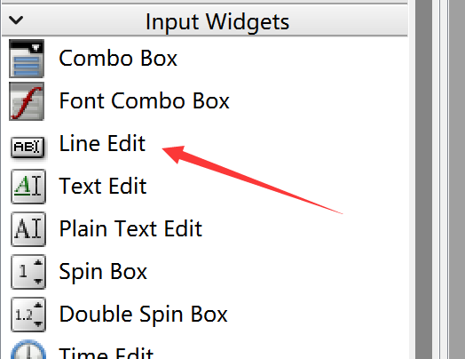

# LineEdit（单行文本框）

## 介绍

单行文本框允许用于输入单行文本。



双击可以添加文本框预显示内容，拖动边缘可以缩放。还有字体大小、其它属性右边属性栏都可以设置。


该窗口生成的py代码如下：
```python
# -*- coding: utf-8 -*-

from PyQt5 import QtCore, QtGui, QtWidgets

class Ui_MainWindow(object):
    def setupUi(self, MainWindow):
        MainWindow.setObjectName("MainWindow")
        MainWindow.resize(480, 320)
        self.centralwidget = QtWidgets.QWidget(MainWindow)
        self.centralwidget.setObjectName("centralwidget")
        self.lineEdit = QtWidgets.QLineEdit(self.centralwidget)
        self.lineEdit.setGeometry(QtCore.QRect(180, 120, 113, 20))
        self.lineEdit.setObjectName("lineEdit")
        MainWindow.setCentralWidget(self.centralwidget)
        self.menubar = QtWidgets.QMenuBar(MainWindow)
        self.menubar.setGeometry(QtCore.QRect(0, 0, 480, 22))
        self.menubar.setObjectName("menubar")
        MainWindow.setMenuBar(self.menubar)
        self.statusbar = QtWidgets.QStatusBar(MainWindow)
        self.statusbar.setObjectName("statusbar")
        MainWindow.setStatusBar(self.statusbar)

        self.retranslateUi(MainWindow)
        QtCore.QMetaObject.connectSlotsByName(MainWindow)

    def retranslateUi(self, MainWindow):
        _translate = QtCore.QCoreApplication.translate
        MainWindow.setWindowTitle(_translate("MainWindow", "MainWindow"))

```

其中跟单行文本相关的代码如下：

```python
# -*- coding: utf-8 -*-

from PyQt5 import QtCore, QtGui, QtWidgets


class Ui_MainWindow(object):
    def setupUi(self, MainWindow):
        ...
        self.lineEdit = QtWidgets.QLineEdit(self.centralwidget)
        self.lineEdit.setGeometry(QtCore.QRect(180, 120, 113, 20)) #文本框的x坐标、y坐标、宽度、高度；
        self.lineEdit.setObjectName("lineEdit") #设置单行文本框对象名称，非显示名称。

```
## QLineEdit对象

|  常用方法 |  说明 |
|  :---:  | --- | 
| setText()  |  设置文本框内容  | 
| Text()  |  获取文本框内容  | 
| clear()  |  清除文本框内容 | 
| setMaxLength()  |  允许输入最大字符长度 | 

<br></br>

|  常用信号 |  说明 |
|  :---:  | --- | 
| textChanged  |  文本框内容发生改变时触发  | 
| editingFinished  |  内容编写结束时，按下**Enter**键触发  | 

## 示例

**例：当用户在文本框完成输入按下Enter键时，在终端将输入内容打印出来。**

完成输入信号使用editingFinished，在self.retranslateUi(MainWindow)后面加入：

```python

self.lineEdit.editingFinished.connect(self.fun) # 编辑结束, 按下<Enter>键结束

```

然后在 Ui_MainWindow 类下加入要执行函数，这里让终端输出信息：

```python

#执行函数
def fun(self):
    print(self.lineEdit.text())


```

完整代码如下：

```python

# -*- coding: utf-8 -*-

from PyQt5 import QtCore, QtGui, QtWidgets


class Ui_MainWindow(object):
    def setupUi(self, MainWindow):
        MainWindow.setObjectName("MainWindow")
        MainWindow.resize(480, 320)
        self.centralwidget = QtWidgets.QWidget(MainWindow)
        self.centralwidget.setObjectName("centralwidget")
        self.lineEdit = QtWidgets.QLineEdit(self.centralwidget)
        self.lineEdit.setGeometry(QtCore.QRect(180, 120, 113, 20))
        self.lineEdit.setObjectName("lineEdit")
        MainWindow.setCentralWidget(self.centralwidget)
        self.menubar = QtWidgets.QMenuBar(MainWindow)
        self.menubar.setGeometry(QtCore.QRect(0, 0, 480, 22))
        self.menubar.setObjectName("menubar")
        MainWindow.setMenuBar(self.menubar)
        self.statusbar = QtWidgets.QStatusBar(MainWindow)
        self.statusbar.setObjectName("statusbar")
        MainWindow.setStatusBar(self.statusbar)

        self.retranslateUi(MainWindow)
        #self.lineEdit.textChanged.connect(self.fun) # 文本框内容改变
        self.lineEdit.editingFinished.connect(self.fun) # 编辑结束, 按下<Enter>键结束
        QtCore.QMetaObject.connectSlotsByName(MainWindow)

    def retranslateUi(self, MainWindow):
        _translate = QtCore.QCoreApplication.translate
        MainWindow.setWindowTitle(_translate("MainWindow", "MainWindow"))

    #执行函数
    def fun(self):
        print(self.lineEdit.text())

#################
#   主程序代码   #
#################
import sys

#【可选代码】允许Thonny远程运行
import os
os.environ["DISPLAY"] = ":0.0"

#【可选代码】解决2K以上分辨率显示器显示缺失问题
QtCore.QCoreApplication.setAttribute(QtCore.Qt.AA_EnableHighDpiScaling)

#主程序入口，构建窗口并显示
app = QtWidgets.QApplication(sys.argv)
MainWindow = QtWidgets.QMainWindow() #构建窗口对象
ui = Ui_MainWindow() #构建pyQT5设计的窗口对象
ui.setupUi(MainWindow) #初始化窗口
MainWindow.show() #显示窗口

#【建议代码】允许终端通过ctrl+c中断窗口，方便调试
import signal
signal.signal(signal.SIGINT, signal.SIG_DFL)
timer = QtCore.QTimer()
timer.start(100)  # You may change this if you wish.
timer.timeout.connect(lambda: None)  # Let the interpreter run each 100 ms

sys.exit(app.exec_()) #程序关闭时退出进程

```

运行代码，在文本框输入信息并按下电脑**Enter**键，可以看到终端打印输入到文本框的信息。

