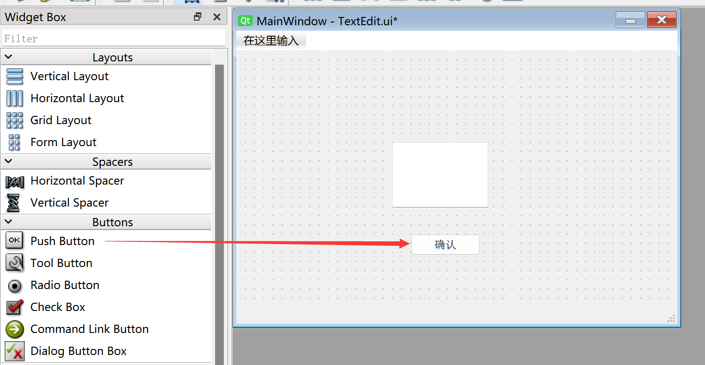

# TextEdit (Multi-Line Text Box)

## Introduction

A multi-line text box allows the user to input multiple lines of text.


Double-click to add preset display content, and drag the edges to resize it. Font size and other properties can be configured in the property panel on the right.


The generated Python code for this window is as follows:

```python
# -*- coding: utf-8 -*-

from PyQt5 import QtCore, QtGui, QtWidgets


class Ui_MainWindow(object):
    def setupUi(self, MainWindow):
        MainWindow.setObjectName("MainWindow")
        MainWindow.resize(480, 320)
        self.centralwidget = QtWidgets.QWidget(MainWindow)
        self.centralwidget.setObjectName("centralwidget")
        self.textEdit = QtWidgets.QTextEdit(self.centralwidget)
        self.textEdit.setGeometry(QtCore.QRect(170, 100, 104, 71))
        self.textEdit.setObjectName("textEdit")
        MainWindow.setCentralWidget(self.centralwidget)
        self.menubar = QtWidgets.QMenuBar(MainWindow)
        self.menubar.setGeometry(QtCore.QRect(0, 0, 480, 22))
        self.menubar.setObjectName("menubar")
        MainWindow.setMenuBar(self.menubar)
        self.statusbar = QtWidgets.QStatusBar(MainWindow)
        self.statusbar.setObjectName("statusbar")
        MainWindow.setStatusBar(self.statusbar)

        self.retranslateUi(MainWindow)
        QtCore.QMetaObject.connectSlotsByName(MainWindow)

    def retranslateUi(self, MainWindow):
        _translate = QtCore.QCoreApplication.translate
        MainWindow.setWindowTitle(_translate("MainWindow", "MainWindow"))

```

The code related to the multi-line text box is as follows:

```python
# -*- coding: utf-8 -*-

from PyQt5 import QtCore, QtGui, QtWidgets


class Ui_MainWindow(object):
    def setupUi(self, MainWindow):
        ...
        self.textEdit = QtWidgets.QTextEdit(self.centralwidget)
        self.textEdit.setGeometry(QtCore.QRect(170, 100, 104, 71)) # x, y, width, height of the text box
        self.textEdit.setObjectName("textEdit") # Set the text box object name (internal, not display name)

```

## QTextEdit Object

|  Common Methods |  Description |
|  :---:  | --- | 
| setPlainText()  |  Set the text box content  | 
| toPlainText()  |  Get the text box content  | 
| clear()  |  Clear the text box content | 
| setTextColor()  |  Set text color. E.g.: QtGui.QColor(255,0,0) for red | 
| setTextBackgroundColor()  |  Set text background color. E.g.: QtGui.QColor(255,0,0) for red | 
| setWordWrapMode()  |  Enable automatic word wrapping | 


## Example

**Example: Enter content in a multi-line text box, then click a button to print it to the terminal.**

Since a multi-line text box has no confirm input signal (the **Enter** key is used for line breaks), you can combine it with a [**button**](../buttons/push_button.md) to implement printing the multi-line text box content on button click.




Here's the complete code:

```python

# -*- coding: utf-8 -*-

from PyQt5 import QtCore, QtGui, QtWidgets


class Ui_MainWindow(object):
    def setupUi(self, MainWindow):
        MainWindow.setObjectName("MainWindow")
        MainWindow.resize(480, 320)
        self.centralwidget = QtWidgets.QWidget(MainWindow)
        self.centralwidget.setObjectName("centralwidget")
        self.textEdit = QtWidgets.QTextEdit(self.centralwidget)
        self.textEdit.setGeometry(QtCore.QRect(140, 100, 191, 71))
        self.textEdit.setObjectName("textEdit")
        self.pushButton = QtWidgets.QPushButton(self.centralwidget)
        self.pushButton.setGeometry(QtCore.QRect(190, 200, 75, 23))
        self.pushButton.setObjectName("pushButton")
        MainWindow.setCentralWidget(self.centralwidget)
        self.menubar = QtWidgets.QMenuBar(MainWindow)
        self.menubar.setGeometry(QtCore.QRect(0, 0, 480, 22))
        self.menubar.setObjectName("menubar")
        MainWindow.setMenuBar(self.menubar)
        self.statusbar = QtWidgets.QStatusBar(MainWindow)
        self.statusbar.setObjectName("statusbar")
        MainWindow.setStatusBar(self.statusbar)

        self.retranslateUi(MainWindow)
        self.pushButton.clicked.connect(self.fun) # Button signal-slot definition
        QtCore.QMetaObject.connectSlotsByName(MainWindow)

    def retranslateUi(self, MainWindow):
        _translate = QtCore.QCoreApplication.translate
        MainWindow.setWindowTitle(_translate("MainWindow", "MainWindow"))
        self.pushButton.setText(_translate("MainWindow", "Confirm"))

    # Execute function
    def fun(self):
        print(self.textEdit.toPlainText()) # Print multi-line text box content

#################
#   Main Code    #
#################
import sys

# [Optional] Allow Thonny remote execution
import os
os.environ["DISPLAY"] = ":0.0"

# [Optional] Fix display issues on 2K+ resolution monitors
QtCore.QCoreApplication.setAttribute(QtCore.Qt.AA_EnableHighDpiScaling)

# Main program entry — build and display the window
app = QtWidgets.QApplication(sys.argv)
MainWindow = QtWidgets.QMainWindow() # Create window object
ui = Ui_MainWindow() # Create PyQt5-designed window object
ui.setupUi(MainWindow) # Initialize window
MainWindow.show() # Show window

# [Recommended] Allow Ctrl+C to interrupt the window from terminal for easier debugging
import signal
signal.signal(signal.SIGINT, signal.SIG_DFL)
timer = QtCore.QTimer()
timer.start(100)  # You may change this if you wish.
timer.timeout.connect(lambda: None)  # Let the interpreter run each 100 ms

sys.exit(app.exec_()) # Exit the process when the window is closed

```

Run the code. Enter text in the multi-line text box and click the **Confirm** button. You'll see the terminal print the content of the text box.


