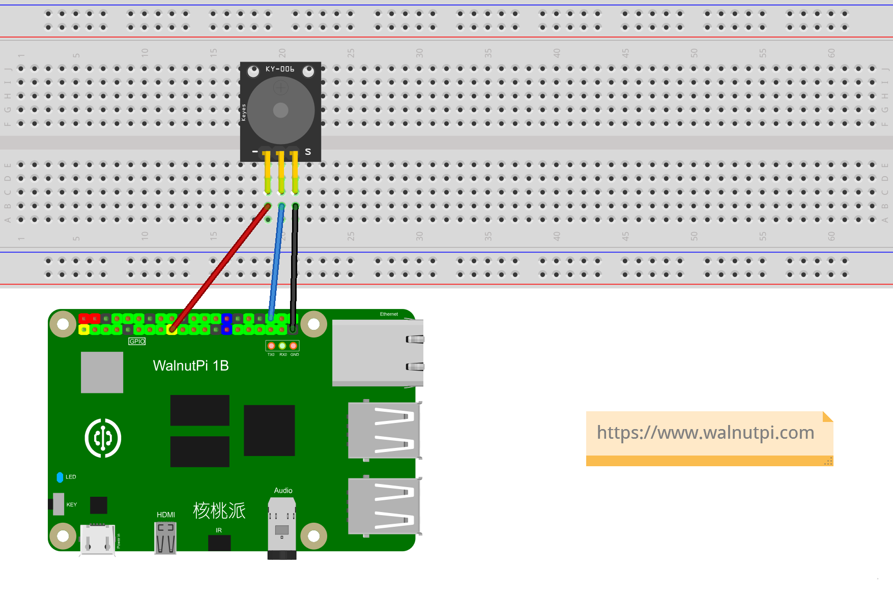
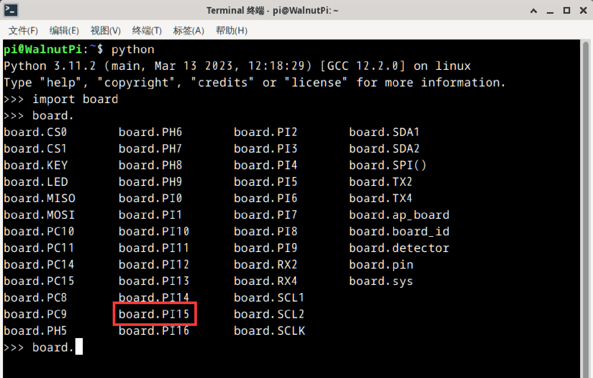

# Active Buzzer

## Introduction
In daily life, many electronic devices sound an alarm when a fault occurs, and sound often draws more attention than indicator lights. In this section, let's learn how to drive an active buzzer with the WalnutPi.

## Objective
Program the buzzer to produce beeping sounds.

## Explanation

Buzzers are mainly divided into active buzzers and passive buzzers. An active buzzer produces sound (with a fixed frequency) when controlled by HIGH/LOW levels, while a passive buzzer is controlled by PWM waves (capable of producing sounds of different frequencies). In this section, we'll explain the use of an active buzzer.

The usage of an active buzzer is similar to an LED — simply apply a HIGH level to the buzzer to make it sound.

Connection of the active buzzer to the WalnutPi: GND → GND, VCC → 3.3V, IO → PI15 (you can also change to any GPIO you want to use)

 <br></br>

The WalnutPi PI15's name in the Python library is **board.PI15**:

 <br></br><br></br>

## The digitalio Object

In CircuitPython, you can directly use the digitalio (Digital IO) module to program IO input/output for HIGH/LOW level output. Details are as follows:

### Constructor
```python
active_buzzer=digitalio.DigitalInOut(pin)
```
Parameter description:
- `pin` Board pin number. Example: board.PI15

### Methods
```python
active_buzzer.direction = value
```
Define pin as input/output. Possible `value` values:
- `digitalio.Direction.INPUT` : Input.
- `digitalio.Direction.OUTPUT` : Output.

<br></br>

## The time Object

`time` can be used for delays.

### Constructor
```python
import time
```
The time module, imported directly:

### Methods
```python
time.sleep(value)
```
Delay.
- `value` refers to the delay time in seconds. A value of 1 means 1 second; a value of 0.1 means 0.1 seconds, i.e., 100ms.

<br></br>

The active buzzer, like the LED, uses the digitalio object in output mode. We can implement code that changes between HIGH and LOW levels every 0.5 seconds to produce a beeping sound from the buzzer.

```mermaid
graph TD
    Import digitalio-related modules --> Construct active_buzzer object --> Turn on buzzer --> Delay 0.5s --> Turn off buzzer --> Delay 0.5s --> Turn on buzzer;
```

## Reference Code

```python
'''
Experiment Name: Active Buzzer
Experiment Platform: WalnutPi
'''

# Import related modules
import board, time
from digitalio import DigitalInOut, Direction, Pull

# Construct and initialize buzzer object
active_buzzer = DigitalInOut(board.PI15) # Define pin number
active_buzzer.direction = Direction.OUTPUT  # IO as output

for i in range(5):

    active_buzzer.value = False # Turn on buzzer
    time.sleep(0.5) # Delay 0.5s
    active_buzzer.value = True # Turn off buzzer
    time.sleep(0.5) # Delay 0.5s
```

## Result

Use Thonny to remotely run the above Python code on the WalnutPi. For instructions on running Python code on the WalnutPi, please refer to: [Running Python Code](../python_run.md)


When running the code, you can hear the active buzzer periodically producing "beep beep" sounds.


