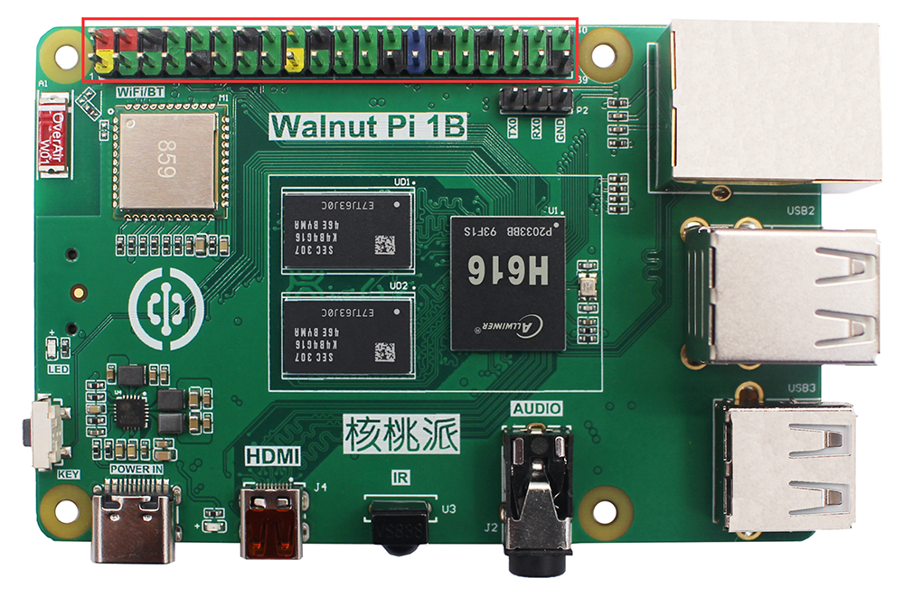
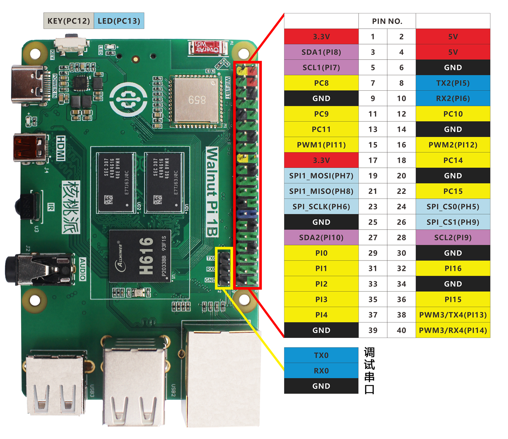
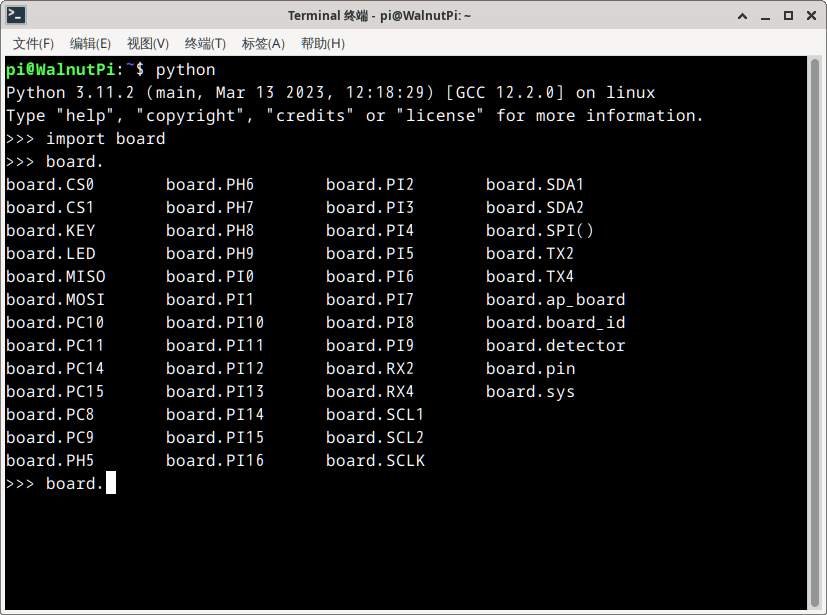

# GPIO Introduction

Before we begin learning, let's take a detailed look at the WalnutPi's GPIO — that is, the 40-pin GPIO header mentioned earlier. The WalnutPi is already a great single-board computer, but the GPIO design makes it easier for users to do various DIY electronics projects, giving you an experience comparable to a powerful microcontroller development board.



Below is the WalnutPi GPIO pinout diagram:


From the table and diagram above, you can see that GPIO is similar to traditional microcontroller development. In addition to regular IO pins, there are also bus interfaces such as I2C, UART, SPI, etc. As you will see in future experiments, programming with Python makes getting started with the WalnutPi very easy — we just need to be familiar with Python library object functions and usage to easily master WalnutPi embedded programming.

We can check pin names using Python commands in the terminal.
Enter `python` in the terminal to enter Python interactive mode, then type:
```python
import board
```
Then type:
```python
board.
```
Press the Tab key to autocomplete and see all WalnutPi Python library pin names.



This will be useful in later experiments.
