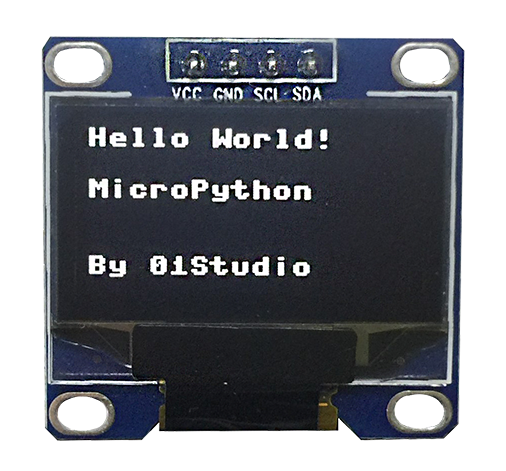
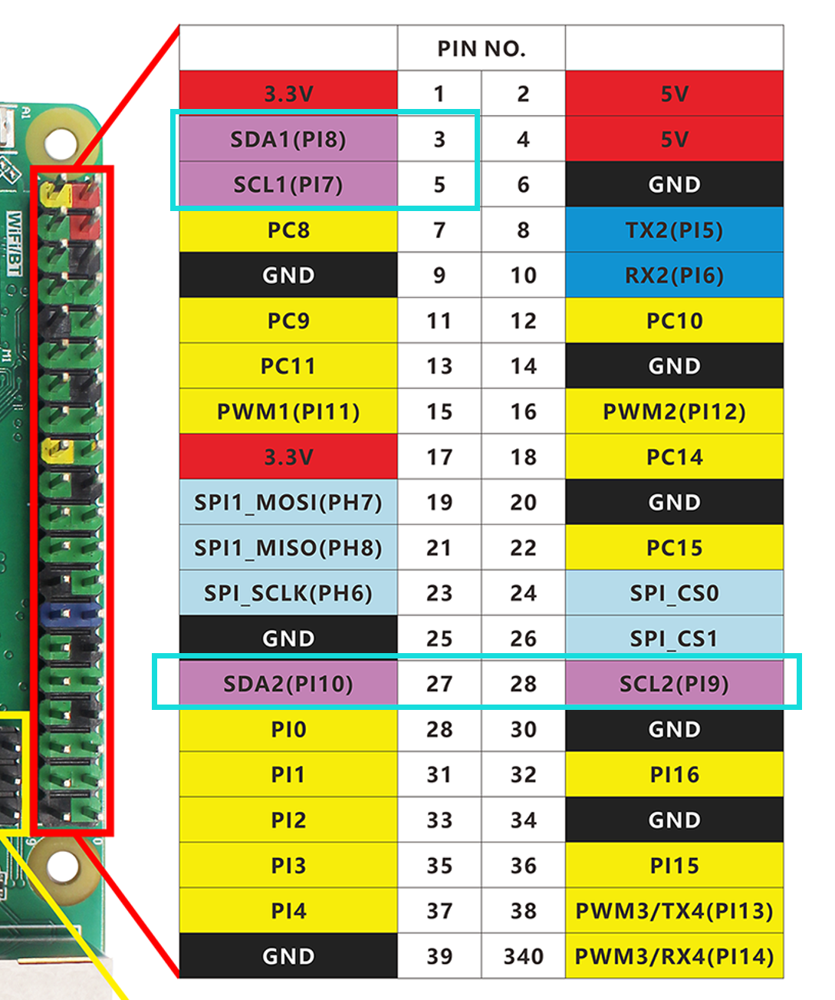
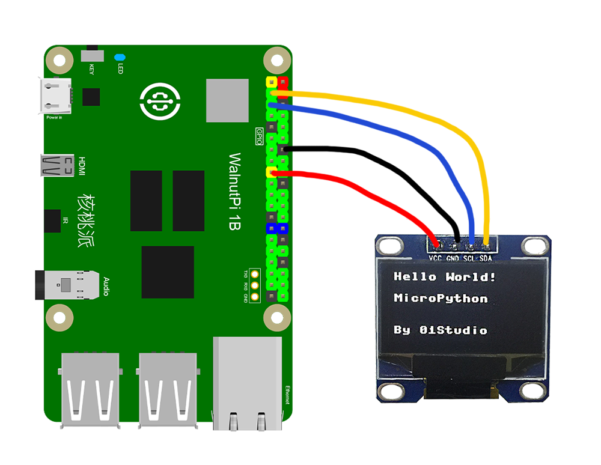
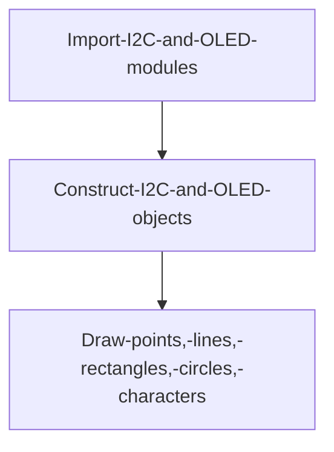
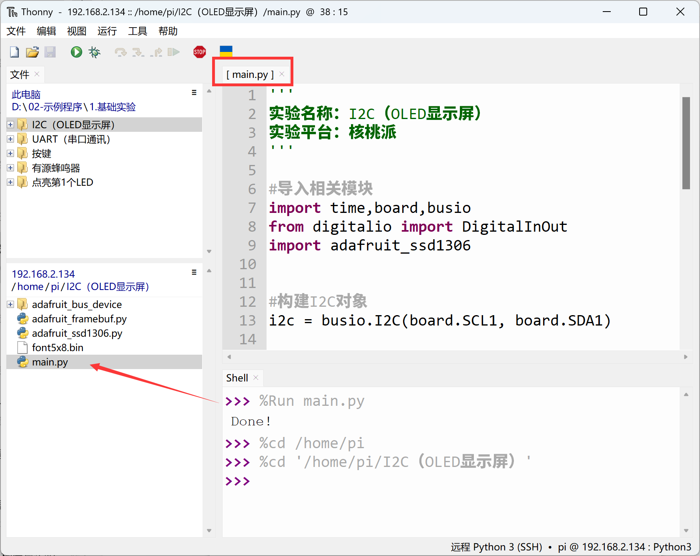
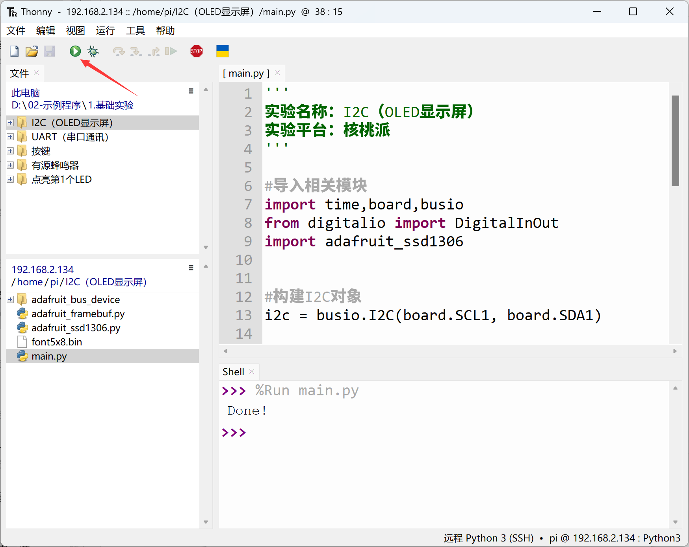

# I2C (OLED Display)

## Introduction
Previously, we learned about various input/output devices. For example, an LED can also be considered an output device because it clearly tells us the hardware status. However, compared to an LED that only has on/off states, an OLED display can show much more information, providing a better experience. The study of the OLED display in this chapter is actually to learn how to use the WalnutPi's I2C bus interface, because the WalnutPi communicates with the OLED display via the I2C bus.

## Objective
Learn to program the WalnutPi's I2C bus and use an OLED display.

## Explanation

**What is I2C?**
I2C is a two-wire protocol for communication between devices. At the physical level, it consists of 2 lines: SCL and SDA, the clock line and data line respectively. This means that different devices can communicate using just these two lines.

**What is an OLED Display?**
OLEDs emit light on their own, unlike TFT LCDs which require a backlight. This results in high visibility and brightness. Additionally, they require low voltage, are power-efficient, have fast response times, are lightweight and thin, have a simple structure, and are low-cost. In simple terms, the difference from traditional LCDs is that the pixel material is composed of individual light-emitting diodes. Because of low density, early OLEDs had low pixel resolution and were mainly used for outdoor LED billboards. As technology matured, integration became increasingly higher. Small screens can now achieve relatively high resolutions. The OLED driver chip used in this experiment is the common SSD1306, which is widely available on the market.

Specifications: 0.91 inch / 128×64 resolution / black background with white text (3.3V power supply).




The WalnutPi's GPIO brings out two I2C interfaces — I2C1 and I2C2, as shown below:



In this experiment, we use I2C1 to connect the OLED display. The wiring is as follows:



## The I2C Object

Generally, I2C communication speeds are not high, so we can use CircuitPython's software-simulated I2C. The object description is as follows:

### Constructor
```python
i2c=busio.I2C(scl,sda,frequency=100000,timeout=255)
```
Constructs a software I2C object.
- `scl` : Clock pin;
- `sda` : Data pin;
- `frequency` : Communication frequency (speed);
- `timeout` : Timeout period.

### Methods
```python
i2c.scan()
```
Scans for devices on the I2C bus. Returns an address, e.g.: 0x3c;

<br></br>

```python
i2c.readfrom(address,buffer)
```
Reads data from a specified address.
- `address` : Number of characters to read.
- `buffer` : Data content.

<br></br>

```python
i2c.writeto(address,buffer)
```
Writes data to a specified address.
- `address` : Number of characters to write.
- `buffer` : Data content.

<br></br>

```python
i2c.deinit()
```
Deinitializes the I2C object.

<br></br>

For more I2C usage, refer to the official documentation at https://docs.circuitpython.org/ and search for **"busio.I2C"**.

## The SSD1306_I2C Object

In addition to the I2C object above, controlling the OLED display also requires OLED-related Python libraries. These libraries have already been written by the Blinka project and are provided as `.py` files. We only need to place the relevant files in the same directory as the main function code.

### Constructor

```python
display = adafruit_ssd1306.SSD1306_I2C(width, height, i2c, addr=0x3C)
```
Constructs an SSD1306-driven OLED display object.
- `width` : OLED width resolution;
- `height` : OLED height resolution;
- `i2c` : Initialized I2C object;
- `addr` : OLED I2C address. Different manufacturers may differ; the display used here has address 0x3C.

### Methods

```python
display.fill(value)
```
Clears the screen.
- `value` : Color.
    - `0` : Black screen
    - `1` : White

<br></br>

```python
display.show()
```
Refresh the display. This command must be executed after adding new display content.

<br></br>

```python
display.pixel(x,y,color)
```
Draws a pixel.
- `x` : Horizontal coordinate.
- `y` : Vertical coordinate.
- `color` : Color:
    - `1` : White
    - `2` : Black

<br></br>

```python
display.hline(x,y,width,color)
```
Draws a horizontal line.
- `x` : Horizontal coordinate.
- `y` : Vertical coordinate.
- `width` : Length.
- `color` : Color:
    - `1` : White
    - `2` : Black

<br></br>

```python
display.rect(x,y,width,height,color,fill=false)
```
Draws a rectangle.
- `x` : Horizontal coordinate.
- `y` : Vertical coordinate.
- `width` : Length.
- `height` : Height.
- `color` : Color:
    - `1` : White
    - `2` : Black
- `fill` : Whether to fill.
    - `false` : No fill
    - `true` : Fill

<br></br>

```python
display.circle(center_x,center_y,radius,color)
```
Draws a circle.
- `center_x` : X-coordinate of center.
- `center_y` : Y-coordinate of center.
- `radius` : Radius.
- `color` : Color:
    - `1` : White
    - `2` : Black

<br></br>

```python
display.text(string,x,y,font_name='font5*8.bin',size=1)
```
Writes characters at a specified position.
- `string` : Characters.
- `x` : Starting horizontal coordinate.
- `y` : Starting vertical coordinate.
- `font_name` : Font.
- `size` : Size.

For more usage methods, refer to the official documentation:
https://circuitpython.readthedocs.io/projects/framebuf/en/latest/api.html

After learning the I2C and OLED object usage, let's organize the approach with a programming flowchart:



## Reference Code

```python
'''
Experiment Name: I2C (OLED Display)
Experiment Platform: WalnutPi
'''

# Import related modules
import time,board,busio
from digitalio import DigitalInOut
import adafruit_ssd1306


# Construct I2C object
i2c = busio.I2C(board.SCL1, board.SDA1)

# Construct OLED object; the display's address is 0x3C
display = adafruit_ssd1306.SSD1306_I2C(128, 64, i2c, addr=0x3C)

# Clear screen
display.fill(0)
display.show()

# Draw pixel (x, y, color)
display.pixel(5, 5, 1)

# Draw line (x, y, width, color)
display.hline(5,10,20,1)

# Draw rectangle (x, y, width, height, color, *, fill=False)
display.rect(5, 15, 20, 10, 1)

# Draw circle
display.circle(50, 15, 10, 1)

# Text
display.text("Hello WalnutPi!", 5, 40, 1,font_name='font5x8.bin')

# Refresh display
display.show()
print('Done!')
```

## Result

Connect the OLED display to the WalnutPi GPIO as follows:


Since the OLED code depends on other `.py` library files, you need to upload the entire folder to the WalnutPi:


After successful transfer, you need to open the remote directory (WalnutPi) and run `main.py`, because running it will import other files in the folder. Therefore, running this type of code locally on a PC is ineffective.



Then use Thonny to remotely run the above Python code on the WalnutPi. For instructions on running Python code on the WalnutPi, please refer to: [Running Python Code](../python_run.md)



After running, you can see the OLED displaying the relevant content:


