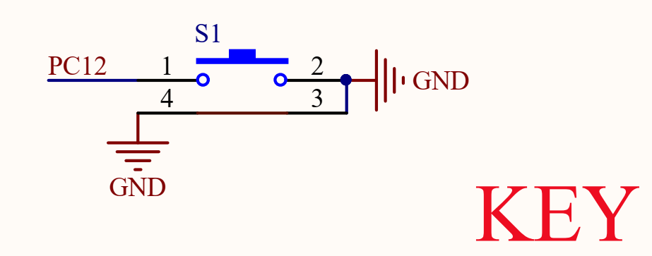
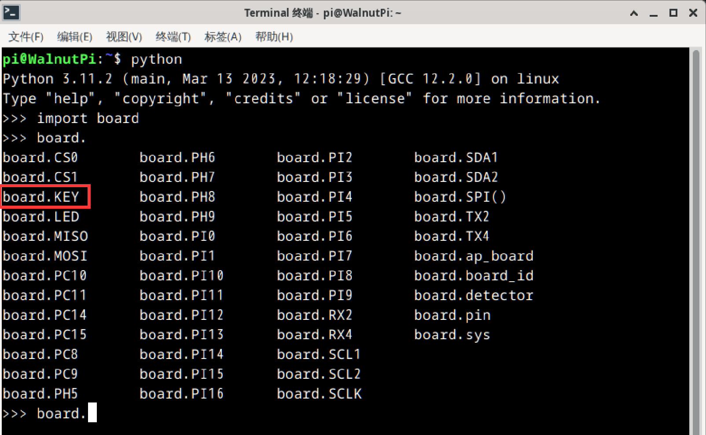
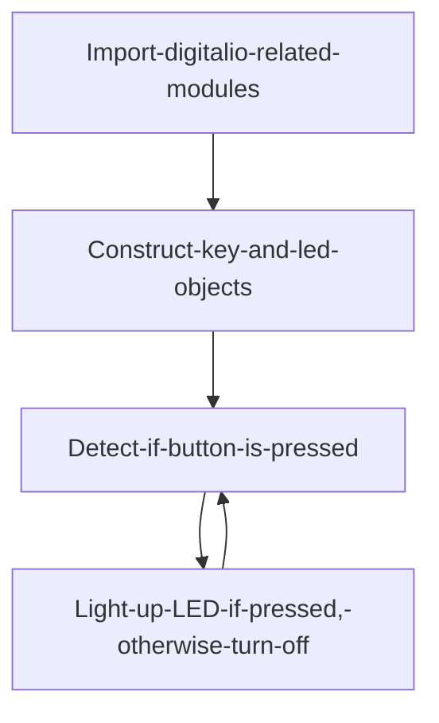
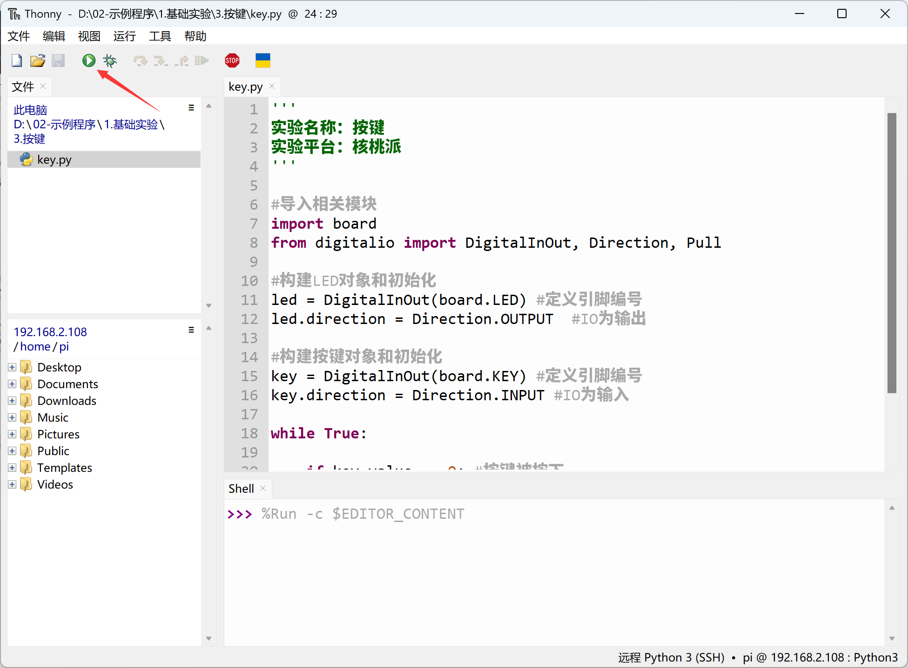
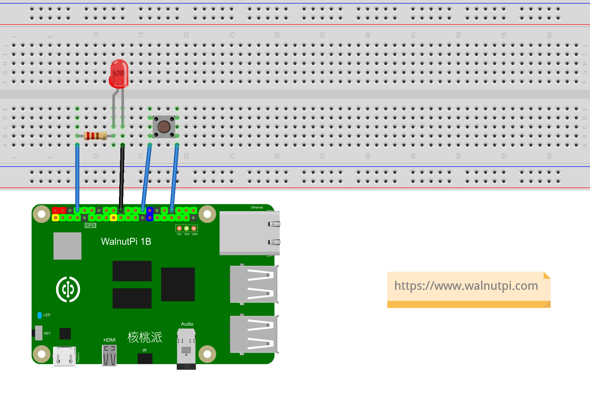

# Button

## Introduction
The button is the simplest and most common input device. Many products rely on buttons, including the early iPhone. Today, let's learn how to write a button program using Python. With button input functionality, we can create many interesting things.

## Objective
Program the detection of button input.

## Explanation

The WalnutPi has an onboard button located next to the TYPE-C power port:

  <br></br><br></br>

From the WalnutPi schematic, we can see that the button is connected to the controller pin PC12. When not pressed, the input is HIGH (1); when pressed, it connects to ground and outputs LOW (0):

 <br></br><br></br>


Since we are using the Python library, we only need to know the library pin name. The button's name in the Python library is **board.KEY**:

 <br></br><br></br>

## The digitalio Object

In CircuitPython, you can directly use the digitalio (Digital IO) module to program IO input for detecting the button's input level. Details are as follows:

### Constructor
```python
key=digitalio.DigitalInOut(pin)
```
Parameter description:
- `pin` Board pin number. Example: board.PC8

### Methods
```python
key.direction = value
```
Define pin as input/output. Possible `value` values:
- `digitalio.Direction.INPUT` : Input.
- `digitalio.Direction.OUTPUT` : Output.

<br></br>

```python
key.pull = value
```
Set pull-up/pull-down resistor. Possible `value` values:
- `digitalio.Pull.UP` : Pull-up.
- `digitalio.Pull.DOWN` : Pull-down.

<br></br>

```python
value = key.value
```
Button input return value. Possible return values:
- `True` or `1` : HIGH.
- `False` or `0` : LOW.

<br></br>

For more usage, refer to the official documentation:<br></br>
https://docs.circuitpython.org/en/latest/shared-bindings/digitalio/index.html

KEY, like the LED in the previous section, also uses the digitalio object, except the mode is changed from output to input. We can implement code that lights up the blue LED when the button is pressed (input LOW) and turns it off when released (input HIGH).



## Reference Code

```python
'''
Experiment Name: Button
Experiment Platform: WalnutPi
'''

# Import related modules
import board
from digitalio import DigitalInOut, Direction, Pull

# Construct and initialize LED object
led = DigitalInOut(board.LED) # Define pin number
led.direction = Direction.OUTPUT  # IO as output

# Construct and initialize button object
key = DigitalInOut(board.KEY) # Define pin number
key.direction = Direction.INPUT # IO as input

while True:

    if key.value == 0: # Button pressed
        led.value = 1 # Turn on LED

    else: # Released
        led.value = 0 # Turn off LED
```

## Result

Use Thonny to remotely run the above Python code on the WalnutPi. For instructions on running Python code on the WalnutPi, please refer to: [Running Python Code](../python_run.md)




Press the button and the LED lights up.


Release the button and the LED turns off.


Besides using the onboard button and LED, you can also build your own circuit. Just remember to modify the GPIO pin number in the code accordingly.



The essence of a button is GPIO operation. In addition to the onboard LED and button, you can also use Dupont wires to connect to other WalnutPi GPIO pins (on the 40-pin header) for related functions.
