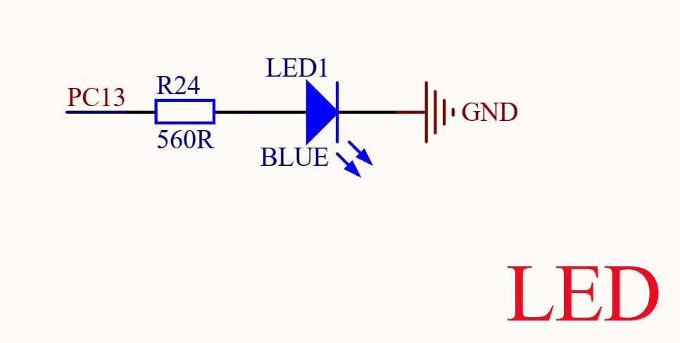
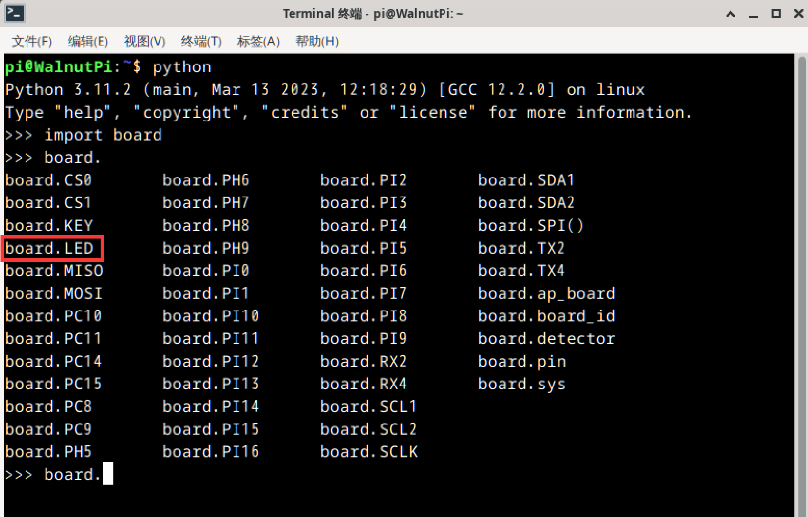
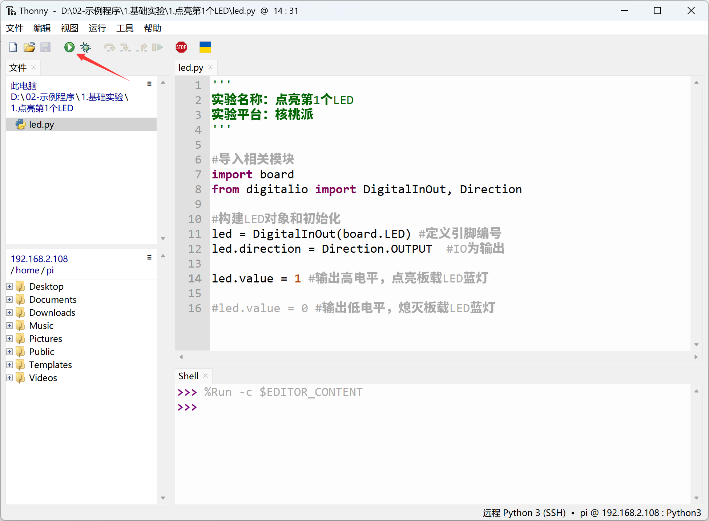
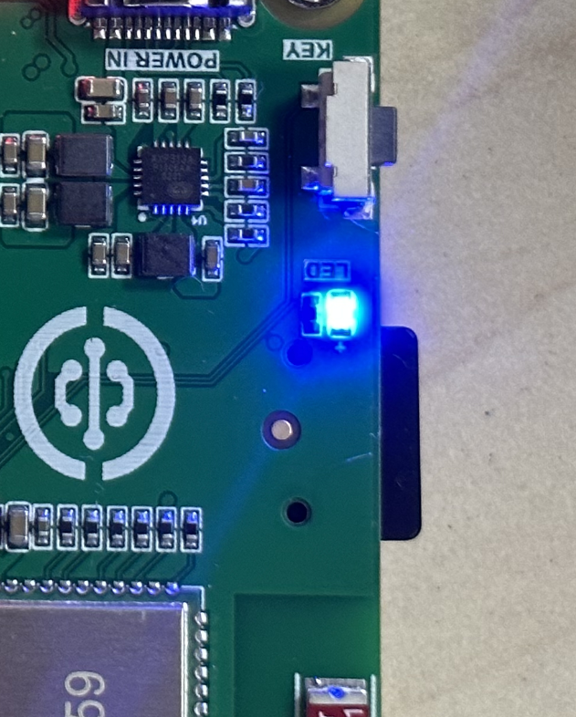

# Lighting the First LED

## Introduction
It is believed that most people start learning embedded microcontroller programming by lighting an LED. The WalnutPi learning journey is no exception. Lighting the first LED gives you some understanding of WalnutPi GPIO applications and programming methods, laying the foundation for future learning and more complex programs, and boosting your confidence.

## Objective
Light up the onboard blue LED.

## Explanation

The WalnutPi has one onboard programmable LED, located next to the button:


From the WalnutPi schematic, we can see that the LED is connected to the controller pin PC13. It lights up when a HIGH level is output:


Since we are using the Python library, we only need to know the library pin name.

We can check pin names using Python commands in the terminal.

Enter `python` in the terminal to enter Python interactive mode:
```bash
python
```

Then type:
```python
import board
```
Then type:
```python
board.
```
Press the Tab key to autocomplete and see all WalnutPi Python library pin names.

The LED's name in the Python library is **board.LED**:



## The digitalio Object

In CircuitPython, you can directly use the digitalio (Digital IO) module to program IO output for lighting the LED. Details are as follows:

### Constructor
```python
led=digitalio.DigitalInOut(pin)
```
Parameter description:
- `pin` Board pin number. Example: board.PC8

### Methods
```python
led.direction = value
```
Define pin as input/output. Possible `value` values:
- `digitalio.Direction.INPUT` : Input.
- `digitalio.Direction.OUTPUT` : Output.

<br></br>

```python
led.pull = value
```
Set pull-up/pull-down resistor. Possible `value` values:
- `digitalio.Pull.UP` : Pull-up.
- `digitalio.Pull.DOWN` : Pull-down.

<br></br>

```python
led.value = value
```
GPIO output value. Possible `value` values:
- `True` or `1` : HIGH.
- `False` or `0` : LOW.

<br></br>

For more usage, refer to the official documentation:<br></br>
https://docs.circuitpython.org/en/latest/shared-bindings/digitalio/index.html

Above, we've explained the CircuitPython DigitalInOut object in detail. `digitalio` is the main module, while `DigitalInOut`, `Direction`, `Pull`, and `DriveMode` are sub-modules under `digitalio`. There are two ways to reference related modules in Python programming:

- Method 1: `import digitalio`, then operate via `digitalio.DigitalInOut`;
- Method 2: `from digitalio import DigitalInOut`, which means directly importing the `DigitalInOut` module from `digitalio`, then operating via `DigitalInOut` directly. Method 2 is clearly more intuitive and convenient. This experiment also uses Method 2. The code writing flow is as follows:

```mermaid
graph TD
    Import digitalio-related modules --> Construct LED object;
    Construct LED object --> Light up LED;
```

## Reference Code

```python
'''
Experiment Name: Lighting the First LED
Experiment Platform: WalnutPi
'''

# Import related modules
import board
from digitalio import DigitalInOut, Direction

# Construct and initialize the LED object
led = DigitalInOut(board.LED) # Define pin number
led.direction = Direction.OUTPUT  # IO as output

led.value = 1 # Output HIGH, light up onboard blue LED

#led.value = 0 # Output LOW, turn off onboard blue LED
```

## Result

Use Thonny to remotely run the above Python code on the WalnutPi. For instructions on running Python code on the WalnutPi, please refer to: [Running Python Code](../python_run.md)




The LED is lit, but since the WalnutPi's blue LED is also used as a system boot indicator by default (lights up on successful boot), you might not notice the difference.



You can modify the code to turn the LED off:
```python
led.value = 0 # Output LOW, turn off onboard blue LED
```


Besides using the onboard LED, you can also build your own circuit. Just remember to modify the GPIO pin number in the code accordingly.


From this first experiment, we can see that developing WalnutPi hardware with Python involves learning the constructors and methods of the Python libraries, and then controlling related objects through programming. With the support of powerful Python libraries, the experiment achieved lighting an LED with just a few simple lines of code.
