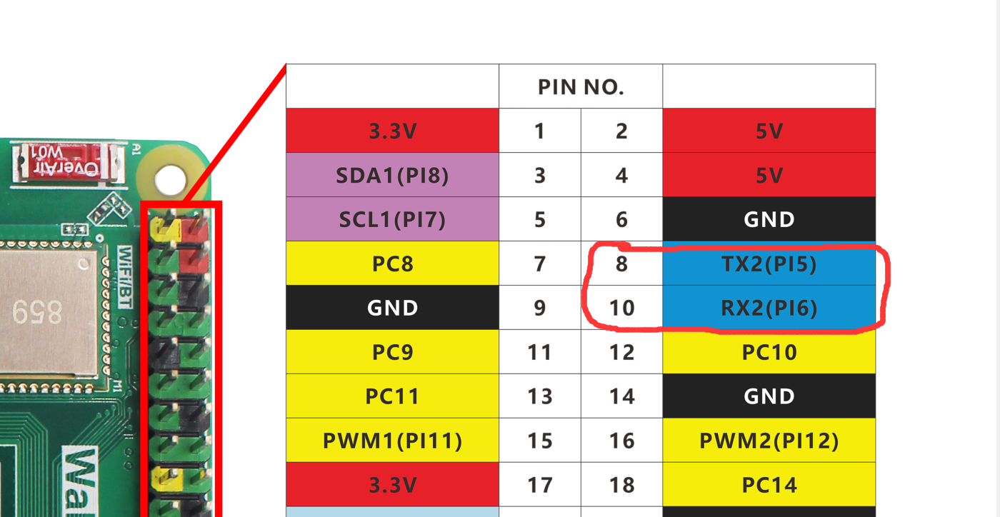
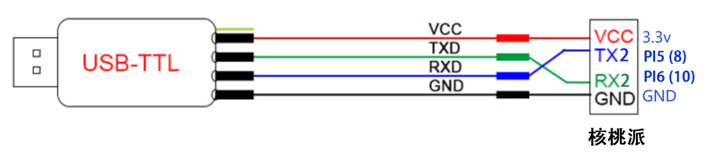
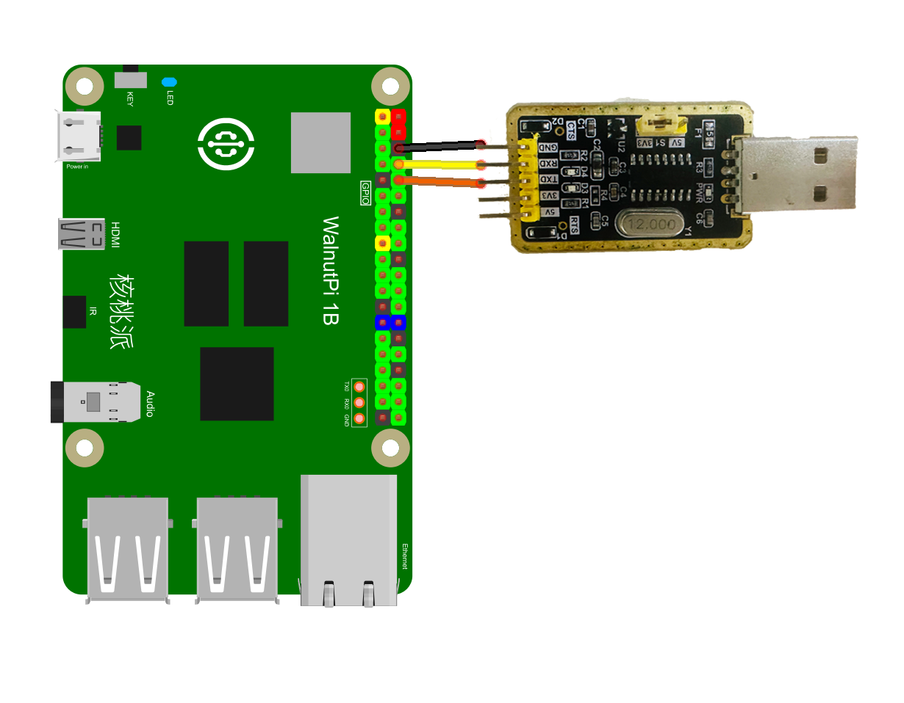
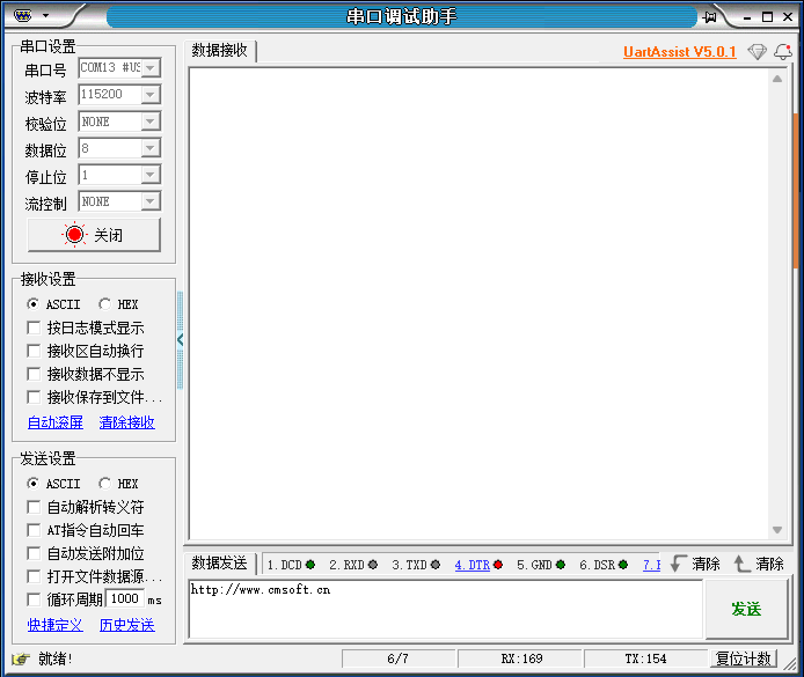
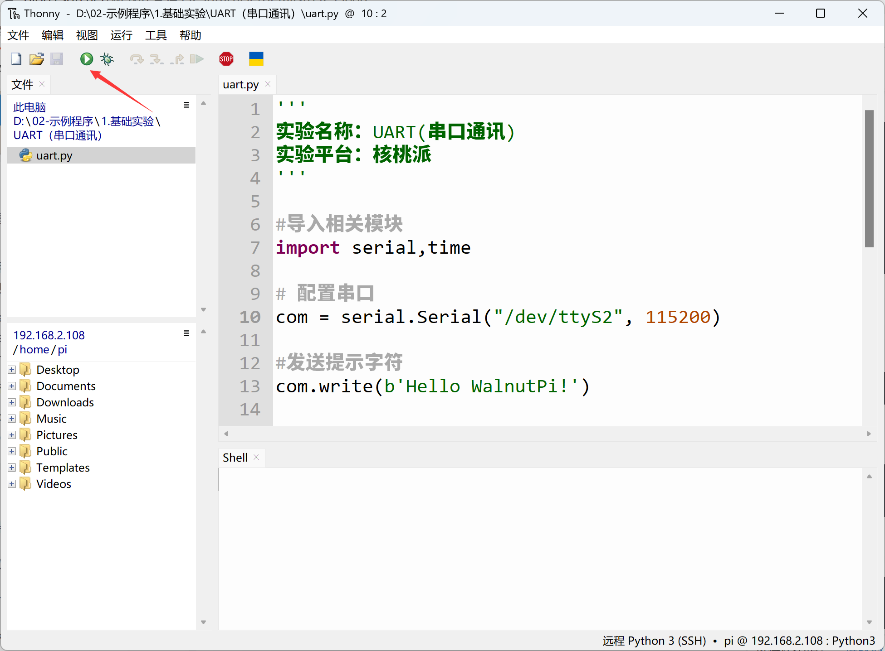
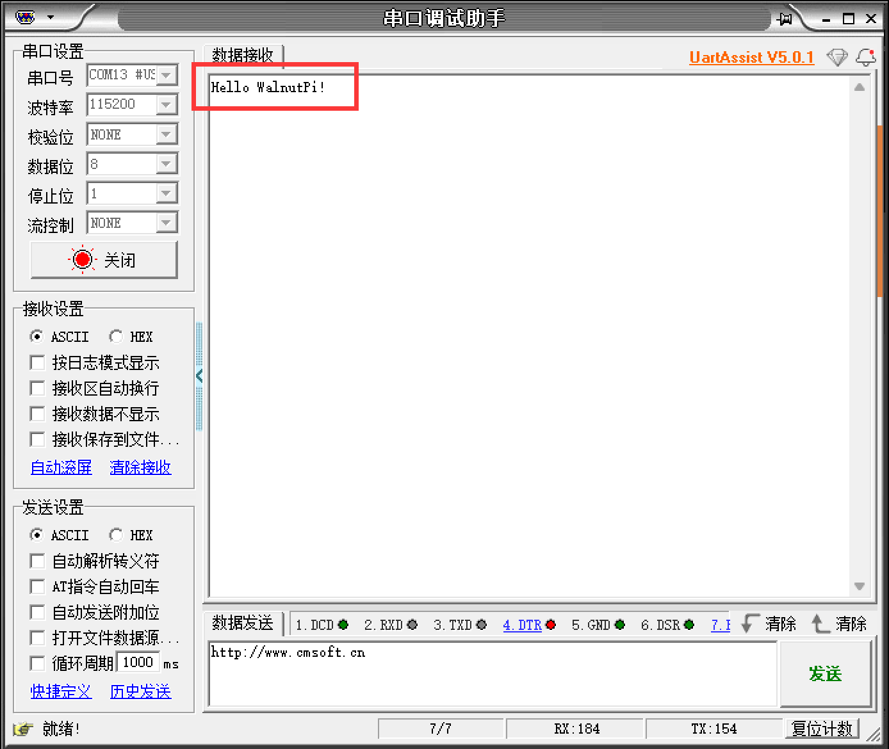
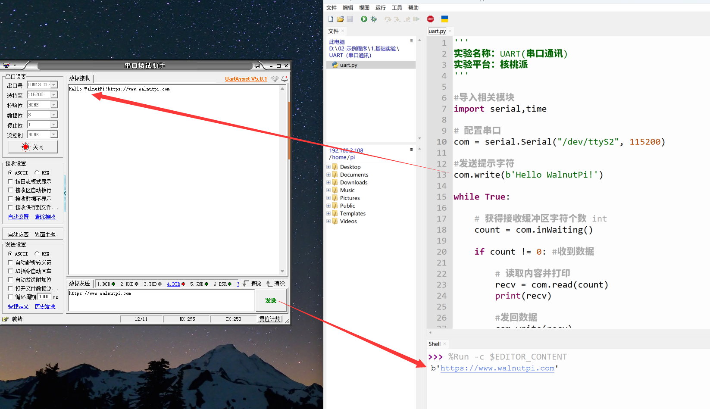

# UART (Serial Communication)

## Introduction
Serial communication is a widely used communication interface. Many industrial control products and wireless transparent transmission modules use serial ports to send/receive commands and transfer data. This allows users to flexibly apply various serial function modules without needing to understand the underlying principles. You can also communicate with other development boards such as STM32, ESP32, Arduino, etc., via serial for data exchange.

## Objective
Program UART data transmission and reception.

## Explanation

The WalnutPi's GPIO header brings out a serial port on pins 8 and 10 — UART2.


## The Serial Object

WalnutPi serial communication can be programmed using the Linux system's built-in `serial` standard library. Details are as follows:

### Constructor
```python
serial.Serial("dev",baudrate)
```
Constructs a UART object.
- `"dev"` : Device node. WalnutPi's UART2 is "/dev/ttyS2";
- `baudrate` : Serial baud rate, can be set to commonly used values like 9600, 115200, etc.

### Methods
```python
Serial.inWaiting()
```
Returns the number of characters received and stored in the buffer, as an int. Can be used to check if data has been received.

<br></br>

```python
Serial.read(num)
```
Reads data, returns a byte string.
- `num` : Number of characters to read.

<br></br>

```python
Serial.write(b'str')
```
Sends data. The format must be a byte string.
- `b'str'` : Content to send.

<br></br>

For more Serial Python usage, refer to the official documentation:
https://pyserial.readthedocs.io/en/latest/pyserial_api.html#module-serial

After understanding the UART object usage, we can use a USB-to-TTL adapter together with a PC host [Serial Assistant] to communicate with the WalnutPi via serial. These tools are similar; **the important thing to note is: if the adapter supports 3.3V/5V level switching, set the jumper cap to 3.3V, because the WalnutPi's GPIO level is 3.3V.**


In this experiment, we use UART2 — TX2(PI5) and RX2(PI6). The wiring diagram is as follows: **(The 3.3V line can be left unconnected)**




In this experiment, we first initialize the serial port, then send a message via serial. The PC's serial assistant will display this message in its receive area. Then we enter a loop: when the WalnutPi detects data to receive, it receives and prints the data through the terminal. The code writing flow is as follows:

```mermaid
graph TD
    Import Serial module --> Construct serial object --> Send message --> Check for data -- Yes --> Receive and print in terminal --> Check for data;
    Check for data -- No --> Check for data;
```

## Reference Code

```python
'''
Experiment Name: UART (Serial Communication)
Experiment Platform: WalnutPi
'''

# Import related modules
import serial,time

# Configure serial port
com = serial.Serial("/dev/ttyS2", 115200)

# Send a test message
com.write(b'Hello WalnutPi!')

while True:

    # Get the number of characters in the receive buffer (int)
    count = com.inWaiting()

    if count != 0: # Data received

        # Read content and print
        recv = com.read(count)
        print(recv)

        # Send data back
        com.write(recv)

        # Clear the receive buffer
        com.flushInput()

    # 100ms delay for receive interval
    time.sleep(0.1)
```

## Result

Connect the WalnutPi to the computer using a USB-to-TTL adapter.



Open the Serial Assistant on the PC, select the COM port corresponding to the USB-to-TTL adapter, set the baud rate to 115200. Click Open and wait to receive data:



Use Thonny to remotely run the above Python code on the WalnutPi. For instructions on running Python code on the WalnutPi, please refer to: [Running Python Code](../python_run.md)



After running, you can see that the PC's Serial Assistant has received the message:



Enter a message in the Serial Assistant's send bar, click Send, and you can see the received data printed in the Thonny terminal at the bottom (data received by the WalnutPi board):




Serial data transmission and reception is widely used. Besides communicating with a PC as in this routine, you can also communicate with other microcontroller development boards or serial module devices.
