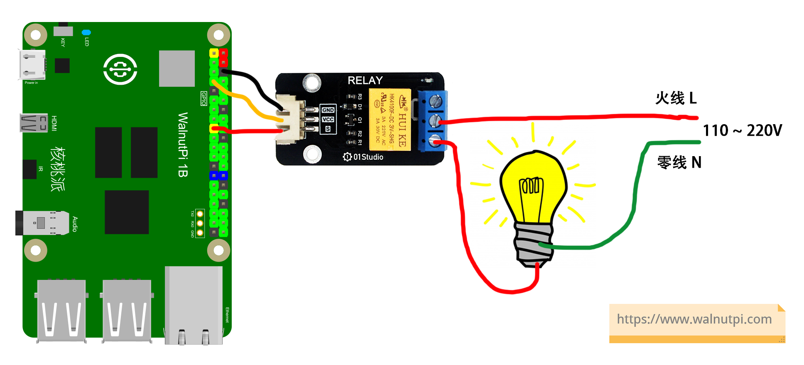
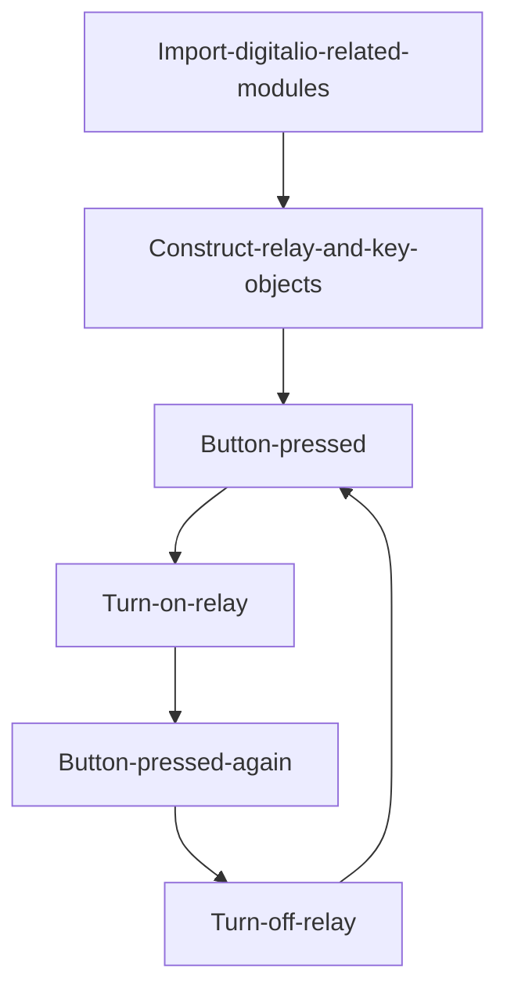
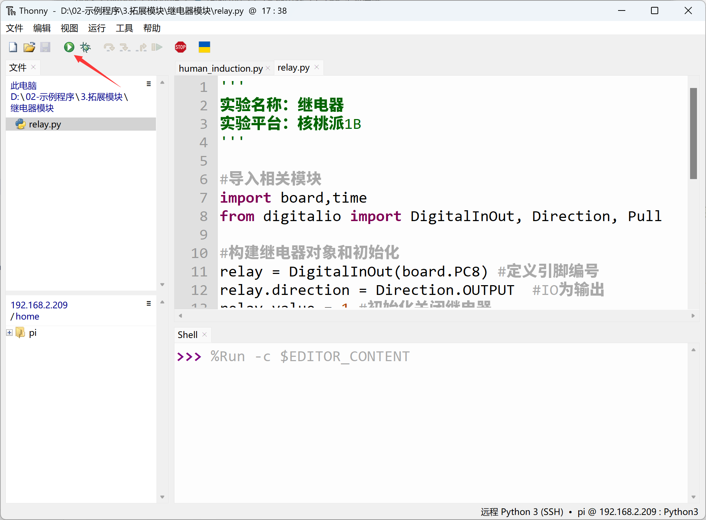

# Relay

## Introduction
As we know, the GPIO output voltage level of the WalnutPi 1B development board is 3.3V, which cannot directly control high-voltage devices such as lights (220V). In such cases, we can use a commonly used low-voltage-to-high-voltage control module — the relay.

## Objective
Use a button to control relay on/off.

## Explanation

The image below shows a commonly used relay module. The low-voltage control interface on the left mainly has power pins and a signal control pin (the supply voltage is generally 3.3V, depending on the manufacturer's specifications). The blue part on the right is the high-voltage section, which can connect to 220V appliances.

::::tip Note

It is recommended to use a relay with 3.3V level control, because the WalnutPi GPIO output is 3.3V. Using a 5V-controlled relay improperly may damage the WalnutPi board.

::::


The image below shows the appliance connection diagram. The left side is the low-voltage control part, and the right side is the high-voltage control part **(pay attention to electrical safety when wiring)**:




The relay operates similarly to the LED in the earlier GPIO chapter. Simply connect the module's signal pin to the WalnutPi, then program the WalnutPi GPIO pin to change between HIGH and LOW levels to control the relay, thereby controlling the high-voltage switch.

## The digitalio Object

In CircuitPython, you can directly use the digitalio (Digital IO) module for IO programming. Details are as follows:

### Constructor
```python
relay=digitalio.DigitalInOut(pin)
```
Parameter description:
- `pin` Board pin number. Example: board.PC8

### Methods
```python
relay.direction = value
```
Define pin as input/output. Possible `value` values:
- `digitalio.Direction.INPUT` : Input.
- `digitalio.Direction.OUTPUT` : Output.

<br></br>

```python
relay.pull = value
```
Set pull-up/pull-down resistor. Possible `value` values:
- `digitalio.Pull.UP` : Pull-up.
- `digitalio.Pull.DOWN` : Pull-down.

<br></br>

```python
relay.value = value
```
GPIO output value. Possible `value` values:
- `True` or `1` : HIGH.
- `False` or `0` : LOW.

<br></br>

For more usage, refer to the official documentation:<br></br>
https://docs.circuitpython.org/en/latest/shared-bindings/digitalio/index.html


In this experiment, we use a button to toggle the relay — press once to turn on, press again to turn off, and so on. The code writing flow is as follows:



## Reference Code

```python
'''
Experiment Name: Relay
Experiment Platform: WalnutPi 1B
'''

# Import related modules
import board,time
from digitalio import DigitalInOut, Direction, Pull

# Construct and initialize relay object
relay = DigitalInOut(board.PC8) # Define pin number
relay.direction = Direction.OUTPUT  # IO as output
relay.value = 1 # Initialize: relay off

# Construct and initialize button object
switch = DigitalInOut(board.KEY) # Define pin number
switch.direction = Direction.INPUT # IO as input

state = 1 # Relay initial state, HIGH = off

while True:

    if switch.value == 0: # Button pressed
        time.sleep(0.01) # 10ms debounce delay
        if switch.value == 0: # Button pressed (confirmed)
            state = not state # Toggle state
            relay.value = state # Change relay state

            # Wait for button release
            while switch.value == 0:
                pass
```

## Result

Use Thonny to remotely run the above Python code on the WalnutPi. For instructions on running Python code on the WalnutPi, please refer to: [Running Python Code](../python_run.md)



When the button is pressed to turn on the relay, the blue LED lights up.


When pressed again to turn off, the blue LED turns off.


