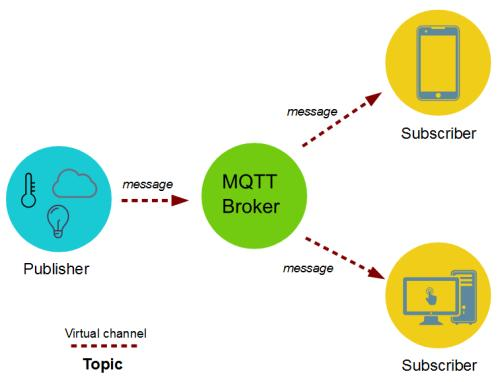
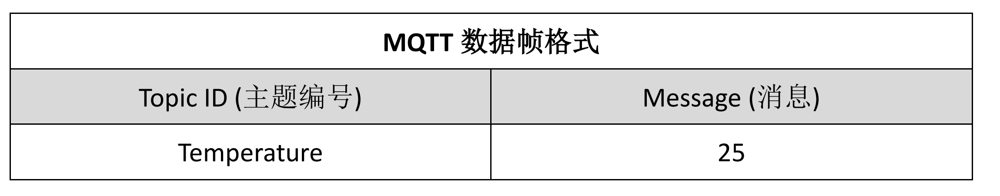
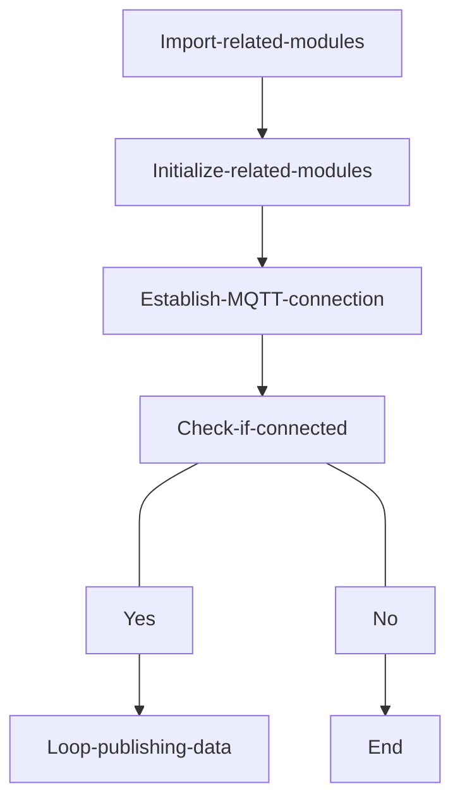
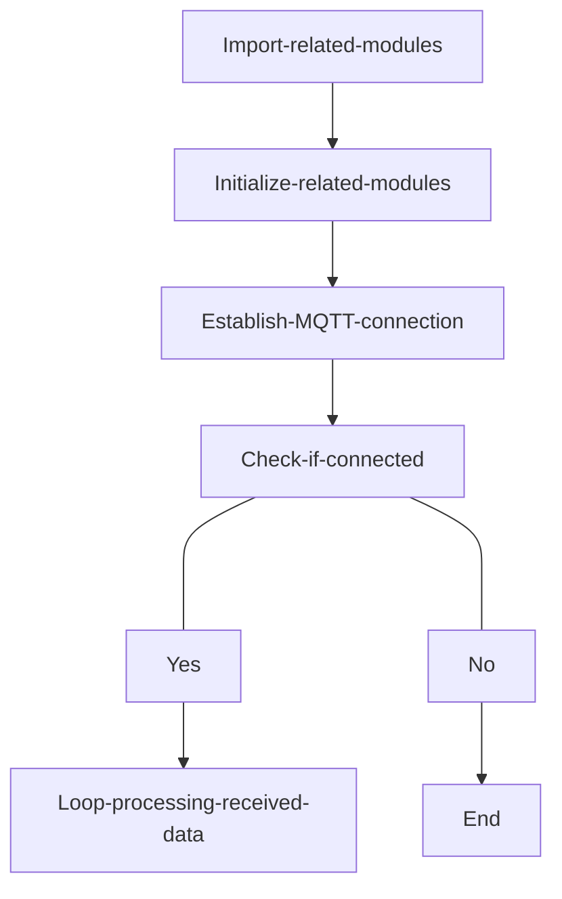
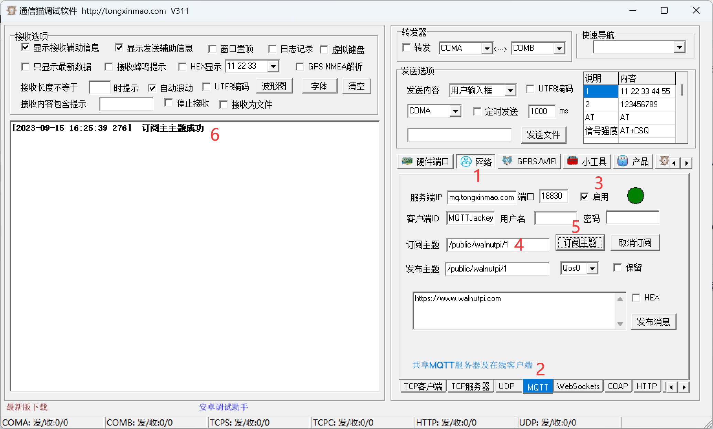
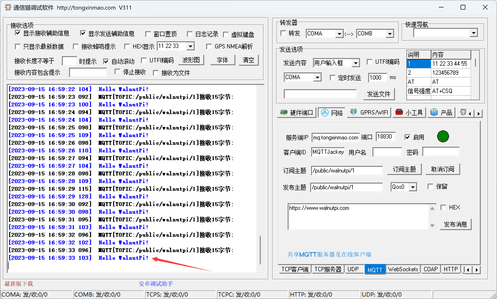
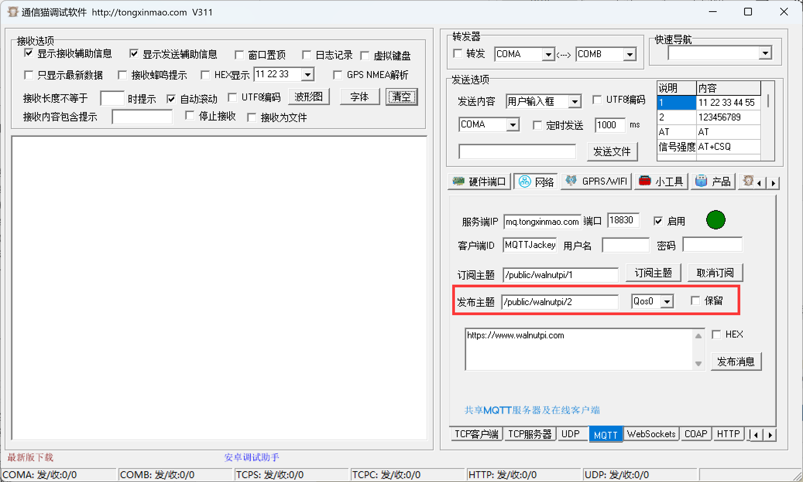
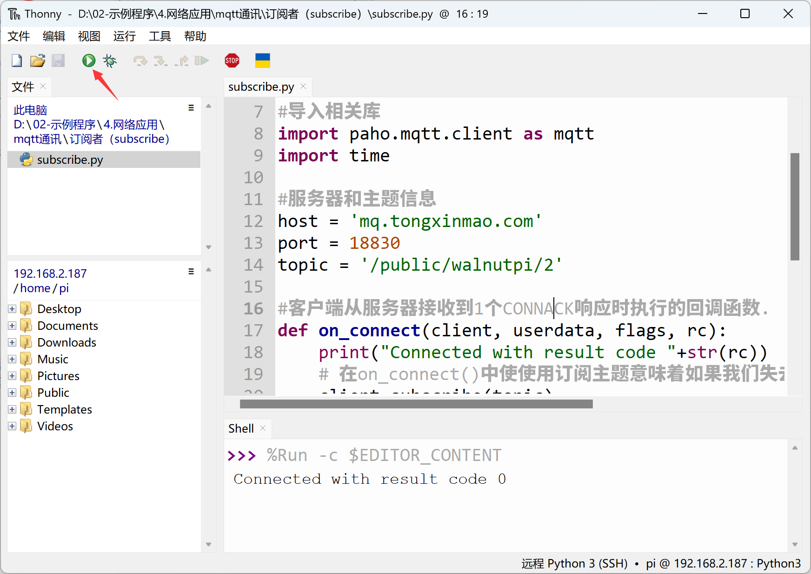
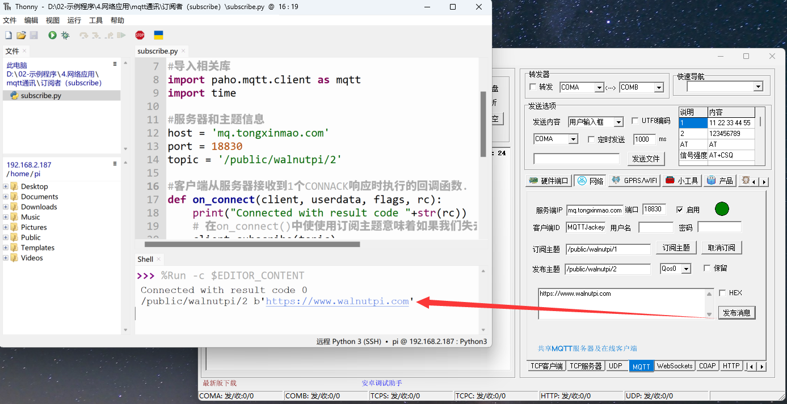

# MQTT Communication

## Introduction
In the previous section, we learned about Socket communication. Once a server and client establish a connection, they can communicate with each other. In Internet applications, WebSocket interfaces are mostly used for data transmission. However, in IoT applications, a common scenario arises: massive numbers of sensors need to stay online at all times, transmitting very small amounts of data, with a large number of users. If socket communication is still used, the server load and communication framework design will become extremely complex as the number of devices grows!

So, is there a framework protocol to solve this problem? The answer is yes — it's MQTT (Message Queuing Telemetry Transport).


## Objective
Program the WalnutPi to publish and subscribe to (receive) MQTT protocol messages.

## Explanation
MQTT was proposed by IBM in 1999. Like HTTP, it belongs to the application layer and operates on top of the TCP/IP protocol suite, often calling socket interfaces. It is a client-server based message publish/subscribe transport protocol. Its characteristics are lightweight, simple, open, and easy to implement, which makes it suitable for a very wide range of applications. It is widely used in many scenarios, including constrained environments, such as machine-to-machine (M2M) communication and the Internet of Things (IoT), including sensors communicating via satellite links, occasionally dialing medical devices, smart homes, and miniaturized devices.

In summary, MQTT has the following features/advantages:
- Asynchronous message protocol
- Long connection-oriented
- Bidirectional data transmission
- Lightweight protocol
- Passive data acquisition




As shown above, there are two roles in MQTT communication: the server and the client. The server is only responsible for relaying data, not storing it; the client can be either a message sender or subscriber, or both. As illustrated below:


After establishing the roles, how is data actually transmitted? The following table shows the most basic MQTT data frame format. For example, a temperature sensor publishes the topic "Temperature" with the message "25" (indicating temperature). Then all clients (mobile apps) that have subscribed to this topic number will receive the relevant information, thereby enabling communication, as shown below:



Due to the unique publish/subscribe mechanism, the server does not need to store data (though you can also set up a client on the server device to subscribe and save information). This makes it highly suitable for massive device communication.

Life is short, and Python has already encapsulated the MQTT client library, making our application simple and elegant. We use the `paho.mqtt` Python library, maintained by Eclipse with a large developer user base. You can install it using pip by running the following command in the terminal:

```bash
sudo pip3 install paho-mqtt
```


## The paho-mqtt Object

### Constructor
```python
import paho.mqtt.client as mqtt
client = mqtt.Client()
```
Import the MQTT library and construct a client object.

### Methods
```python
client.connect(host,port,keepalive)
```
Connect to the MQTT server.
- `host` : Server address;
- `port` : Port, typically 1883;
- `keepalive` : Keep-alive, default 60 seconds.

<br></br>

```python
client.publish(topic,message)
```
Publish a message.
- `topic` : Topic name;
- `message` : Message content, e.g.: 'Hello WalnutPi!'

<br></br>

```python
client.subscribe(topic)
```
Subscribe.
- `topic` : Topic name.

<br></br>

```python
client.on_connect = on_connect
```
Use callback function for connection. See subscriber example code for usage.

<br></br>

```python
client.on_message = on_message
```
Callback function for receiving messages. See subscriber example code for usage.

<br></br>

For more usage methods, refer to the official documentation: https://github.com/eclipse/paho.mqtt.python#eclipse-paho-mqtt-python-client

Since the client can be either a publisher or a subscriber, for better understanding, this experiment is divided into two cases: publisher and subscriber. We'll test them using an MQTT network debug assistant. The code writing flows are as follows:

**Publisher code flow:**


<br></br>

**Subscriber code flow:**



## Reference Code

### Publisher

```python
'''
Experiment Name: MQTT Communication
Experiment Platform: WalnutPi 1B
Description: Program MQTT communication: Publisher.
'''

# Import related libraries
import paho.mqtt.client as mqtt
import time

# Server and topic information
host = 'mq.tongxinmao.com'
port = 18830
topic = '/public/walnutpi/1'

# Construct MQTT client object
client = mqtt.Client()

# Initiate connection
client.connect(host,port)

while True:

    # Publish message
    client.publish(topic,'Hello WalnutPi!')

    time.sleep(1) # 1-second delay, publish interval
```

### Subscriber

```python
'''
Experiment Name: MQTT Communication
Experiment Platform: WalnutPi 1B
Description: Program MQTT communication: Subscriber.
'''

# Import related libraries
import paho.mqtt.client as mqtt
import time

# Server and topic information
host = 'mq.tongxinmao.com'
port = 18830
topic = '/public/walnutpi/1'

# Callback function executed when the client receives a CONNACK response from the server.
def on_connect(client, userdata, flags, rc):
    print("Connected with result code "+str(rc))
    # Subscribing in on_connect() means that if we lose the connection
    # and reconnect, subscriptions will be renewed.
    client.subscribe(topic)

# Callback function executed when a published message is received from the server.
def on_message(client, userdata, msg):
    print(msg.topic+" "+str(msg.payload))

# Construct MQTT client
client = mqtt.Client()

# Configure callback functions for connection and message reception
client.on_connect = on_connect
client.on_message = on_message

# Connect to server
client.connect(host, port)

# A blocking call that processes network traffic, dispatches callbacks,
# and handles reconnecting.
client.loop_forever()
```

## Result

### Publisher Test

Open the Tongxinmao MQTT Assistant on the PC, making sure the PC is connected to the Internet:


Next, configure the MQTT Assistant as shown below:

1. Click Network;
2. Click MQTT;
3. Click Start;
4. Enter the subscription topic. Here, enter the sender's topic "/public/walnutpi/1";
5. Click the Subscribe Topic button and wait to receive messages;
6. After successful subscription, the left side will show a success prompt.



Use Thonny to remotely run the above publisher code on the WalnutPi. For instructions on running Python code on the WalnutPi, please refer to: [Running Python Code](../python_run)


After running, you can see that the MQTT network assistant has received the message from the WalnutPi:




### Subscriber Test

The subscriber test method is the reverse of the publisher. In the MQTT assistant, change the publish topic to: '/public/01Studio/2'.



Run the subscriber code:



You can see the received data printed in the Thonny terminal at the bottom (actually the data received by the WalnutPi board).



Of course, you can also test both publish and subscribe functions within the same MQTT online assistant — just make sure the topic is set consistently, as shown below:


Through this section, we have learned the principles of MQTT communication and successfully implemented communication. The MQTT in this experiment connects to the Tongxinmao server, which means it supports remote data transmission. That is, you can use WalnutPi A at home to subscribe to WalnutPi B in your company or school lab to receive sensor data, etc. Most IoT cloud platforms on the market today support MQTT, and the principles are essentially the same. You can develop based on different platform protocols to enable remote connectivity for your own IoT devices.
