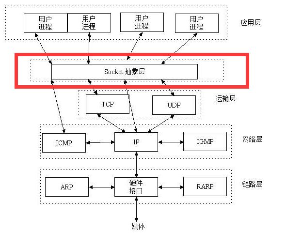
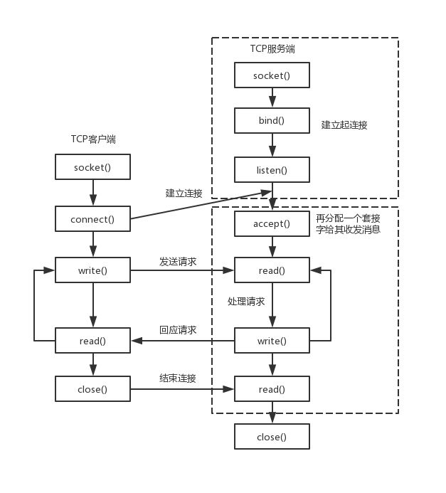
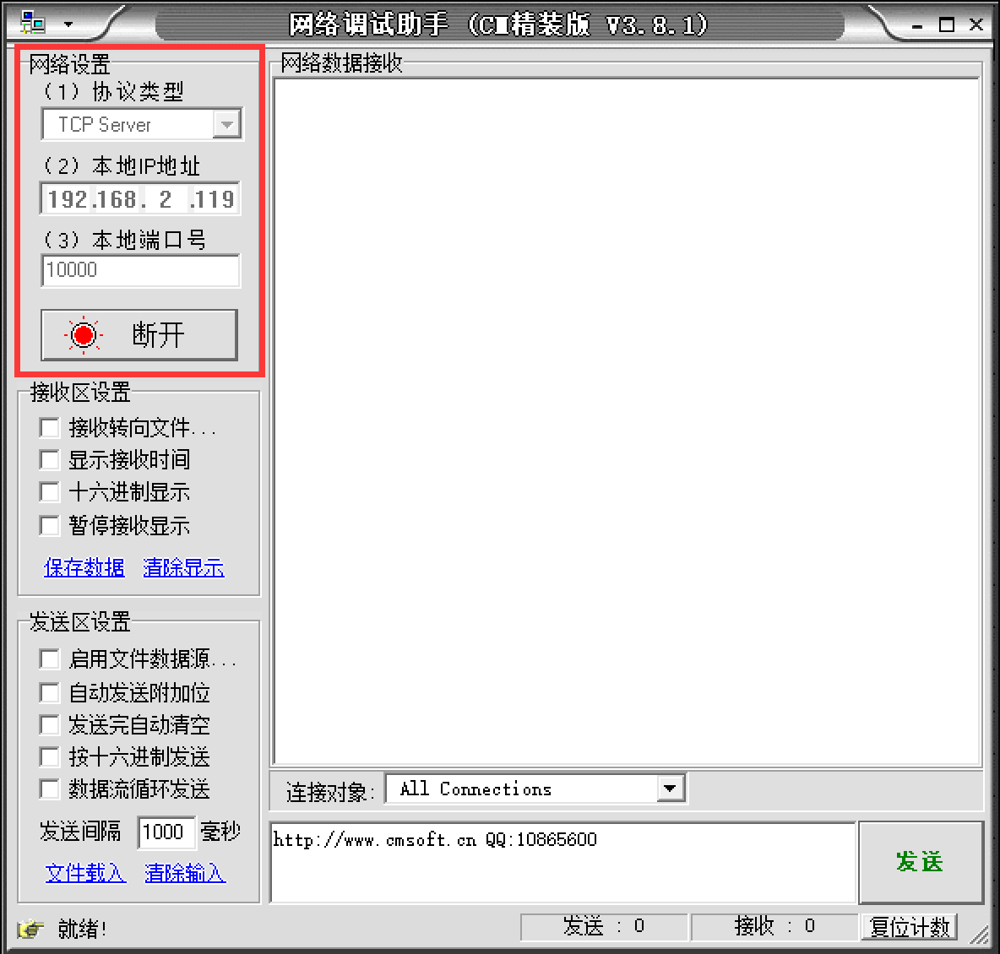
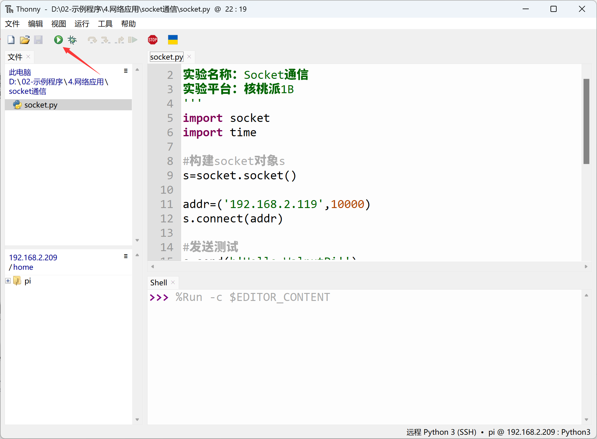
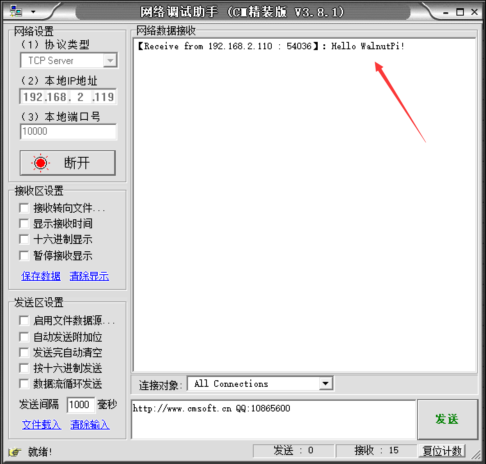

# Socket Communication

## Introduction
In today's era of the Internet of Everything, smart device networking is becoming increasingly common. However, most devices ultimately connect to local or online servers through traditional Internet mechanisms. The WalnutPi supports both WiFi (2.4G/5G) and Ethernet connectivity, which is automatically handled after the OS boots — so we just need to focus on communication programming. Running a Linux system, the WalnutPi can even serve as a lightweight local server.

In this section, let's learn about the most common Socket communication experiment. Socket is essentially the foundation of all Internet communication.

## Objective
Use Socket programming to establish a connection between the WalnutPi and a PC network assistant, and exchange data with each other.

## Explanation
We hear about Socket a lot, but since network engineering is a systems engineering discipline involving a vast range of knowledge and many concepts — any single topic could fill thick books — it's easy to get confused. Here, we try to explain Socket in the most understandable way. If you want a comprehensive understanding, you can consult related resources on your own.

Let's first look at the network layer model diagram, which forms the foundation of network communication:


Let's examine the transport layer and application layer of the TCP/IP model. Familiar concepts at the transport layer are TCP and UDP. The UDP protocol essentially does not perform any additional processing on IP layer data. The TCP protocol adds more complex transmission control, such as a sliding data transmission window (Slice Window), as well as acknowledgment and retransmission mechanisms, to achieve reliable data delivery. At the application layer, web pages commonly use HTTP. So let's first analyze the relationship between TCP and HTTP.

We know that network communication fundamentally relies on IP addresses and ports. HTTP generally uses port 80 by default. A simple example: when we browse Taobao, the browser initiates a request to Taobao's URL (essentially an IP address) and port. Taobao receives the request, responds, and returns relevant web page data to our phone, completing the web page interaction process. This brings up the issue of multi-user connections — many people visiting Taobao actually disconnect after receiving the web page data, otherwise Taobao's servers could not handle so many simultaneously maintained connections. Even if they could, it would be extremely resource-intensive.

That is, when HTTP at the application layer performs data communication through the transport layer, TCP faces the challenge of providing concurrent services for multiple application processes simultaneously. Multiple TCP connections or multiple application processes may need to transmit data through the same TCP protocol port. To distinguish between different application processes and connections, many computer operating systems provide a Socket interface for applications to interact with the TCP/IP protocol. The application layer and transport layer can communicate through the Socket interface, distinguishing communication from different application processes or network connections and enabling concurrent data transmission services.

Simply put, the Socket abstraction layer sits between the transport layer and the application layer, and is not inherently tied to TCP/IP. The Socket programming interface was designed with the hope of also adapting to other network protocols.



A socket is the cornerstone of communication and the basic operational unit for network communication supporting the TCP/IP protocol. It is an abstract representation of endpoints in the network communication process, containing five essential pieces of information needed for network communication: **the protocol used for the connection (usually TCP or UDP), the local host's IP address, the local process's protocol port, the remote host's IP address, and the remote process's protocol port.**

So, the emergence of sockets simply makes it easier to use the TCP/IP protocol stack. Simply put, it abstracts TCP/IP and forms a few basic function interfaces, such as **create, listen, accept, connect, read, write**, etc. Below is the communication flow:



As shown above, socket communication requires a server side and a client side. In this experiment, the WalnutPi acts as the client, and the PC uses a network debug assistant as the server. Both sides communicate using the TCP protocol. For the client, it only needs to know the PC's IP and port to establish a connection. (The port can be customized, ranging from 0 to 65535, just avoid occupying commonly used ports like 80.)

In summary, from an application-oriented perspective, the WalnutPi only needs to know three pieces of information — **the communication protocol (TCP or UDP), the server's IP, and the port number** — to connect to the server and send information. That's it.

Generally, the operating system already includes a socket module, which we can directly call using Python. The socket object is described as follows:

## The socket Object

### Constructor
```python
s=socket.socket(family=AF_INET, type=SOCK_STREAM)
```
Parameter description:
- `family` IP version type
    - `socket.AF_INET` IPv4
    - `socket.AF_INET6` IPv6

- `type` Communication type
    - `socket.SOCK_STREAM` TCP
    - `socket.SOCK_DGRAM` UDP

### Methods
```python
addr=socket.getaddrinfo('www.baidu.com', 80)[0][-1]
```
Get socket communication format address. Returns: ('14.215.177.38', 80)
<br></br>

```python
s.connect(address)
```
Create a connection.
- `address` : Address format is IP + port. Example: ('192.168.1.115', 10000)

<br></br>

```python
s.send(bytes)
```
Send data.
- `bytes` : Content to send, in bytes format.

<br></br>

```python
s.recv(bufsize)
```
Receive data.
- `bufsize` : Maximum number of bytes to receive per call.

<br></br>

```python
s.bind(address)
```
Bind, used for the server role.

<br></br>

```python
s.listen([backlog])
```
Listen, used for the server role.
- `backlog` : Allowed number of connections, must be greater than 0.

<br></br>

```python
s.accept()
```
Accept a connection, used for the server role.

<br></br>

For more usage, refer to the Python socket official documentation:
https://docs.python.org/3/library/socket.html#functions

In this experiment, the WalnutPi acts as the client, so we only need the client-side functions. The code writing flow is as follows:

```mermaid
graph TD
    Import related modules --> Initialize related modules --> Establish socket connection --> Check if connected -- Yes --> Exchange data;
    Check if connected -- No --> End;
```


## Reference Code

```python
'''
Experiment Name: Socket Communication
Version: v1.0
Date: 2023.8
Platform: WalnutPi
Description: Socket communication with PC network assistant
'''
import socket
import time

# Construct socket object s
s=socket.socket()

addr=('192.168.1.111',10000)
s.connect(addr)

# Test send
s.send(b'Hello 01Studio!')

while True:

    text=s.recv(128) # Receive up to 128 bytes per call

    # Received empty
    if text == '':
        pass

    # Received data, print and echo back
    else:
        print(text)
        s.send(text)

    time.sleep(0.1) # 100ms query interval
```

## Result

Make sure the PC and WalnutPi are on the same network segment (usually meaning connected to the same router), and also turn off the PC firewall. Use "sudo ifconfig" to [get the WalnutPi IP address](../../os_software/ip_get)

Open the network debug assistant on the PC:


Select TCP Server, enter the PC's IP address, use port 10000 for testing, click Connect, and wait to receive data:



Use Thonny to remotely run the above Python code on the WalnutPi. For instructions on running Python code on the WalnutPi, please refer to: [Running Python Code](../python_run)




After running, you can see that the PC network assistant has received the message from the WalnutPi:




In the network assistant's send bar, select the WalnutPi's IP and port, enter the message you want to send, and click Send:


You can see the received data printed in the Thonny terminal at the bottom (data received by the WalnutPi board):


Through this section, we have learned the principles of socket communication and completed an experiment using Python for socket programming and communication. Thanks to excellent encapsulation, we can directly program socket objects to quickly implement socket communication and thus develop more network applications, such as sending previously collected sensor data to other WalnutPi boards, PCs, or remote servers.
