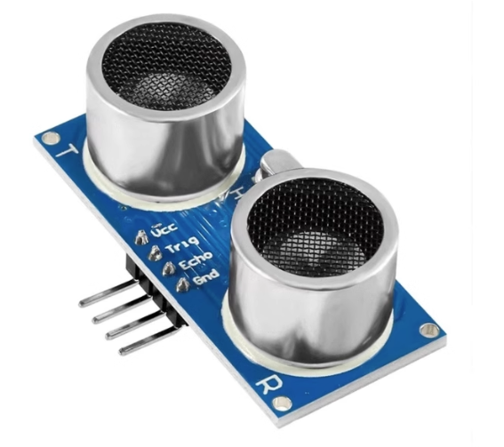
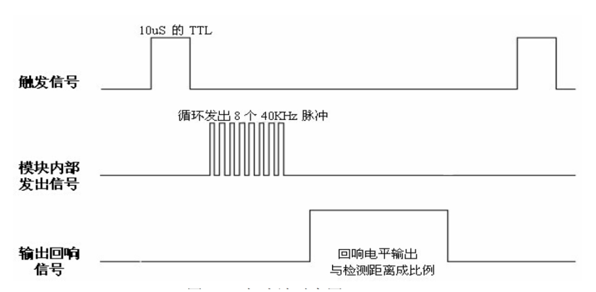
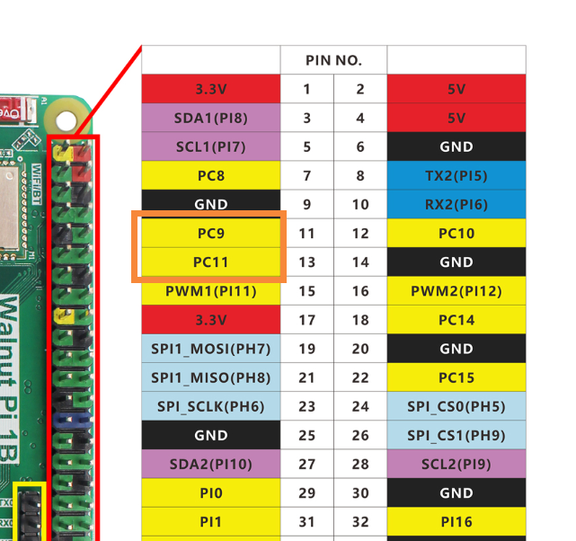
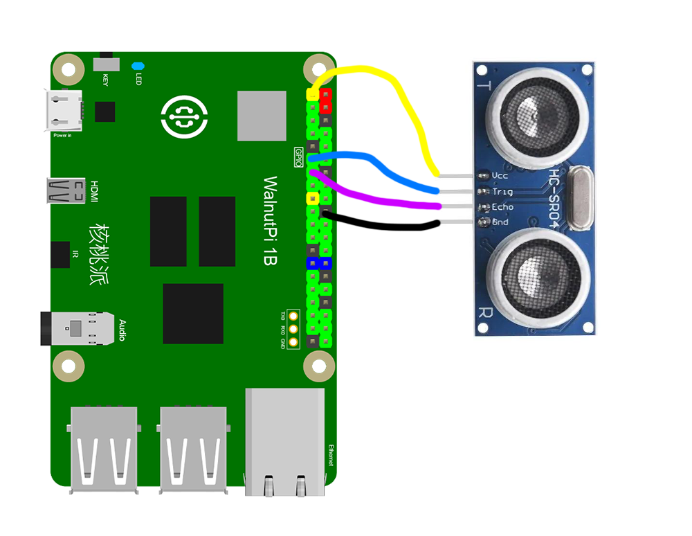
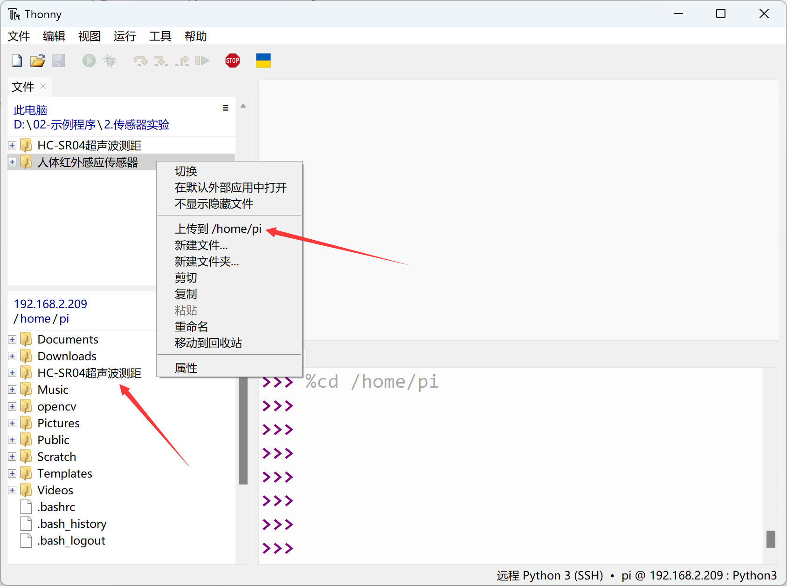
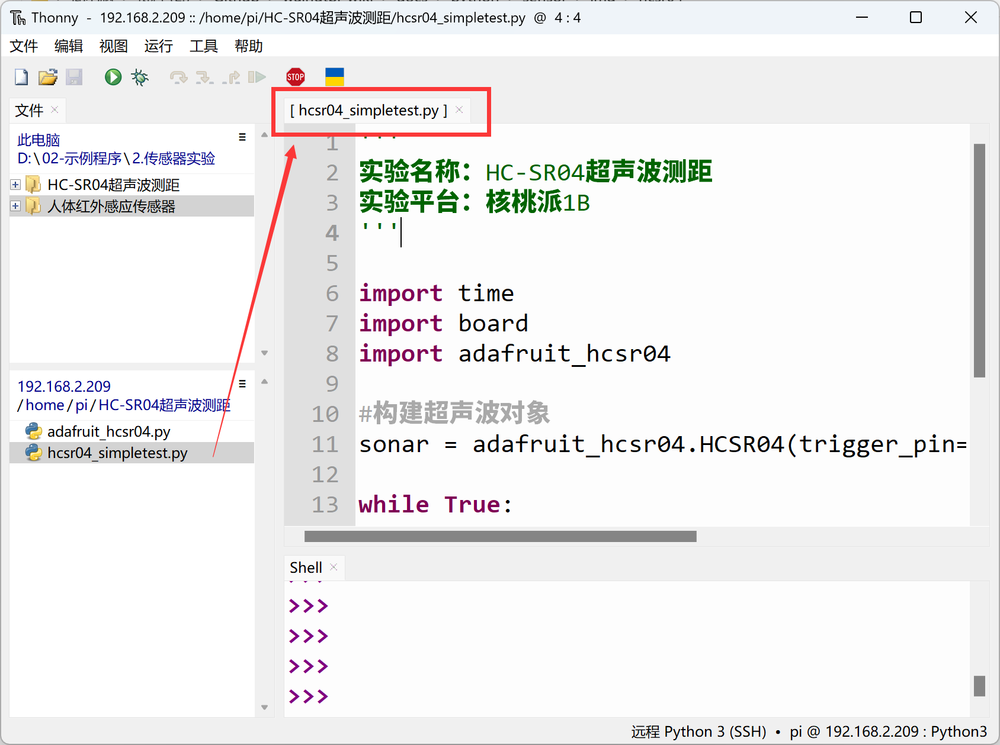
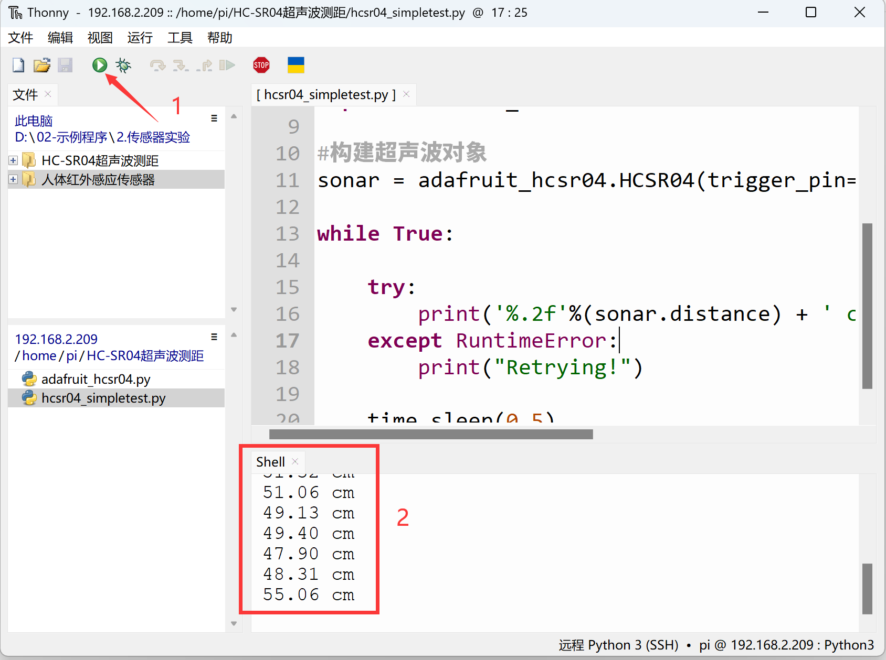

# HC-SR04 Ultrasonic Distance Measurement

## Introduction
The ultrasonic sensor is a distance measurement sensor. Its principle uses sound waves that reflect off obstacles and combines with the speed of sound in air to calculate distance. It has applications in ranging, obstacle avoidance cars, autonomous driving, and other fields.

## Objective
Use Python programming to implement distance measurement with an ultrasonic sensor.

## Explanation

The image below shows a commonly used HC-SR04 ultrasonic module:



|  Module Parameters | |
|  :---:  | ---  |
| Supply Voltage  | 3.3V~5V (WalnutPi needs a module supporting 3.3V) |
| Measuring Range  | 2cm~450cm |
| Accuracy  | 0.5cm |
| Pin Description  | `VCC`: Connect to 3.3V <br></br> `GND`: Ground <br></br>  `Trig`: Trigger pin  <br></br> `Echo`: Echo pin |

<br></br>

The ultrasonic sensor module uses two IO pins to control ultrasonic transmission and reception separately. The working principle is as follows:

1. Connect power and ground to the ultrasonic module;
2. Input a 20µs HIGH square wave pulse to the trigger pin (Trig);
3. After the square wave input, the module automatically emits 8 40KHz sound waves, and simultaneously the echo pin (Echo) level changes from 0 to 1; (a timer should be started at this point)
4. When the ultrasonic wave returns and is received by the module, the echo pin level changes from 1 to 0; (the timer should be stopped at this point). The time recorded by the timer is the total round-trip time of the ultrasonic wave;
5. Using the speed of sound in air (340 m/s), the measured distance can be calculated.

Below is the timing trigger diagram for the HC-SR04 ultrasonic sensor:



We can use any two regular GPIO pins to connect the ultrasonic sensor. Here, PC9 is connected to the Trig pin, and PC11 to the Echo pin:



<br></br>



## The HCSR04 Object

In CircuitPython, you can directly use a pre-written Python library to get distance values from the ultrasonic sensor. Details are as follows:

### Constructor
```python
sonar=adafruit_hcsr04.HCSR04(trigger_pin=board.PC9, echo_pin=board.PC11)
```
Constructs an ultrasonic module object, mainly initializing the two pins connected to the ultrasonic sensor.

Parameter description:
- `trigger_pin` Board pin number. Example: board.PC9;
- `echo_pin` Board pin number. Example: board.PC11;

### Methods
```python
value = sonar.distance
```
Returns the measured distance value in cm, data type `float`.

<br></br>

After constructing the object, we can loop to continuously obtain ultrasonic distance information. The code writing flow is as follows:

```mermaid
graph TD
    Import related modules --> Construct ultrasonic sensor object --> Measure distance and print --> Measure distance and print;
```

## Reference Code

```python
'''
Experiment Name: HC-SR04 Ultrasonic Distance Measurement
Experiment Platform: WalnutPi 1B
'''

import time
import board
import adafruit_hcsr04

# Construct ultrasonic object
sonar = adafruit_hcsr04.HCSR04(trigger_pin=board.PC9, echo_pin=board.PC11)

while True:

    try:
        print('%.2f'%(sonar.distance) + ' cm') # Print distance in cm, 2 decimal places.
    except RuntimeError:
        print("Retrying!")

    time.sleep(0.5)
```

## Result

Connect the HC-SR04 ultrasonic sensor to the WalnutPi as shown — PC9 to Trig pin, PC11 to Echo pin:


Since this code depends on other `.py` library files, you need to upload the entire example folder to the WalnutPi:



After successful transfer, you need to open and run the `.py` file from the remote directory (WalnutPi), because running it will import other library files in the folder. Therefore, running this type of code locally on a PC is ineffective.



Use Thonny to remotely run the above Python code on the WalnutPi. For instructions on running Python code on the WalnutPi, please refer to: [Running Python Code](../python_run.md). After successful execution, you can see ultrasonic sensor distance information printed in the terminal.


